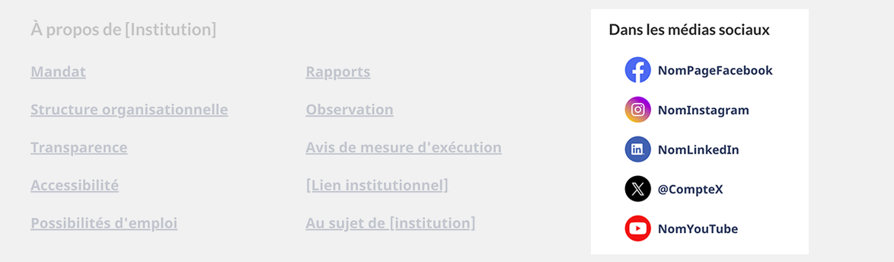
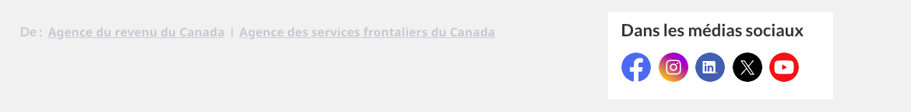
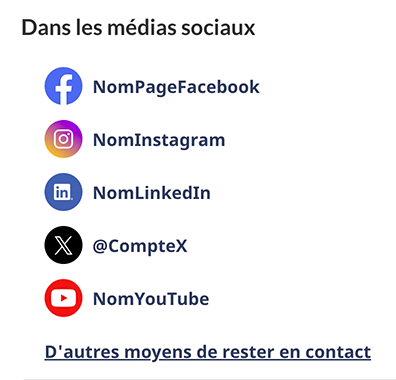
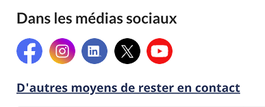
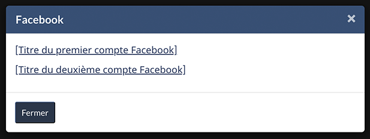

**Dernière mise à jour**&nbsp;: {{ page.dateModified }}

La configuration de conception des chaînes de médias sociaux fournit des liens vers les comptes de médias sociaux officiels du gouvernement du Canada (GC).

  

## Sur cette page

* [Quand l’utiliser](#quand-lutiliser)
* [Quoi éviter](#quoi-éviter)
* [Contenu et conception](#contenu-et-conception)
* [Comment procéder à la mise en œuvre](#comment-procéder-à-la-mise-en-œuvre)
* [Recherche et justification](#recherche-et-justification)
* [Derniers changements](#derniers-changements)

## Quand l’utiliser

Utilisez la configuration de conception des chaînes de médias sociaux sur les pages afin de promouvoir les comptes de médias sociaux officiels du gouvernement du Canada (GC) qui sont pertinents par rapport à la page.

Exemples&nbsp;:

* Page d’accueil institutionnelle
* Blogue
* Page de sujet

## Quoi éviter

N’utilisez pas la configuration de conception des chaînes de médias sociaux lorsque le flux d’un utilisateur ne doit pas être interrompu, par exemple pendant un processus transactionnel.

## Contenu et conception

Trouvez des spécifications de contenu et de conception et des exemples visuels.

### Spécifications de contenu

La configuration de conception des chaînes de médias sociaux est composée du titre «&nbsp;Dans les médias sociaux &nbsp;» et d’icônes renvoyant aux comptes de médias sociaux officiels du gouvernement du Canada.

Les comptes mentionnés dans la configuration de conception doivent être entièrement conformes à la [Directive sur la gestion des communications.](https://www.tbs-sct.canada.ca/pol/doc-fra.aspx?id=30682)

Vous pouvez utiliser les icônes d’autres médias sociaux que celles qui sont fournies dans cet exemple, en autant qu’ils représentent des comptes de médias sociaux officiels du GC.

L’ordre des icônes des médias sociaux n’est pas imposé. Vous pouvez les placer dans l’ordre qui convient le mieux au contexte.

Il est recommandé d’utiliser au maximum 5 icônes. Affichez les icônes alignées en colonne verticale ou en ligne horizontale&nbsp;:

* L’affichage vertical comprend une étiquette à côté de chaque icône.
* L’affichage horizontal ne comprend que les icônes.

S’il y a plus d’un compte pour une plateforme&nbsp;:

* Indiquez le nom de la plateforme à côté de son icône (affichage vertical seulement).
* Utilisez une fenêtre contextuelle modale pour afficher le nom de chaque compte sur cette plateforme.
  * La fenêtre contextuelle modale peut avoir jusqu’à huit (8) liens de texte.
  * Utilisez les noms des comptes en tant qu’étiquettes.

Placez les chaînes de médias sociaux après la tâche et le contenu de navigation.

#### Lien optionnel

Vous pouvez ajouter un lien intitulé «&nbsp;D’autres moyens de rester en contact&nbsp;» si vous souhaitez créer un lien vers d’autres comptes de médias sociaux ou d’autres plateformes de communication ministérielles (p. ex., balados, magazines externes, etc.). Le lien doit mener vers une page qui répertorie tous vos comptes de médias sociaux et les autres moyens de communiquer avec le ministère ou de le suivre.

### Spécifications de conception

* Spécifications de conception de la fenêtre contextuelle modale
  * Couleur de fond de l’en-tête modal&nbsp;: #2e5274
  * Titre&nbsp;: Lato, H2, 27px (H2 stylisé en taille H4)
  * Le style du bouton est celui d’un bouton principal.
* Liens&nbsp;:
  * Police&nbsp;: Noto Sans, 17 px, [couleurs de lien standards](https://conception.canada.ca/styles/couleurs.html)
* Lien «&nbsp;D’autres moyens de rester en contact&nbsp;»&nbsp;:
  * Police&nbsp;: Noto Sans, 17 px, [couleurs de lien standards](https://conception.canada.ca/styles/couleurs.html)
  * Aligné à gauche
  * Placé sous la liste des icônes

Les classes de lien pour les médias sociaux et les icônes associés sont disponibles.

    

        

            <table class="table table-striped" id="social-media" aria-live="polite">
                <caption class="wb-inv">Classes des liens des médias sociaux et les icônes associés</caption>
                <thead>
                    <tr>
                        <th class="col-md-4">Plateforme de médias sociaux</th>
                        <th class="col-md-4">Classe CSS</th>
                        <th class="col-md-4">Lien vers le fichier SVG (GitHub)</th>
                    </tr>
                </thead>
                <tbody>
                    <tr>
                        <td>Facebook</td>
                        <td><code>facebook</code></td>
                        <td class="text-center">
                            

                                <ul class="list-inline">
                                    <li><a href="https://github.com/wet-boew/GCWeb/blob/master/components/gc-follow-us/assets/facebook.svg" class="facebook">Facebook</a></li>
                                </ul>
                            

                        </td>
                    </tr>
                    <tr>
                        <td>Instagram</td>
                        <td><code>instagram</code></td>
                        <td class="text-center">
                            

                                <ul class="list-inline">
                                    <li><a href="https://github.com/wet-boew/GCWeb/blob/master/components/gc-follow-us/assets/instagram.svg" class="instagram">Instagram</a></li>
                                </ul>
                            

                        </td>
                    </tr>
                    <tr>
                        <td>LinkedIn</td>
                        <td><code>linkedin</code></td>
                        <td class="text-center">
                            

                                <ul class="list-inline">
                                    <li><a href="https://github.com/wet-boew/GCWeb/blob/master/components/gc-follow-us/assets/linkedin.svg" class="linkedin">LinkedIn</a></li>
                                </ul>
                            

                        </td>
                    </tr>
                    <tr>
                        <td>X</td>
                        <td><code>twitter</code></td>
                        <td class="text-center">
                            

                                <ul class="list-inline">
                                    <li><a href="https://github.com/wet-boew/GCWeb/blob/master/components/gc-follow-us/assets/x.svg" class="twitter">X</a></li>
                                </ul>
                            

                        </td>
                    </tr>
                    <tr>
                        <td>YouTube</td>
                        <td><code>youtube</code></td>
                        <td class="text-center">
                            

                                <ul class="list-inline">
                                    <li><a href="https://github.com/wet-boew/GCWeb/blob/master/components/gc-follow-us/assets/youtube.svg" class="youtube">YouTube</a></li>
                                </ul>
                            

                        </td>
                    </tr>
                </tbody>
            </table>
        

    

### Exemples visuels

    <figure class="mrgn-tp-md mrgn-bttm-lg">
        <figcaption><b>Chaînes de médias sociaux (affichage vertical avec étiquettes) — grand écran</b></figcaption>
        
        

            
Description de l’image&nbsp;: chaîne de médias sociaux (affichage vertical) - grand écran

            
Les liens vers les chaînes de médias sociaux apparaissent avec le titre «&nbsp;Dans les médias sociaux &nbsp;». On trouve sous le titre une liste verticale avec les icônes et les étiquettes associées&nbsp;:

            <ul>
                <li>Icône de Facebook suivie du texte de l’espace réservé NomPageFacebook</li>
                <li>Icône d’Instagram suivie du texte de l’espace réservé NomInstagram</li>
                <li>Icône de LinkedIn suivie du texte de l’espace réservé NomLinkedIn</li>
                <li>Icône de X suivie du texte de l’espace réservé @CompteX</li>
                <li>Icône de YouTube suivie du texte de l’espace réservé NomYouTube</li>
            </ul>
        

      </figure>

    <figure class="mrgn-tp-md mrgn-bttm-lg">
        <figcaption><b>Chaînes de médias sociaux (affichage horizontal avec étiquettes) — grand écran</b></figcaption>
        
        

            
Description de l’image&nbsp;: chaîne de médias sociaux (affichage horizontal) - grand écran

            
Les liens vers les chaînes de médias sociaux apparaissent avec le titre «&nbsp;Dans les médias sociaux &nbsp;».  On trouve sous le titre une liste horizontale avec les icônes associées, mais sans les étiquettes&nbsp;:

            <ul>
                <li>Facebook</li>
                <li>Instagram</li>
                <li>LinkedIn</li>
                <li>X</li>
                <li>YouTube</li>
            </ul>
        

    </figure>

    <figure class="mrgn-tp-md mrgn-bttm-lg">
        <figcaption><b>Chaînes de médias sociaux (affichage vertical avec étiquettes et lien «&nbsp;D’autres moyens de rester en contact&nbsp;») – petit écran</b></figcaption>
        
        

            
Description de l’image&nbsp;: chaînes de médias sociaux (affichage vertical avec étiquettes et lien «&nbsp;D’autres moyens de rester en contact&nbsp;») - petit écran

            
Les liens vers les chaînes de médias sociaux apparaissent avec le titre «&nbsp;Dans les médias sociaux &nbsp;». Les liens sont organisés dans une liste à puces avec les icônes et les étiquettes associées&nbsp;:

            <ul>
                <li>Icône de Facebook suivie du texte de l’espace réservé NomPageFacebook</li>
                <li>Icône de YouTube suivie du texte de l’espace réservé NomYouTube</li>
                <li>Icône d’Instagram suivie du texte de l’espace réservé NomInstagram</li>
                <li>Icône de X suivie du texte de l’espace réservé @CompteX</li>
                <li>Icône de LinkedIn suivie du texte de l’espace réservé NomLinkedIn</li>
            </ul>
            
Sous les icônes se trouve un lien intitulé&nbsp;: D’autres moyens de rester en contact

        

    </figure>

    <figure class="mrgn-tp-md mrgn-bttm-lg">
        <figcaption><b>Chaînes de médias sociaux (affichage horizontal avec étiquettes et lien «&nbsp;D’autres moyens de rester en contact&nbsp;») – petit écran</b></figcaption>
        
        

            
Description de l’image&nbsp;: chaînes de médias sociaux (affichage horizontal avec étiquettes et lien «&nbsp;D’autres moyens de rester en contact&nbsp;») - petit écran

            
Les liens vers les chaînes de médias sociaux apparaissent avec le titre «&nbsp;Dans les médias sociaux &nbsp;». Les liens sont organisés dans une liste à puces avec les icônes et les étiquettes associées&nbsp;:

            <ul>
                <li>Icône de Facebook</li>
                <li>Icône de YouTube</li>
                <li>Icône d’Instagram</li>
                <li>Icône de X</li>
                <li>Icône de LinkedIn</li>
            </ul>
            
Sous les icônes se trouve un lien intitulé&nbsp;: D’autres moyens de rester en contact

        

    </figure>

    <figure class="mrgn-tp-md mrgn-bttm-lg">
        <figcaption><b>Fenêtre contextuelle modale de médias sociaux pour comptes multiples</b></figcaption>
        
        

            
Description de l’image&nbsp;: fenêtre contextuelle modale de médias sociaux pour comptes multiples

            
Une fenêtre contextuelle superposée pour afficher de multiples comptes Facebook. Un titre indique la plateforme de médias sociaux, tandis que deux liens intitulés [Titre du premier compte Facebook] et [Titre du deuxième compte Facebook] se trouvent en dessous. La fenêtre modale est dotée d’un bouton de fermeture et d’un X dans le coin pour fermer la composante modale.

        

    </figure>

## Comment procéder à la mise en œuvre

Trouvez des exemples pratiques et de code pour mettre en œuvre la configuration de conception des chaînes de médias sociaux.

### Référence pour la mise en œuvre du thème GCWeb (BOEW)

La référence à l’implémentation comprend la façon de configurer chaque élément du système de conception.

* [Chaînes de médias sociaux de GCWeb (BOEW)](https://wet-boew.github.io/GCWeb/components/gc-follow-us/gc-follow-us-fr.html)
* [Guide de mise en œuvre rapide – thème GCWeb](https://wet-boew.github.io/GCWeb/docs/implementing-fr.html)

### Mises en œuvre

Déterminez ce qui convient le mieux au type de page que vous créez.

    

        

            

                

                    
<strong>GC-AEM</strong>

                    
Pour Adobe Experience Manager (AEM) du gouvernement du Canada (GC)&nbsp;:

                    <ul>
                        <li><a href="https://www.gcpedia.gc.ca/wiki/Documentation_d%27AEM_sp%C3%A9cifique_au_GC_6.5">Documentation d’AEM et des services Web gérés (lien GCpédia – accessible uniquement sur le réseau du gouvernement du Canada)</a></li>
                    </ul>
                

                

                    
<strong>SGDC</strong>

                    
Pour la Solution de gabarits à déploiement centralisé (SGDC)&nbsp;:

                    <ul>
                        <li><a href="https://cenw-wscoe.github.io/sgdc-cdts/docs/index-fr.html">Documentation de la SGDC</a></li>
                    </ul>
                

                

                    
<strong>Drupal WxT</strong>

                    
Pour Drupal WxT&nbsp;:

                    <ul>
                        <li><a href="https://drupalwxt.github.io/">Documentation de Drupal WxT (en anglais seulement)</a></li>
                    </ul>
                

            

        

    

## Recherche et justification

Consultez la justification stratégique.

### Justification stratégique

Le contenu de la section des chaînes de médias sociaux doit suivre la [Directive sur la gestion des communications](https://www.tbs-sct.canada.ca/pol/doc-fra.aspx?id=30682).

Cette configuration de conception est facultative pour les modèles obligatoires suivants&nbsp;:

* [Page d’accueil institutionnelle](https://conception.canada.ca/modeles-obligatoire/pages-profil-institutionnel.html)
* [Page de sujet](https://conception.canada.ca/modeles-obligatoire/sujet.html)
* [Pages ministérielles](https://conception.canada.ca/modeles-obligatoire/pages-profil-ministres.html)

## Derniers changements

<dl class="dl-horizontal">
    <dt><time>2026-09-01</time></dt>
    <dd>Les recommandations ont été mises à jour afin de préciser que le nombre de 5 icônes est une bonne pratique recommandée, et non une limite maximale.</dd>
    <dt><time>2026-01-30</time></dt>
    <dd> L’orientation qui précise que d’autres icônes de médias sociaux peuvent être utilisées et qu’elles peuvent être placées dans un autre ordre a été mise à jour.</dd>
    <dt><time>2025-05-15</time></dt>
    <dd>Mise à jour des caractéristiques typographiques en parallèle avec les activités d'alignement pour GCWeb et le Système de design GC.</dd>
    <dt><time>2024-09-19</time></dt>
    <dd>Mise à jour de la configuration pour y ajouter le lien optionnel «&nbsp;D’autres moyens de rester en contact&nbsp;».</dd>
    <dt><time>2024-04-03</time></dt>
    <dd>Mise à jour de l’orientation pour y inclure les spécifications de contenu et de conception, des exemples visuels et une orientation sur la mise en œuvre.</dd>
</dl>
