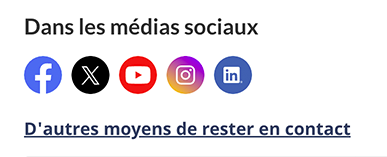
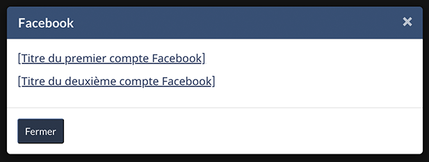

<strong>Dernière mise à jour</strong>&nbsp;: {{ page.dateModified }}

La configuration de conception des chaînes de médias sociaux fournit des liens vers les comptes de médias sociaux officiels du gouvernement du Canada (GC).

<section>
  <h2>Sur cette page</h2>
  <ul>
    <li><a href="#utiliser">Quand l’utiliser</a></li>
    <li><a href="#eviter">Quoi éviter</a></li>
    <li><a href="#contenu">Contenu et conception</a></li>
    <li><a href="#œuvre">Comment procéder à la mise en œuvre</a></li>
    <li><a href="#recherche">Recherche et justification</a></li>
    <li><a href="#changements">Derniers changements</a></li>
  </ul>
</section>
<section id="utiliser">
  <h2>Quand l’utiliser</h2>
  
Utilisez la configuration de conception des chaînes de médias sociaux sur les pages afin de promouvoir les comptes de médias sociaux officiels du gouvernement du Canada (GC) qui sont pertinents par rapport à la page.

  
Exemples&nbsp;:

  <ul>
    <li>Page d’accueil institutionnelle</li>
    <li>Blogue</li>
    <li>Page de sujet</li>
  </ul>
</section>
<section id="eviter">
  <h2>Quoi éviter</h2>
  
N’utilisez pas la configuration de conception des chaînes de médias sociaux lorsque le flux d’un utilisateur ne doit pas être interrompu, par exemple pendant un processus transactionnel.

</section>
<section id="contenu">
  <h2>Contenu et conception</h2>
  
Trouvez des spécifications de contenu et de conception et des exemples visuels.

  <h3>Spécifications de contenu</h3>
  
La configuration de conception des chaînes de médias sociaux est composée du titre «&nbsp;Sur les médias sociaux&nbsp;» et d’icônes renvoyant aux comptes de médias sociaux officiels du gouvernement du Canada.

  
Les comptes mentionnés dans la configuration de conception doivent être entièrement conformes à la <a href="https://www.tbs-sct.canada.ca/pol/doc-fra.aspx?id=30682">Directive sur la gestion des communications.</a>

  
Afficher un maximum de sept (7) icônes alignées dans une colonne verticale ou une rangée horizontale&nbsp;:

  <ul>
    <li>L’affichage vertical comprend une étiquette à côté de chaque icône.</li>
    <li>L’affichage horizontal ne comprend que les icônes.</li>
  </ul>
  <h4>Lien optionnel</h4>
  
Vous pouvez ajouter un lien intitulé « D’autres moyens de rester en contact » si vous souhaitez créer un lien vers d’autres comptes de médias sociaux ou d’autres plateformes de communication ministérielles (p. ex., balados, magazines externes, etc.). Le lien doit mener vers une page qui répertorie tous vos comptes de médias sociaux et les autres moyens de communiquer avec le ministère ou de le suivre.

  
S’il y a plus d’un compte pour une plateforme&nbsp;:

  <ul>
    <li>Indiquez le nom de la plateforme à côté de son icône (affichage vertical seulement).</li>
    <li>Utilisez une fenêtre contextuelle modale pour afficher le nom de chaque compte sur cette plateforme.
      <ul>
        <li>La fenêtre contextuelle modale peut avoir jusqu’à huit (8) liens de texte.</li>
        <li>Utilisez les noms des comptes en tant qu’étiquettes.</li>
      </ul>
    </li>
  </ul>
  
Placez les chaînes de médias sociaux après la tâche et le contenu de navigation.

  <h3>Spécifications de conception</h3>
  <ul>
    <li>Spécifications de conception de la fenêtre contextuelle modale
      <ul>
        <li>Couleur de fond de l’en-tête modal&nbsp;: #2e5274</li>
        <li>Titre&nbsp;: H2, Lato, le style de la taille de police est de 1.15 em</li>
      </ul>
    </li>
    <li>Liens&nbsp;:
      <ul>
        <li>Police&nbsp;: Noto Sans, 16 px, <a href="https://conception.canada.ca/styles/couleurs.html">couleurs de lien standards</a></li>
      </ul>
    </li>
    <li>Le style du bouton est celui d’un bouton principal.</li>
     <li>Lien « D’autres moyens de rester en contact »&nbsp;:
        <ul>
            <li>Police&nbsp;: Noto Sans, 17 px, <a href="https://conception.canada.ca/styles/couleurs.html">couleurs de lien standards</a></li>
            <li>Aligné à gauche</li>
            <li>Placé sous la liste des icônes</li>
        </ul>
      </li>
  </ul>
  
Les classes de lien pour les médias sociaux et les icônes associés sont disponibles.

  

    

      

        <table class="table table-striped" id="social-media" aria-live="polite">
          <caption class="wb-inv">
          Classes des liens des médias sociaux et les icones associés
          </caption>
          <thead>
            <tr>
              <th class="col-md-4">Plateforme de médias sociaux</th>
              <th class="col-md-4">Classe CSS</th>
              <th class="col-md-4">Lien vers le fichier SVG (GitHub)</th>
            </tr>
          </thead>
          <tbody>
            <tr>
              <td>Facebook</td>
              <td>
facebook
</td>
              <td class="text-center">

                  <ul class="list-inline">
                    <li><a href="https://github.com/wet-boew/GCWeb/blob/master/components/gc-follow-us/assets/facebook.svg" class="facebook">Facebook</a></li>
                  </ul>
                
</td>
            </tr>
            <tr>
              <td>X</td>
              <td>
twitter
</td>
              <td class="text-center">

                  <ul class="list-inline">
                    <li><a href="https://github.com/wet-boew/GCWeb/blob/master/components/gc-follow-us/assets/twitter.svg" class="twitter">X</a></li>
                  </ul>
                
</td>
            </tr>
            <tr>
              <td>YouTube</td>
              <td>
youtube
</td>
              <td class="text-center">

                  <ul class="list-inline">
                    <li><a href="https://github.com/wet-boew/GCWeb/blob/master/components/gc-follow-us/assets/youtube.svg" class="youtube">YouTube</a></li>
                  </ul>
                
</td>
            </tr>
            <tr>
              <td>Instagram</td>
              <td>instagram</td>
              <td class="text-center">

                  <ul class="list-inline">
                    <li><a href="https://github.com/wet-boew/GCWeb/blob/master/components/gc-follow-us/assets/instagram.svg" class="instagram">Instagram</a></li>
                  </ul>
                
</td>
            </tr>
            <tr>
              <td>LinkedIn</td>
              <td>
linkedin
</td>
              <td class="text-center">

                  <ul class="list-inline">
                    <li><a href="https://github.com/wet-boew/GCWeb/blob/master/components/gc-follow-us/assets/linkedin.svg" class="linkedin">LinkedIn</a></li>
                  </ul>
                
</td>
            </tr>
          </tbody>
        </table>
      

    

  

  <h3>Exemples visuels</h3>
  

    <figure class="mrgn-tp-md mrgn-bttm-lg">
      <figcaption><b>Chaînes de médias sociaux (affichage vertical avec étiquettes) — grand écran</b></figcaption>
      
      

        
Description de l’image&nbsp;: chaîne de médias sociaux (affichage horizontal) - grand écran

        
Les liens vers les chaînes de médias sociaux apparaissent avec le titre «&nbsp;Sur les médias sociaux&nbsp;». On trouve sous le titre une liste horizontale avec les icônes et les étiquettes associées&nbsp;:

        <ul>
          <li>Icône de Facebook suivie du texte de l’espace réservé NomPageFacebook</li>
          <li>Icône de X suivie du texte de l’espace réservé @CompteX</li>
          <li>Icône de YouTube suivie du texte de l’espace réservé NomYouTube</li>
          <li>Icône d’Instagram suivie du texte de l’espace réservé NomInstagram</li>
          <li>Icône de LinkedIn suivie du texte de l’espace réservé NomLinkedIn</li>
        </ul>
      

    </figure>
  

  

    <figure class="mrgn-tp-md mrgn-bttm-lg">
      <figcaption><b>Chaînes de médias sociaux (affichage vertical avec étiquettes) — grand écran</b></figcaption>
      
      

        
Description de l’image&nbsp;: chaîne de médias sociaux (affichage horizontal) - grand écran

        
Les liens vers les chaînes de médias sociaux apparaissent avec le titre «&nbsp;Sur les médias sociaux&nbsp;».  On trouve sous le titre une liste horizontale avec les icônes associées, mais sans les étiquettes&nbsp;:

        <ul>
          <li>Facebook</li>
          <li>X</li>
          <li>Youtube</li>
          <li>Instagram</li>
          <li>LinkedIn</li>
        </ul>
      

    </figure>
  

  

    <figure class="mrgn-tp-md mrgn-bttm-lg">
      <figcaption><b>Chaînes de médias sociaux (affichage verticale avec étiquettes et lien « D’autres moyens de rester en contact ») – petit écran</b></figcaption>
      
      

        
Description de l’image&nbsp;: chaînes de médias sociaux (affichage verticale avec étiquettes et lien « D’autres moyens de rester en contact ») - petit écran

        
Les liens vers les chaînes de médias sociaux apparaissent avec le titre «&nbsp;Sur les médias sociaux&nbsp;». Les liens sont organisés dans une liste à puces avec les icônes et les étiquettes associées&nbsp;:

        <ul>
          <li>Icône de Facebook suivie du texte de l’espace réservé NomPageFacebook</li>
          <li>Icône de X suivie du texte de l’espace réservé @CompteX</li>
          <li>Icône de YouTube suivie du texte de l’espace réservé NomYouTube</li>
          <li>Icône d’Instagram suivie du texte de l’espace réservé NomInstagram</li>
          <li>Icône de LinkedIn suivie du texte de l’espace réservé NomLinkedIn</li>
        </ul>
        
Sous les icônes se trouve un lien intitulé&nbsp;: D’autres moyens de rester en contact

      

    </figure>
  

    

    <figure class="mrgn-tp-md mrgn-bttm-lg">
      <figcaption><b>Chaînes de médias sociaux (affichage horizontale avec étiquettes et lien « D’autres moyens de rester en contact ») – petit écran</b></figcaption>
      
      

        
Description de l’image&nbsp;: chaînes de médias sociaux (affichage horizontale avec étiquettes et lien « D’autres moyens de rester en contact ») - petit écran

        
Les liens vers les chaînes de médias sociaux apparaissent avec le titre «&nbsp;Sur les médias sociaux&nbsp;». Les liens sont organisés dans une liste à puces avec les icônes et les étiquettes associées&nbsp;:

        <ul>
          <li>Icône de Facebook suivie du texte de l’espace réservé NomPageFacebook</li>
          <li>Icône de X suivie du texte de l’espace réservé @CompteX</li>
          <li>Icône de YouTube suivie du texte de l’espace réservé NomYouTube</li>
          <li>Icône d’Instagram suivie du texte de l’espace réservé NomInstagram</li>
          <li>Icône de LinkedIn suivie du texte de l’espace réservé NomLinkedIn</li>
        </ul>
        
Sous les icônes se trouve un lien intitulé&nbsp;: D’autres moyens de rester en contact

      

    </figure>
  

  

    <figure class="mrgn-tp-md mrgn-bttm-lg">
      <figcaption><b>Fenêtre contextuelle modale de médias sociaux pour comptes multiples</b></figcaption>
      
      

        
Description de l’image&nbsp;: fenêtre contextuelle modale de médias sociaux pour comptes multiples

        
Une fenêtre contextuelle superposée pour afficher de multiples comptes Facebook. Un titre indique la plateforme de médias sociaux, tandis que deux liens intitulés [Titre du premier compte Facebook] et [Titre du deuxième compte Facebook] se trouvent en dessous. La fenêtre modale est dotée d’un bouton de fermeture et d’un X dans le coin pour fermer la composante modale.

      

    </figure>
  

</section>
<section id="œuvre">
  <h2>Comment procéder à la mise en œuvre</h2>
  
Trouvez des exemples pratiques et de code pour mettre en œuvre la configuration de conception des chaînes de médias sociaux.

  <h3>Référence pour la mise en œuvre du thème GCWeb (BOEW)</h3>
  
La référence à l’implémentation comprend la façon de configurer chaque élément du système de conception.

  <ul>
    <li><a href="https://wet-boew.github.io/GCWeb/components/gc-follow-us/gc-follow-us-fr.html">Chaînes de médias sociaux de GCWeb (BOEW)</a></li>
    <li><a href="https://wet-boew.github.io/GCWeb/docs/implementing-fr.html">Guide de mise en œuvre rapide – thème GCWeb</a></li>
  </ul>
  <h3>Mises en œuvre</h3>
  
Déterminez ce qui convient le mieux au type de page que vous créez.

  

    

      

        

          

            
<strong>GC-AEM</strong>

            
Pour Adobe Experience Manager (AEM) du gouvernement du Canada (GC)&nbsp;:

            <ul>
              <li><a href="https://www.gcpedia.gc.ca/wiki/Documentation_d%27AEM_sp%C3%A9cifique_au_GC_6.5">Documentation d’AEM et des services Web gérés (lien GCpédia – accessible uniquement sur le réseau du gouvernement du Canada)</a></li>
            </ul>
          

          

            
<strong>SGDC</strong>

            
Pour la Solution de gabarits à déploiement centralisé (SGDC)&nbsp;:

            <ul>
              <li><a href="https://cenw-wscoe.github.io/sgdc-cdts/docs/index-fr.html">Documentation de la SGDC</a></li>
            </ul>
          

          

            
<strong>Drupal WxT</strong>

            
Pour Drupal WxT&nbsp;:

            <ul>
              <li><a href="https://drupalwxt.github.io/">Documentation de Drupal WxT (en anglais seulement)</a></li>
            </ul>
          

        

      

    

  

</section>
<section id="recherche">
  <h2>Recherche et justification</h2>
  
Consultez la justification stratégique.

  <h3>Justification stratégique</h3>
  
Le contenu de la section des chaînes de médias sociaux doit suivre la <a href="https://www.tbs-sct.canada.ca/pol/doc-fra.aspx?id=30682">Directive sur la gestion des communications</a>.

  
Cette configuration de conception est facultative pour les modèles obligatoires suivants&nbsp;:

  <ul>
    <li><a href="https://conception.canada.ca/modeles-obligatoire/pages-profil-institutionnel.html">Page d’accueil institutionnelle</a></li>
    <li><a href="https://conception.canada.ca/modeles-obligatoire/theme-sujet.html">Page de thème et de sujet</a></li>
    <li><a href="https://conception.canada.ca/modeles-obligatoire/pages-profil-ministres.html">Pages ministérielles</a></li>
  </ul>
</section>
<section id="changements">
  <h2>Derniers changements</h2>
  <dl class="dl-horizontal">
     <dt>
      <time datetime="2024-04-03" class="link-muted">2024-09-13</time>
      </dt>
      <dd>Mise à jour de la configuration pour y ajouter le lien optionnel « D’autres moyens de rester en contact ».</dd>
    <dt>
      <time datetime="2024-04-03" class="link-muted">2024-04-03</time>
    </dt>
    <dd>Mise à jour de l’orientation pour y inclure les spécifications de contenu et de conception, des exemples visuels et une orientation sur la mise en œuvre.</dd>
  </dl>
</section>

