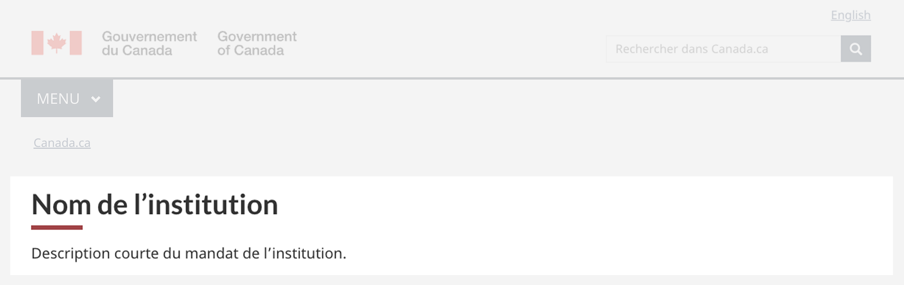
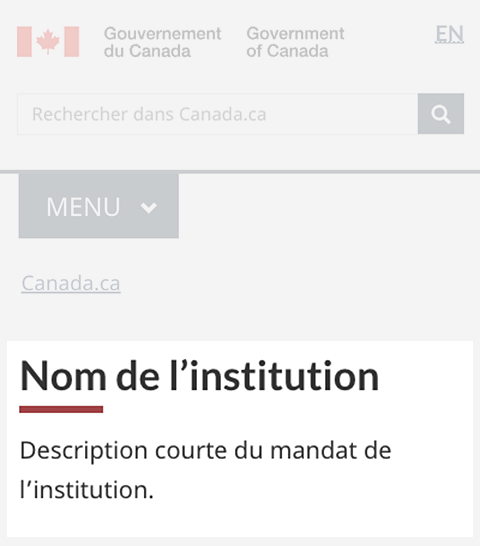

<strong>Dernière mise à jour</strong>&nbsp;: {{ page.dateModified }}

La configuration de conception du bloc d’introduction introduit le contenu d’une page de renvoi.

<section>
    <h2>Sur cette page</h2>
    <ul>
        <li><a href="#use">Quand l’utiliser</a></li>
        <li><a href="#avoid">Quoi éviter</a></li>
        <li><a href="#design">Contenu et conception</a></li>
        <li><a href="#implement">Comment procéder à la mise en œuvre</a></li>
        <li><a href="#research">Recherche et justification</a></li>
        <li><a href="#latest">Derniers changements</a></li>
    </ul>
</section>
<section>
    <h2 id="use">Quand l’utiliser</h2>
    
La configuration de conception du bloc d’introduction est un élément obligatoire pour les pages d’accueil institutionnelles et les pages de sujet. Elle est facultative pour les autres pages de renvoi.

</section>
<section>
    <h2 id="avoid">Quoi éviter</h2>
    
Ne l’utilisez pas sur les pages de destination lorsque les gens tentent d’accomplir une tâche.

</section>
<section>
    <h2 id="design">Contenu et conception</h2>
    
Trouvez des spécifications de contenu et de conception et des exemples visuels.

    <h3>Spécifications de contenu</h3>
    
La configuration de conception du bloc d’introduction consiste en ce qui suit&nbsp;:

    <ul>
        <li><a href="#titre">titre</a></li>
        <li><a href="#desc-courte">description courte</a></li>
    </ul>
    
Elle peut également inclure ces éléments&nbsp;:

    <ul>
        <li><a href="#image">image</a></li>
        <li><a href="#super-task">bouton de super-tâche </a></li>
    </ul>
    <h4 id="titre">Titre</h4>
    
Le titre de la page doit être descriptif et unique, mais bref.

    
N’utilisez pas d’acronymes ou d’abréviations dans le titre.

    <h4 id="desc-courte">Description courte</h4>
    
Le texte doit être court et concis, idéalement sur une ou deux lignes.

    <ul>
        <li>Environ 145 caractères avec les espaces</li>
    </ul>
    
Rédigez dans un langage clair et simple.

    <h4 id="image">Image</h4>
    
N’utilisez que des images décoratives, car l’image est cachée sur les petits écrans.

    
N’appliquez pas de lien à l’image; utilisez plutôt la configuration de conception d’un lien en vedette.

    <ul>
        <li><a href="./lien-vedette.html">Configuration de conception d’un lien en vedette</a></li>
    </ul>
    
Limitez l’usage du texte dans les images.

    <ul>
        <li><a href="https://www.canada.ca/fr/secretariat-conseil-tresor/services/communications-gouvernementales/guide-redaction-contenu-canada.html">Consultez le Guide de rédaction du contenu du site Canada.ca</a> pour obtenir d’autres conseils sur les images.</li>
    </ul>
    <h4 id="super-task">Bouton de super-tâche</h4>
    
N’incluez un bouton de super-tâche que s’il y a une tâche précise qui représente au moins le tiers du taux de clics provenant de la page.

    
Découvrez comment utiliser un bouton de super-tâche&nbsp;:

    <ul>
        <li><a href="https://conception.canada.ca/configurations-conception-communes/boutons.html">Boutons - Configuration de conception de Canada.ca</a></li>
    </ul>
    <h3>Spécifications de conception</h3>
    <ul>
        <li>
            Titre et description courte
            <ul>
                <li>Le titre utilise la classe H1, et la description courte utilise le texte du corps.</li>
                <li>Utilisez les <a href="https://conception.canada.ca/styles/typographie.html">styles typographiques standards</a>.</li>
            </ul>
        </li>
        <li>
            Image
            <ul>
                <li>1200&nbsp;px sur 726&nbsp;px</li>
                <li>Rapport de l’image : 1,65:1</li>
                <li>Visible sur les grands écrans, mais caché sur les moyens et les petits écrans</li>
                <li>Traité comme une image d’arrière-plan et positionné à droite</li>
            </ul>
        </li>
        <li>
            Bouton de super-tâche
            <ul>
                <li><a href="https://conception.canada.ca/configurations-conception-communes/boutons.html#action">Voir les détails sur le bouton de super-tâche</a></li>
            </ul>
        </li>
    </ul>
    <h4>Accessibilité</h4>
    <ul>
        <li>Si vous superposez du texte à une image, veillez à ce que le rapport de contraste soit d’au moins 4,5:1.</li>
    </ul>
    <h3>Exemples visuels</h3>
    

        <figure class="mrgn-tp-md mrgn-bttm-lg">
            <figcaption><b>Bloc d’introduction – grand écran</b></figcaption>
            
            

                
Description de l’image&nbsp;: bloc d’introduction - grand écran

                
Le bloc d’introduction apparaît sous l’en-tête général et le fil d’Ariane de Canada.ca. Il se compose d’un titre h1 pour le nom de l’institution et d’une description courte du mandat de l’institution.

            

        </figure>
    

    

        <figure class="mrgn-tp-md mrgn-bttm-lg">
            <figcaption><b>Bloc d’introduction – petit écran</b></figcaption>
            
            

                
Description de l’image&nbsp;: bloc d’introduction - petit écran

                
Le bloc d’introduction apparaît sous l’en-tête général et le fil d’Ariane de Canada.ca. Il se compose d’un titre h1 pour le nom de l’institution et d’une description courte du mandat de l’institution.

            

        </figure>
    

</section>
<section>
    <h2 id="implement">Comment procéder à la mise en œuvre</h2>
    
Trouvez des exemples pratiques et du code pour mettre en œuvre la configuration de conception du bloc d’introduction.

    <h3>Référence pour la mise en œuvre du thème GCWeb (BOEW)</h3>
    
La référence à l’implémentation comprend la façon de configurer les éléments du système de conception.

    <ul>
        <li><a href="">Bloc d’introduction de GCWeb (BOEW)</a></li>
        <li><a href="https://wet-boew.github.io/GCWeb/docs/implementing-fr.html">Guide de mise en œuvre rapide – thème GCWeb</a></li>
    </ul>
    <h3>Mises en œuvre</h3>
    
Déterminez ce qui convient le mieux au type de page que vous créez.

    

        

            

                

                    

                        
<strong>GC-AEM</strong>

                        
Pour Adobe Experience Manager (AEM) du gouvernement du Canada (GC)&nbsp;:

                        <ul>
                            <li><a href="https://www.gcpedia.gc.ca/wiki/Documentation_d%27AEM_sp%C3%A9cifique_au_GC_6.5">Documentation d’AEM et des services Web gérés (lien GCpédia – accessible uniquement sur le réseau du gouvernement du Canada)</a></li>
                        </ul>
                    

                    

                        
<strong>SGDC</strong>

                        
Pour la Solution de gabarits à déploiement centralisé (SGDC)&nbsp;:

                        <ul>
                            <li><a href="https://cenw-wscoe.github.io/sgdc-cdts/docs/index-fr.html">Documentation de la SGDC</a></li>
                        </ul>
                    

                    

                        
<strong>Drupal WxT</strong>

                        
Pour Drupal WxT&nbsp;:

                        <ul>
                            <li><a href="https://drupalwxt.github.io/">Documentation de Drupal WxT</a> (en anglais seulement)</li>
                        </ul>
                    

                

            

        

    

</section>
<section>
    <h2 id="research">Recherche et justification</h2>
    
Consultez les conclusions de la recherche et la justification de la politique.

    <h3>Constatations découlant de la recherche</h3>
    
<a href="https://blogue.canada.ca/resumes-recherche/arc-contactez-nous-resume-recherche.html">Résumé de recherche : Communiquer avec l’ARC</a>

    
L’Agence du revenu du Canada (ARC) et le Bureau de la transformation numérique ont élaboré le bloc d’introduction dans le cadre du projet d’optimisation des contacts avec l’ARC.

    

        Nous avons constaté que la configuration de conception du bloc d’introduction était utile sur les pages d’accueil institutionnelles, en particulier dans les situations où un bouton de super-tâche est nécessaire. Consultez le résumé de recherche pour en savoir plus sur d’autres aspects du projet.
    

    <h3>Justification stratégique</h3>
    
La configuration de conception du bloc d’introduction est requise dans les modèles obligatoires suivants&nbsp;:

    <ul>
        <li><a href="https://conception.canada.ca/modeles-obligatoire/pages-profil-institutionnel.html">Modèle de page d’accueil institutionnelle</a></li>
        <li><a href="https://conception.canada.ca/modeles-obligatoire/theme-sujet.html">Modèle de page de thème et de sujet</a></li>
    </ul>
</section>
<section>
    <h2 id="latest">Derniers changements</h2>
    <dl class="dl-horizontal">
        <dt>
            <time datetime="2023-08-20" class="link-muted">2023-08-20</time>
        </dt>
        <dd>Mise à jour de l’orientation pour y inclure les spécifications de contenu et de conception, des exemples visuels et une orientation sur la mise en œuvre.</dd>
    </dl>
</section>
