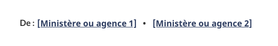

Utilisez la configuration Collaborateurs pour mettre en évidence les institutions ou organismes ayant contribué au contenu d’une page Web.

<section>
    <h2>Sur cette page&nbsp;:</h2>
    <ul>
        <li><a href="#use">Quand utiliser cette configuration</a></li>
        <li><a href="#design">Contenu et conception</a></li>
        <li><a href="#implement">Comment procéder à la mise en œuvre</a></li>
    </ul>
</section>
<section>
    <h2 id="use">
        Quand utiliser cette configuration
    </h2>
    

        Utilisez la configuration Collaborateurs pour fournir des liens vers les institutions, les organismes ou les entités similaires qui sont chargés du contenu de la page ou qui y contribuent. Vous pouvez lister un ou plusieurs collaborateurs.
    

</section>
<section>
    <h2 id="design">
        Contenu et conception 
    </h2>
    
Trouvez ici des spécifications sur le contenu et la conception ainsi que des exemples visuels.

    <h3>Spécifications de contenu</h3>
    
Le lien vers l’institution ou l’organisme est précédé par le mot «&nbsp;De&nbsp;:&nbsp;».

    
Énumérez les institutions ou organismes contributeurs. Les liens doivent diriger vers la page d’accueil principale de l’organisme. Si possible, utilisez&nbsp;:

    <ul>
        <li>
            la page d’accueil institutionnelle
        </li>
        <li>
            la page de profil de partenariat ou d’entente de collaboration
        </li>
    </ul>
    
Le texte de l’hyperlien doit correspondre au nom apparaissant sur la page liée.

    <h3>Spécifications de conception</h3>
    
La configuration Collaborateurs doit être placée en dessous de tout le contenu de la page, mais au-dessus du champ «&nbsp;Date de modification &nbsp;».

    
N’alignez pas ce bloc avec d’autres blocs de texte ou d’autres éléments de mise en page; il doit être seul.

    
Justifiez à gauche le titre et les liens.

    
Utilisez les styles standard de paragraphe, de titre et de lien.

    
Le titre est un titre H2 dont la taille de police est : 87 % (ou 17 px).

    
Les liens se trouvent à droite du titre H2 et sont codés dans une liste horizontale. Le premier élément de la liste n’est pas stylisé (pas de puce).

    <h3>Exemple visuel</h3>
    

        <figure class="mrgn-tp-md mrgn-bttm-lg">
            <figcaption><b>Configuration collaborateurs</b></figcaption>
            
            

                
Description de l’image&nbsp;: collaborateurs

                

                    Le titre « De : » est justifié à gauche. Deux liens fictifs apparaissent dans une liste alignée horizontalement avec le titre. Le texte du premier lien fictif est [Ministère ou organisme 1]. Il est suivi d’une puce, puis d’un autre lien fictif intitulé [Ministère ou organisme 2]
                

            

        </figure>
    

</section>
<section>
    <h2 id="implement">Comment procéder à la mise en œuvre</h2>
    
Trouvez des exemples pratiques et du code pour mettre en œuvre la configuration de conception du bloc d’introduction.

    <h3>Référence pour la mise en œuvre du thème GCWeb (BOEW)</h3>
    <ul>
        <li><a href="https://wet-boew.github.io/GCWeb/components/gc-contributors/gc-contributors-fr.html">Collaborateurs - GCWeb</a></li>
    </ul>
</section>
