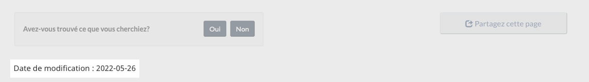

 

  <ul class="toc lst-spcd col-md-12">
   <li class="col-md-4 col-sm-6">
    <a class="list-group-item" href="pied-page-contenu.html">
     Pied de page de la zone du contenu
    </a>
   </li>
   <li class="col-md-4 col-sm-6">
    <a class="list-group-item" href="signaler-probleme.html">
     Signaler un problème sur cette page
    </a>
   </li>
   <li class="col-md-4 col-sm-6">
    <a class="list-group-item" href="partagez-page.html">
     Partagez cette page
    </a>
   </li>
   <li class="col-md-4 col-sm-6">
    <a class="list-group-item active">
     Date de modification
    </a>
   </li>
  </ul>
 

<section>
 

  
   Obligatoire sur toutes les pages
  
 

 

  La composante de date de modification indique la date de la dernière mise à jour d'une page Web.
 

 <figure>
  <figcaption>
   <b>
    Date de modification
   </b>
  </figcaption>
  
 </figure>
</section>

<section>
 <h2>
  Objectifs
 </h2>
 

  Utilisez la composante « Date de modification » pour fournir à aux gens la date où le contenu a été mis à jour en dernier.
 

</section>

<section>
 <h2>
  Quand utiliser la date de modification
 </h2>
 

  La date de modification est obligatoire sur toutes les pages. Dans les applications, elle peut être remplacée par une numéro de version. Pour en savoir plus, allez à
  <a href="{{ site.url }}/specifications/elements-obligatoires.html#entete-piedpage">
   Éléments obligatoires du système de conception</a>.
 

</section>

<section>
 <h2>
  Quand mettre à jour la date de modification
 </h2>
 

  Cette composante :
 

 <ul>
  <li>
   ne devrait généralement être mise à jour que lorsque d’importants changements au contenu se produisent;
  </li>
  <li>
   ne devrait généralement pas être mise à jour lors de corrections aux erreurs typographiques ou de changements au code HTML sous-jacent;
  </li>
  <li>
   peut être mise à jour manuellement pour signifier que le contenu a été entièrement revu et qu’il est encore valide à cette date.
  </li>
 </ul>
 

  Dans les scénarios transactionnels, il est possible de remplacer la composante par un « Numéro de version », au besoin;
 

</section>

<section>
 <h2>
  Comment mettre en œuvre la date de modification
 </h2>
 <ul>
  <li>
   Cette composante commence toujours par les mots « Date de modification : » suivis d’une date.
  </li>
  <li>
   La date s’affiche à l’aide de la méthode numérique commune, c’est-à-dire 2016-10-04.
  </li>
  <li>
   Placement&nbsp;: alignée à gauche, sous le contenu général. Si elle est utilisée conjointement avec la composante, « Outil de rétroaction sur la page », elle est placée après.
  </li>
 </ul>
</section>

  

    

      

        

          
<strong>AEM-GC</strong>

          
Pour Adobe Experience Manager (AEM) du gouvernement du Canada (GC)&nbsp;:

          <ul>
            <li><a href="https://www.gcpedia.gc.ca/wiki/Documentation_d%27AEM_sp%C3%A9cifique_au_GC_6.5">Documentation d’AEM et des services Web gérés (lien GCpédia – uniquement accessible sur le réseau du gouvernement du Canada)</a></li>
          </ul>
        

        

          
<strong>Système de design GC</strong>

          
Pour le Système de design GC&nbsp;:

          <ul>
            <li><a href="https://systeme-design.alpha.canada.ca/fr/composants/date-de-modification/">Conseils pour le composant de date de modification</a></li>
          </ul>
        

        

          
<strong>SGDC</strong>

          
Pour la Solution de gabarits à déploiement centralisé (SGDC)&nbsp;:

          <ul>
            <li><a href="https://cenw-wscoe.github.io/sgdc-cdts/docs/index-fr.html">Documentation de la SGDC</a></li>
          </ul>
        

        

          
<strong>Drupal</strong>

          
Pour Drupal&nbsp;:

          <ul>
            <li><a href="https://drupalwxt.github.io/">Documentation de Drupal WxT (en anglais seulement)</a></li>
            <li><a href="https://www.drupal.org/project/gcds">Drupal : Système de design GC (en anglais seulement)</a></li>
          </ul>
        

      

    

  

