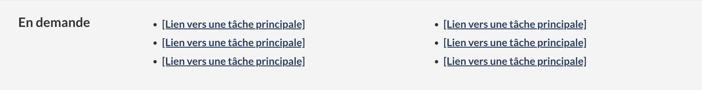

<<<<<<< refs/remotes/origin/master

=======

<strong>Dernière mise à jour</strong>&nbsp;: {{ page.dateModified }}

<label class="label label-info">Facultatif</label>

Le modèle en demande comprend les principales tâches des pages d’accueil qui offrent de nombreux choix. Les principales tâches sont les choses principales que les utilisateurs essaient de faire dans un contexte donné. 

<<<<<<< refs/remotes/origin/master

>>>>>>> Update en-demande.md
=======

>>>>>>> Update en-demande.md
<section>
  <h2>Sur cette page</h2>
  <ul>
    <li><a href="#utiliser">Quand l’utiliser</a></li>
    <li><a href="#eviter">Quoi éviter</a></li>
    <li><a href="#contenu">Contenu et conception</a></li>
    <li><a href="#œuvre">Comment procéder à la mise en œuvre</a></li>
    <li><a href="#recherche">Recherche et justification</a></li>
    <li><a href="#changements">Derniers changements</a></li>
  </ul>
</section>
<section id="utiliser">
  <h2>Quand l’utiliser</h2>
  
Utilisez ce modèle sur les pages de navigation où les utilisateurs essaient de trouver par où commencer leur tâche, comme une page de sujet ou une page d’accueil institutionnelle.

</section>
<section id="eviter">
  <h2>Quoi éviter</h2>
  
N’utilisez pas ce modèle lorsque vous voulez que les gens restent sur la page et accomplissent leur tâche.

  
Ne l’utilisez pas pour promouvoir les préférences ministérielles. Utilisez des données et des preuves pour déterminer les principales tâches auxquelles les personnes essaient d’accéder.

  
Ne présentez pas différentes tâches principales sur les versions anglaise et française de la page d’accueil. Les principales tâches doivent être les mêmes dans les deux langues.

</section>
<section id="contenu">
  <h2>Contenu et conception</h2>
  
Trouver des spécifications de contenu et de conception et des exemples visuels.

  <h3>Spécifications de contenu</h3>
  
L’en-tête de section est &laquo;&nbsp;En demande&nbsp;&raquo; en français et &laquo;&nbsp;Most requested&nbsp;&raquo; en anglais.

  
Incluez des liens vers les principales tâches pertinentes – utilisez des preuves et des données pour déterminer quels liens doivent apparaître.

  
Organisez les liens dans une liste à puces.

  
Faites en sorte que les puces soient visibles pour que les liens soient faciles à analyser.

  
Maximum recommandé de huit liens.

  
Utilisez des étiquettes de liens en langage clair et simple, axées sur les tâches (évitez les noms ou les titres de programmes qui pourraient ne pas être connus des gens).

  
Sur les grands écrans&nbsp;:

  <ul>
    <li>l’en-tête de section apparaît à gauche des liens;</li>
    <li>la liste des liens apparaît sur deux colonnes maximum.</li>
  </ul>
  
Sur les petits écrans&nbsp;:

  <ul>
    <li>l’en-tête de section apparaît au-dessus des liens;</li>
    <li>la liste des liens apparaît dans une seule colonne.</li>
  </ul>
  <h3>Spécifications de conception</h3>
  <ul>
    <li>Mise en page&nbsp;:
      <ul>
        <li>Colonnes&nbsp;: deux colonnes de puces sur les écrans grands et moyens, une seule colonne de puces sur les petits écrans (si vous n’avez que deux ou trois liens, faites une seule colonne pour toutes les tailles d’écran). </li>
        <li>Ordre des onglets&nbsp;: de gauche à droite, puis de haut en bas.</li>
      </ul>
    </li>
    <li> Style&nbsp;:
      <ul>
        <li>Couleur de fond&nbsp;: #f5f5f5</li>
        <li>Famille de police&nbsp;: Noto Sans</li>
        <li>Épaisseur de la police&nbsp;: gras</li>
        <li>Titre: H2, Lato&nbsp;: 1,2&nbsp;em</li>
        <li>Hauteur de ligne&nbsp;: 2&nbsp;em (la taille de base est 20&nbsp;px)</li>
        <li>Taille du texte&nbsp;: 87% (la taille de base est 20&nbsp;px)</li>
      </ul>
    </li>
  </ul>
  <h3>Exemples visuels</h3>
  

    <figure class="mrgn-tp-md mrgn-bttm-lg">
      <figcaption><b>En demande – grand écran</b></figcaption>
      
      

        
Description de l’image&nbsp;: en demande - grand écran

        
Les liens en demande apparaissent dans une bande horizontale avec l’en-tête de section &laquo;&nbsp;En demande&nbsp;&raquo;. Les liens sont organisés dans une liste à puces.

      

    </figure>
  

  

    <figure class="mrgn-tp-md mrgn-bttm-lg">
      <figcaption><b>En demande – petit écran</b></figcaption>
      
      

        
Description de l’image&nbsp;: en demande - petit écran

        
Les liens en demande apparaissent dans une liste à puces sous l’en-tête de section &laquo;&nbsp;En demande&nbsp;&raquo;.

      

    </figure>
  

</section>
<section id="œuvre">
  <h2>Comment procéder à la mise en œuvre</h2>
  
Trouvez des exemples pratiques et de code pour mettre en œuvre la configuration de conception en demande.

  <h3>Référence pour la mise en œuvre du thème GCWeb (BOEW)</h3>
  <ul>
    <li><a href="https://wet-boew.github.io/GCWeb/components/gc-most-requested/gc-most-requested-fr.html">En demande</a></li>
  </ul>
  <h3>Mises en œuvre</h3>
  
Déterminez ce qui convient le mieux au type de page que vous créez.

  

    

      

        

          

            
<strong>GC-AEM</strong>

            
Pour Adobe Experience Manager (AEM) du gouvernement du Canada&nbsp;:

            <ul>
              <li><a href="https://www.gcpedia.gc.ca/wiki/Documentation_d%27AEM_sp%C3%A9cifique_au_GC_6.5">Documentation d’AEM et des services Web gérés (lien GCpédia - accessible uniquement sur le réseau du gouvernement du Canada)</a></li>
            </ul>
          

          

            
<strong>SGDC</strong>

            
Pour la Solution de gabarits à déploiement centralisé (SGDC)&nbsp;:

            <ul>
              <li><a href="https://cenw-wscoe.github.io/sgdc-cdts/docs/index-fr.html">Documentation relative à la SGDC</a></li>
            </ul>
          

          

            
<strong>Drupal WxT</strong>

            
Pour Drupal WxT&nbsp;:

            <ul>
              <li><a href="https://drupalwxt.github.io/">Documentation relative à Drupal WxT</a> (en anglais seulement) </li>
            </ul>
          

        

      

    

  

</section>
<section id="recherche">
  <h2>Recherche et justification</h2>
  <h3>Constatations découlant de la recherche</h3>
  
L’approche par bandes de la configuration de conception en demande a été testée avec succès sur la page d’accueil de Canada.ca en 2018.

  
Dans le cadre du projet Communiquez avec l’Agence du revenu du Canada (ARC) en 2019, l’approche par bandes a été testée avec succès sur un prototype de la page d’accueil institutionnelle de l’ARC.

  
L’utilité des liens en demande pour les pages de navigation a été reconfirmée dans le cadre du projet Orientation en 2022.

  <h3>Justification stratégique</h3>
  
La configuration de conception en demande est requise dans les modèles obligatoires suivants&nbsp;:

  <ul>
    <li><a href="/modeles-obligatoire/pages-profil-institutionnel.html">Page d’accueil institutionnelle</a></li>
    <li><a href="/modeles-obligatoire/theme-sujet.html">Page de thème et de sujet</a></li>
  </ul>
</section>
<section id="changements">
  <h2>Derniers changements</h2>
  <dl class="dl-horizontal">
    <dt>
      <time datetime="2023-09-21" class="link-muted">2023-09-21</time>
    </dt>
    <dd>Orientation mise à jour pour refléter le style à bandes de la configuration de conception en demande</dd>
    <dt>
      <time datetime="2018-12-19" class="link-muted">2018-12-19</time>
    </dt>
    <dd>Documenté le modèle en demande</dd>
  </dl>
</section>
