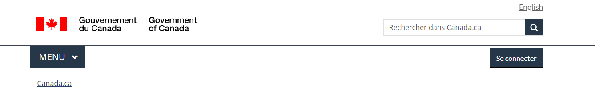
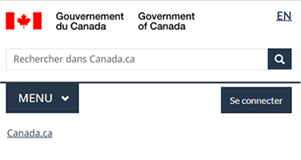
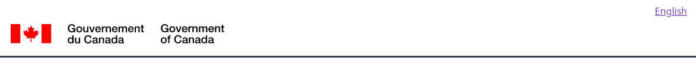
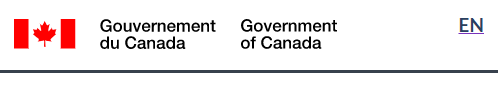
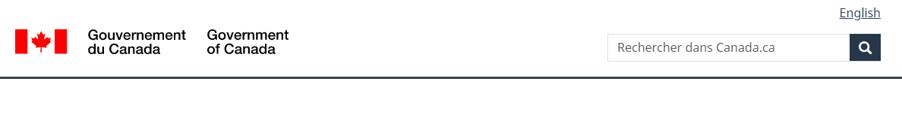
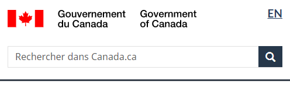

  

    

      <ul class="list-inline small mrgn-bttm-sm" id="list-inline-desktop-only">
        <li class="mrgn-rght-lg">Dernière mise à jour&nbsp;: AAAA-MM-JJ</li>
      </ul>
    

  

  
Obligatoire

  
L’en-tête global se trouve au haut de chaque page Web du gouvernement du Canada.

  
Le fait d’avoir le même en-tête global sur toutes les pages&nbsp;:

  <ul>
    <li>renforce la marque Canada.ca;</li>
    <li>favorise la confiance;</li>
    <li>offre une expérience unifiée de la présence du gouvernement du Canada sur le Web;</li>
    <li>permet de naviguer dans le large éventail de services et de renseignements proposés.</li>
  </ul>
  
<strong>Mise à jour de la conception en 2023</strong>&nbsp;: nous avons récemment mis à jour ce modèle dans le cadre d’une nouvelle stratégie de navigation issue du projet de recherche Orientation. Pour en savoir plus sur ce projet, consultez la section <a href="#recherche">Recherche et justification</a>.

  

    <figure class="mrgn-bttm-sm"></figure>
  

  <section>
    <h2>Sur cette page</h2>
    <ul>
      <li><a href="#quand">Quand l’utiliser</a></li>
      <li><a href="#eviter">Ce qu’il faut éviter</a></li>
      <li><a href="#contenu">Contenu et conception</a></li>
      <li><a href="#implementation">Comment procéder à la mise en œuvre</a></li>
      <li><a href="#recherche">Recherche et justification</a></li>
      <li><a href="#changements">Derniers changements</a></li>
    </ul>
  </section>
  <h2 id="quand">Quand l’utiliser</h2>
  
Inclure l’en-tête global sur toutes les pages Web du gouvernement du Canada. Déterminez les éléments d’en-tête à utiliser en fonction du type de page que vous créez.

  

    

      

        

          
<strong>Pages régulières</strong>

          
<strong>Les pages régulières</strong> sont celles que les gens peuvent abandonner sans perdre de données, déclencher des erreurs ou mettre fin à leur session.

          <h3>Exigences pour l’entête globale sur une page régulière</h3>
          

            <table class="table table-striped" id="mandatory-01" aria-live="polite">
              <caption class="wb-inv">
              Exigences pour l’entête globale sur une page régulière
              </caption>
              <thead>
                <tr>
                  <th class="col-md-8">Élément de l’en-tête</th>
                  <th class="col-md-4">Obligatoire</th>
                </tr>
              </thead>
              <tbody>
                <tr>
                  <td><a href="en-tete-general.html">Signature du gouvernement du Canada (liée à la page d'accueil de Canada.ca)</a></td>
                  <td> Obligatoire</td>
                </tr>
                <tr>
                  <td><a href="changer-langue.html">Lien pour changer de langue</a></td>
                  <td> Obligatoire</td>
                </tr>
                <tr>
                  <td><a href="connexion-contextuel.html">Champ de recherche du site</a></td>
                  <td> Obligatoire</td>
                </tr>
                <tr>
                  <td><a href="connexion-contextuel.html">Bouton &laquo;&nbsp;Se connecter&nbsp;&raquo;</a></td>
                  <td> Facultatif</td>
                </tr>
                <tr>
                  <td>Ligne de separation</td>
                  <td> Mandatory</td>
                </tr>
                <tr>
                  <td><a href="menu-site.html">Menu thématique</a></td>
                  <td> Mandatory (<a href="#smenu-note" id="smenu">Nota</a>)</td>
                </tr>
                <tr>
                  <td><a href="fil-ariane.html">Fil d'Ariane</a></td>
                  <td> Obligatoire</td>
                </tr>
                <tr>
                  <td>Couleur d'arrière-plan (blanc)</td>
                  <td> Obligatoire</td>
                </tr>
              </tbody>
              <tfoot>
                <tr>
                  <td colspan="2">

                      
<a href="#smenu">Retour à la note Nota referrer</a>&nbsp;: Vous devez appliquer le menu thématique sur toutes les pages utilisant le menu thématique. Cependant, vous pouvez le supprimer des autres pages régulières si les analyses montrent qu’il est utilisé dans moins de 1 % des visites.

                    
</td>
                </tr>
              </tfoot>
            </table>
          

        

        

          
<strong>Pages transactionnelles</strong>

          
Les <strong>pages transactionnelles</strong> sont des pages où les gens sont engagés dans un processus transactionnel, et le fait de suivre par erreur d’autres liens entraînerait des erreurs, une perte de données ou une interruption accidentelle de la session.

          <h3>Exigences pour l’entête globale sur une page transactionnelle</h3>
          

            <table class="table table-striped" id="mandatory-02" aria-live="polite">
              <caption class="wb-inv">
              Exigences pour l’entête globale 
              </caption>
              <thead>
                <tr>
                  <th class="col-md-8">Élément de l’en-tête</th>
                  <th class="col-md-4">Obligatoire</th>
                </tr>
              </thead>
              <tbody>
                <tr>
                  <td><a href="en-tete-general.html">Signature du gouvernement du Canada (liée à la page d'accueil de Canada.ca)</a></td>
                  <td> Obligatoire (Le lien vers la page d'accueil de Canada.ca est facultatif)</td>
                </tr>
                <tr>
                  <td><a href="changer-langue.html">Lien pour changer de langue</a></td>
                  <td> Mandatory (<a href="#tmenu-note" id="tmenu">Nota</a>)</td>
                </tr>
                <tr>
                  <td><a href="connexion-contextuel.html">Champ de recherche du site</a></td>
                  <td>Facultatif</td>
                </tr>
                <tr>
                  <td><a href="connexion-contextuel.html">Bouton &laquo;&nbsp;Se connecter&nbsp;&raquo;</a></td>
                  <td>Facultatif</td>
                </tr>
                <tr>
                  <td>Ligne de separation</td>
                  <td> Mandatory</td>
                </tr>
                <tr>
                  <td><a href="menu-site.html">Menu thématique</a></td>
                  <td>Facultatif</td>
                </tr>
                <tr>
                  <td><a href="fil-ariane.html">Fil d'Ariane</a></td>
                  <td>Facultatif</td>
                </tr>
                <tr>
                  <td>Couleur d'arrière-plan (blanc)</td>
                  <td>Obligatoire</td>
                </tr>
              </tbody>
              <tfoot>
                <tr>
                  <td colspan="2">

                      
<a href="#tmenu">Retour à la noteNota referrer</a>&nbsp;: Les nouvelles pages transactionnelles des applications Web doivent permettre aux utilisateurs de basculer entre les langues officielles. Les anciennes applications Web qui ne permettent pas de basculer d’une langue à l’autre doivent être mises à jour ou remplacées. En attendant, vous pouvez omettre le basculement entre les langues si son utilisation entraîne une perte de données.

                    
</td>
                </tr>
              </tfoot>
            </table>
          

        

        

          
<strong>Pages de campagne</strong>

          
Les <strong>Pages de campagne</strong> sont des pages d'accueil pour les campagnes de marketing ou de publicité externes. La flexibilité de la présentation permet aux institutions de faire correspondre des éléments de leur campagne externe avec cette page d'accueil.

          <h3>Exigences pour l’entête globale sur une page de campagne</h3>
          

            <table class="table table-striped" id="mandatory-03" aria-live="polite">
              <caption class="wb-inv">
              Exigences pour l’entête globale 
              </caption>
              <thead>
                <tr>
                  <th class="col-md-8">Élément de l’en-tête</th>
                  <th class="col-md-4">Obligatoire</th>
                </tr>
              </thead>
              <tbody>
                <tr>
                  <td><a href="en-tete-general.html">Signature du gouvernement du Canada (liée à la page d'accueil de Canada.ca)</a></td>
                  <td> Obligatoire</td>
                </tr>
                <tr>
                  <td><a href="changer-langue.html">Lien pour changer de langue</a></td>
                  <td> Obligatoire</td>
                </tr>
                <tr>
                  <td><a href="connexion-contextuel.html">Champ de recherche du site</a></td>
                  <td> Obligatoire</td>
                </tr>
                <tr>
                  <td><a href="connexion-contextuel.html">Bouton &laquo;&nbsp;Se connecter&nbsp;&raquo;</a></td>
                  <td>Facultatif</td>
                </tr>
                <tr>
                  <td>Ligne de separation</td>
                  <td> Mandatory</td>
                </tr>
                <tr>
                  <td><a href="menu-site.html">Menu thématique</a></td>
                  <td>Facultatif</td>
                </tr>
                <tr>
                  <td><a href="fil-ariane.html">Fil d'Ariane</a></td>
                  <td> Obligatoire</td>
                </tr>
                <tr>
                  <td>Couleur d'arrière-plan (blanc)</td>
                  <td> Obligatoire</td>
                </tr>
              </tbody>
            </table>
          

        

      

    

  

  <h2 id="eviter">Ce qu’il faut éviter</h2>
  
Ne personnalisez pas les éléments obligatoires de l’en-tête global au-delà de ce qui est recommandé dans les instructions pour chacun d’entre eux. La cohérence dans cet espace est essentielle pour renforcer la notoriété de la marque et la confiance des utilisateurs.

  
Par exemple, le symbole du drapeau dans la signature du gouvernement du Canada devrait toujours être du ton de rouge approprié. Le premier lien du fil d’Ariane devrait toujours être intitulé &laquo;&nbsp;Canada.ca&nbsp;&raquo; et pointer vers la page d’accueil de Canada.ca.

  <h2 id="contenu">Contenu et conception</h2>
  
Trouver des spécifications du contenu et de conception et des exemples visuels.

  <ul>
    <li><a href="https://conception.canada.ca/configurations-conception-communes/en-tete-general.html">Signature du gouvernement du Canada</a></li>
    <li><a href="https://conception.canada.ca/configurations-conception-communes/changer-langue.html">Lien pour changer de langue</a></li>
    <li><a href="https://conception.canada.ca/configurations-conception-communes/connexion-contextuel.html">Champ de recherche du site</a></li>
    <li><a href="https://conception.canada.ca/configurations-conception-communes/connexion-contextuel.html">Bouton &laquo;&nbsp;Se connecter&nbsp;&raquo;</a></li>
    <li><a href="https://conception.canada.ca/configurations-conception-communes/menu-site.html">Menu thématique</a></li>
    <li><a href="https://conception.canada.ca/configurations-conception-communes/fil-ariane.html">Fil d’Ariane</a></li>
  </ul>
  <h3>Exemples visuels</h3>
  

    
Pages régulières

    

      <figure>
        <figcaption><b>En-tête global : pages régulières, grand écran</b></figcaption>
        
        

          
Texte de remplacement&nbsp;: schéma de l’en-tête global pour les grands écrans.

          
Sur les grands écrans, l’en-tête global sur une page régulière comporte 4 lignes&nbsp;:

          <ol>
            <li>Lien pour changer de langue à l’extrême droite;</li>
            <li>Signature du gouvernement du Canada à gauche, champ de recherche du site à droite;</li>
            <li>Sous une ligne de séparation, le menu thématique se trouve à gauche, le bouton facultatif &laquo;&nbsp;Se connecter&nbsp;&raquo; se trouve à droite;</li>
            <li>Fil d’Ariane à gauche.</li>
          </ol>
        

      </figure>
    

    

      <figure>
        <figcaption><b>En-tête global : pages régulières, petit écran</b></figcaption>
        
        

          
Texte de remplacement&nbsp;: schéma de l’en-tête global pour les petits écrans.

          
Sur les petits écrans, l’en-tête global sur une page régulière comporte 4 lignes&nbsp;:

          <ol>
            <li>Signature du gouvernement du Canada à gauche, lien pour changer de langue à l’extrême droite;</li>
            <li>Le champ de recherche du site couvre toute la ligne;</li>
            <li>Sous une ligne de séparation, le menu thématique se trouve à gauche, le bouton facultatif &laquo;&nbsp;Se connecter&nbsp;&raquo; se trouve à droite;</li>
            <li>Fil d’Ariane à gauche.</li>
          </ol>
        

      </figure>
    

  

  

    
Pages transactionnelles

    

      <figure>
        <figcaption><b>En-tête global minimum&nbsp;: pages transactionnelles, grand écran</b></figcaption>
        
        

          
Texte de remplacement&nbsp;: schéma de l’en-tête global minimum sur un grand écran

          
Sur les grands écrans, l’en-tête global minimum sur une page régulière comporte 2 lignes&nbsp;:

          <ol>
            <li>Lien pour changer de langue à l’extrême droite;</li>
            <li>Signature du gouvernement du Canada à gauche avec une ligne de séparation en dessous.</li>
          </ol>
        

      </figure>
    

    

      <figure>
        <figcaption><b>En-tête global minimum&nbsp;: pages transactionnelles, petit écran</b></figcaption>
        
        

          
Texte de remplacement&nbsp;: schéma de l’en-tête global minimum sur un petit écran

          
Sur les petits écrans, l’en-tête global minimum sur une page régulière comporte une seule ligne&nbsp;:

          <ol>
            <li>Signature du gouvernement du Canada à gauche, lien pour changer de langue à droite, avec une ligne de séparation en dessous.</li>
          </ol>
        

      </figure>
    

  

  

    
Pages de campagne

    

      <figure>
        <figcaption><b>En-tête global minimum&nbsp;: pages de campagne, grand écran</b></figcaption>
        
        

          
Texte de remplacement&nbsp;: schéma de l’en-tête global minimum sur un grand écran

          
Sur les grands écrans, l’en-tête global minimum sur une page de campagne comporte 3 lignes&nbsp;:

          <ol>
            <li>Lien pour changer de langue à l’extrême droite;</li>
            <li>Signature du gouvernement du Canada à gauche, champ de recherche du site à droite;</li>
            <li>Sous une ligne de séparation, le fil d’Ariane est à gauche.</li>
          </ol>
        

      </figure>
    

    

      <figure>
        <figcaption><b>En-tête global minimum&nbsp;: pages de campagne, petit écran</b></figcaption>
        
        

          
Texte de remplacement&nbsp;: schéma de l’en-tête global minimum sur un petit écran

          
Sur les petits écrans, l’en-tête global minimum sur une page de campagne comporte 3 lignes&nbsp;:

          <ol>
            <li>Signature du gouvernement du Canada à gauche, lien pour changer de langue à l’extrême droite;</li>
            <li>Le champ de recherche du site couvre toute la ligne;</li>
            <li>Sous une ligne de séparation, le fil d’Ariane est à gauche.</li>
          </ol>
        

      </figure>
    

  

  <h2 id="implementation">Comment procéder à la mise en œuvre</h2>
  
Voyez des exemples concrets et accédez au code pour mettre l’en-tête en œuvre.

  <h3>Référence pour la mise en œuvre du thème GCWeb (BOEW)</h3>
  
La référence à l’implémentation comprend la façon de configurer chaque élément de l’en-tête.

  <ul>
    <li><a href="https://wet-boew.github.io/GCWeb/sites/header/header-docs-fr.html">Documentation de l’en-tête GCWeb (Boîte à outils de l’expérience Web)</a></li>
    <li><a href="https://wet-boew.github.io/GCWeb/docs/implementing-fr.html">Guide d’implémentation rapide — thème GCWeb</a></li>
  </ul>
  <h3>Mises en œuvre</h3>
  
Déterminez ce qui convient le mieux au type de page que vous créez. Consultez les instructions applicables à votre implémentation si vous souhaitez exclure les fils d’Ariane.

  

    

      

        

          
<strong>AEM-GC</strong>

          
Pour Adobe Experience Manager (AEM) du gouvernement du Canada (GC)&nbsp;:

          <ul>
            <li><a href="https://www.gcpedia.gc.ca/wiki/AEM_GC-specific_Documentation_6.5?setlang=fr&uselang=fr">Documentation d’AEM et des services Web gérés (lien GCpédia – uniquement accessible sur le réseau du gouvernement du Canada)</a></li>
          </ul>
        

        

          
<strong>SGDC</strong>

          
Pour la solution de gabarits à déploiement centralisé (SGDC)&nbsp;:

          <ul>
            <li><a href="https://cenw-wscoe.github.io/sgdc-cdts/docs/index-fr.html">Documentation de la SGDC</a></li>
          </ul>
        

        

          
<strong>Drupal WxT</strong>

          
Pour Drupal WxT&nbsp;:

          <ul>
            <li><a href="https://drupalwxt.github.io/fr/">Documentation de Drupal WxT</a></li>
          </ul>
        

      

    

  

  <h2 id="recherche">Recherche et justification</h2>
  
Consultez les conclusions des recherches et la justification de la politique.

  <h3>Constatations découlant des recherches</h3>
  
Deux projets de recherche sont à la base des dernières mises à jour des directives relatives à l’en-tête.

  <h4>Étude sur la confiance du Canada.ca</h4>
  
Notre étude sur la confiance du Canada.ca et des recherches antérieures montrent qu’un en-tête cohérent est nécessaire pour maintenir une marque de confiance.

  
À ce titre, les gens font plus confiance, par exemple :

  <ul>
    <li>au drapeau dans la signature du gouvernement du Canada quand il est rouge;</li>
    <li>à un fond blanc plus qu’à un mode sombre.</li>
  </ul>
  
Si vous souhaitez en savoir plus au sujet de cette recherche, communiquez avec le Bureau de la transformation numérique à <a href="mailto:dto.btn@tbs-sct.gc.ca">dto.btn@tbs-sct.gc.ca</a>.

  <h4>Projet Orientation dans Canada.ca</h4>
  
Nous avons mis à jour l’en-tête global de Canada.ca pour l’harmoniser à une nouvelle stratégie de navigation globale issue du projet de recherche Orientation.

  <ul>
    <li><a href="https://blogue.canada.ca/resumes-recherche/orientation-dans-canada-ca.html">Résumé de recherche : Orientation dans Canada.ca</a> 
      Ce résumé explique le contexte de la recherche et les idées qui ont motivé les mises à jour de la conception.</li>
    <li><a href="https://blogue.canada.ca/2022/12/21/le-projet-orientation.html">Le projet de recherche Orientation améliore notre approche de la navigation dans Canada.ca</a> 
      Ce billet de blogue explique les changements apportés à la conception de Canada.ca et comment ils sont mis en œuvre.</li>
  </ul>
  <h3>Justification stratégique</h3>
  
Ce modèle est un élément obligatoire des spécifications du contenu et de l’architecture de l’information pour Canada.ca.

  <ul>
    <li><a href="https://www.canada.ca/fr/secretariat-conseil-tresor/services/communications-gouvernementales/specifications-contenu-architecture-information-canada/elements-obligatoires.html#header-footer">Éléments obligatoires du système de conception</a></li>
  </ul>
  <h2 id="changes">Derniers changements</h2>
  <dl class="dl-horizontal">
    <dt>
      <time datetime="YYYY-MM-DD" class="link-muted">YYYY-MM-DD</time>
    </dt>
    <dd>Mise à jour du modèle pour refléter les changements de la conception en fonction de l’étude sur la confiance et du projet Orientation, ajout d’exemples visuels pour les différents types de pages et ajout de liens vers des projets de recherche qui servent à éclairer les directives relatives à l’en-tête</dd>
    <dt>
      <time datetime="2022-08-17" class="link-muted">2022-08-17</time>
    </dt>
    <dd>Mise à jour de la conception du contenu pour plus de clarté, ajout d’un bouton contextuel de connexion et ajout de ressources de mise en œuvre</dd>
    <dt>
      <time datetime="2020-06-25" class="link-muted">2020-06-25</time>
    </dt>
    <dd>La version pour petits écrans a été modifiée pour être plus mince </dd>
  </dl>

