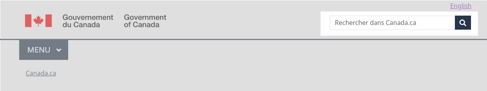
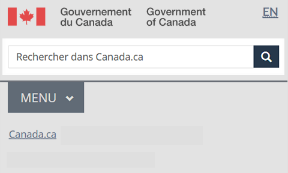

	

		<ul class="list-inline small mrgn-bttm-sm" id="list-inline-desktop-only">
			<li class="mrgn-rght-lg">Dernière mise à jour&nbsp;: 2023-MM-JJ</li>
		</ul>
	

Obligatoire sur les pages standards et de campagne

Le champ de recherche du site est un élément de l’En-tête général. Il permet aux gens de lancer une recherche dans le contenu du gouvernement du Canada au moyen d’un champ de recherche simple.

Les résultats de la recherche dans le site sont présentés pour l’ensemble du contenu Web du gouvernement du Canada ou pour un sous-ensemble de contenu au niveau du ministère ou de l’organisme.

	<figure class="mrgn-bttm-sm">
		
	</figure>

<section>
	<h2>Sur cette page</h2>
	<ul>
		<li><a href="#quand">Quand l’utiliser</a></li>
		<li><a href="#eviter">Quoi éviter</a></li>
		<li><a href="#contenu">Contenu et conception</a></li>
		<li><a href="#implementation">Comment procéder à la mise en œuvre</a></li>
		<li><a href="#recherche">Recherche et justification</a></li>
		<li><a href="#changements">Derniers changements</a></li>
	</ul>
</section>

<h2 id="quand">Quand l’utiliser</h2>

Le champ de recherche du site est obligatoire sur toutes les pages, sauf pour les pages transactionnelles.

<h2 id="eviter">Quoi éviter</h2>

Ne pas utiliser le champ de recherche du site pour rechercher un contenu autre que celui indexé par GC Recherche. Placer le champ de recherche d’autres jeux de données dans la zone de contenu de la page.

<h2 id="contenu">Contenu et conception</h2>

Trouver des spécifications de contenu et de conception ainsi que des exemples visuels.

<h3>Spécifications du contenu</h3>

Le champ de recherche du site est composé de trois éléments visuels&nbsp;:

<ul>
	<li>un champ de saisie de texte (170 caractères tout au plus);</li>
	<li>un texte réservé pour le champ de saisie;</li>
	<li>un bouton de recherche et une icône de loupe.</li>
</ul>

Dans le champ de saisie de texte, l’étiquette de l’espace réservé est la suivante&nbsp;:

<ul>
	<li>&laquo;&nbsp;Search Canada.ca&nbsp;&raquo; en anglais</li>
	<li>&laquo;&nbsp;Rechercher dans Canada.ca&nbsp;&raquo; en français</li>
</ul>

L’étiquette de l’espace réservé dans un champ de recherche personnalisé est la suivante&nbsp;:

<ul>
	<li>&laquo;&nbsp;Search [institution]&nbsp;&raquo; en anglais</li>
	<li>&laquo;&nbsp;Rechercher dans [institution]&nbsp;&raquo; en français</li>
</ul>

<h4>Interactions</h4>
<ul>
	<li>Les recherches interrogent l’index de GC Recherche. Lorsque l’on saisit un terme de recherche dans le champ de saisie et que l’on sélectionne l’icône de recherche, une page de résultats s’ouvre.</li>
</ul>

<h3>Spécifications de conception</h3>

Les spécifications de conception pour le champ de recherche du site sont les suivantes&nbsp;:

<ul>
	<li>Position&nbsp;: coin supérieur droit de la zone de l’En-tête général, sous le lien qui permet de changer de langue</li>
	<li>Catégorie de formulaire&nbsp;: form-inline</li>
	<li>Icône de bouton&nbsp;: glyphicon-search glyphicon</li>
	<li>Catégorie de bouton&nbsp;: btn btn-primary btn-small</li>
	<li>Couleur&nbsp;: no&nbsp;26374a</li>
	<li>Longueur du champ de saisie&nbsp;: longueur maximale&nbsp;=&nbsp;170</li>
	<li>Taille de valeur&nbsp;: 34</li>
</ul>

Les éléments de recherche sont réactifs. Ils s’adaptent à la taille de l’écran.

<h3>Exemples visuels</h3>

	<figure>
		<figcaption><b>Champ de recherche du site – grand écran</b></figcaption>
		
		

			
Description de l’image&nbsp;: Champ de recherche du site – grand écran

			
Le champ de recherche s’affiche dans le coin supérieur droit, sous le lien qui permet de changer de langue et directement à l’opposé de la signature du gouvernement du Canada.

			
La barre de recherche du site est un rectangle défini par un contour gris clair. Dans le rectangle, on peut lire les mots &laquo;&nbsp;Rechercher dans Canada.ca&nbsp;&raquo;. À la droite du rectangle se trouve un carré bleu dans lequel il y a une icône de loupe blanche.

		

	</figure>

	<figure>
		<figcaption><b>Champ de recherche du site – Petit écran</b></figcaption>
		
		

			
Description de l’image&nbsp;: Champ de recherche du site – Petit écran

			
Le champ de recherche s’affiche dans l’en-tête, directement sous la signature du gouvernement du Canada et le lien qui permet de changer de langue. Il couvre la largeur de l’écran.

			
La barre de recherche du site est un rectangle défini par un contour gris clair. Dans le rectangle, on peut lire les mots &laquo;&nbsp;Rechercher dans Canada.ca&nbsp;&raquo;. À la droite du rectangle se trouve un carré bleu dans lequel il y a une icône de loupe blanche.

		

	</figure>

<h2 id="implementation">Comment procéder à la mise en œuvre</h2>

Trouver des exemples fonctionnels de la mise en œuvre du champ de recherche du site.

<h3>Référence pour la mise en œuvre du thème GCWeb (BOEW)</h3>

La référence à la mise en œuvre comprend la façon de configurer chaque élément de l’en-tête.

<ul>
	<li><a href="https://wet-boew.github.io/GCWeb/sites/header/header-docs-fr.html">Documentation de l’en-tête GCWeb (BOEW)</a></li>
</ul>

<h3>Mises en œuvre</h3>

Déterminez ce qui convient le mieux au type de page que vous créez.

	

		

			

				

					
<strong>AEM-GC</strong>

					
Pour Adobe Experience Manager (AEM) du gouvernement du Canada (GC)&nbsp;:

					<ul>
						<li><a href="https://www.gcpedia.gc.ca/wiki/AEM_GC-specific_Documentation_6.5">Documentation d’AEM et des services Web gérés (lien GCpédia – uniquement accessible sur le réseau du gouvernement du Canada)</a></li>
					</ul>
				

				

					
<strong>SGDC</strong>

					
Pour la Solution de gabarits à déploiement centralisé (SGDC)&nbsp;:

					<ul>
						<li><a href="https://cdts.service.canada.ca/app/cls/WET/gcweb/v4_0_45/cdts/samples/custom-search-fr.html">Recherche personnalisée</a> – options de configuration pour le champ de recherche du site </li>
						<li><a href="https://cenw-wscoe.github.io/sgdc-cdts/docs/index-fr.html">Documentation de la SGDC</a></li>
					</ul>
				

				

					
<strong>Drupal WxT</strong>

					
Pour Drupal WxT :

					<ul>
						<li><a href="https://drupalwxt.github.io/en/">Documentation de Drupal WxT (en anglais seulement)</a></li>
					</ul>
				

			

		

	

<h3>Configurer la recherche</h3>

L’éditeur principal fournit un soutien pour l’adoption de GC Recherche, la configuration de la recherche, l’indexation des pages Web, les erreurs liées aux fonctionnalités et d’autres demandes concernant les recherches&nbsp;:

<ul>
	<li><a href="https://www.gcpedia.gc.ca/wiki/Soutien_%C3%A0_la_plateforme_de_recherche_Web_du_GC">Éléments obligatoires du système de conception</a></li>
</ul>

<h2 id="recherche">Recherche et justification</h2>

Le fait de placer le champ de recherche dans le coin supérieur droit d’une page Web est une convention Web établie.

<h3>Justification stratégique</h3>

Dans l’En-tête général, le champ de recherche du site est un élément obligatoire des <cite>Spécifications du contenu et de l’architecture de l’information</cite>.

<ul>
	<li><a href="https://www.canada.ca/fr/secretariat-conseil-tresor/services/communications-gouvernementales/specifications-contenu-architecture-information-canada/elements-obligatoires.html">Éléments obligatoires du système de conception</a></li>
</ul>

<h2 id="changements">Derniers changements</h2>
<dl class="dl-horizontal">
	<dt>
		<time>2023-MM-DD</time>
	</dt>
	<dd>Mise à jour de l’orientation pour y inclure des conseils sur quoi éviter, les spécifications du contenu et de conception, des exemples visuels, une orientation sur la mise en œuvre, du soutien pour la configuration de la recherche, et la justification stratégique</dd>
</dl>
