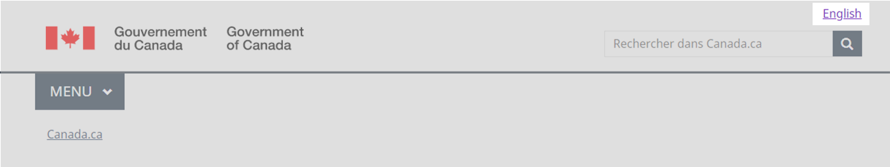

  

    <ul class="list-inline small mrgn-bttm-sm" id="list-inline-desktop-only">
      <li class="mrgn-rght-lg">Dernière mise à jour&nbsp;: {{ page.dateModified }}</li>
    </ul>
  

Obligatoire

Tout le contenu du gouvernement du Canada destiné au public est accessible dans les deux langues officielles. Un lien permettant de changer de langue, situé dans l’En-tête général du site, donne à la personne accès à la page correspondante dans l’autre langue officielle.

  <figure class="mrgn-bttm-sm"></figure>

<section>
  <h2>Sur cette page</h2>
  <ul>
    <li><a href="#quand">Quand l’utiliser</a></li>
    <li><a href="#eviter">Quoi éviter</a></li>
    <li><a href="#contenu">Contenu et conception</a></li>
    <li><a href="#implementation">Comment procéder à la mise en œuvre</a></li>
    <li><a href="#recherche">Recherche et justification</a></li>
    <li><a href="#changements">Derniers changements</a></li>
  </ul>
</section>

<h2 id="quand">Quand l’utiliser</h2>

La présence du lien pour changer la langue est obligatoire sur toutes les pages.

Les nouvelles pages transactionnelles des applications Web doivent permettre aux utilisateurs de basculer entre les langues officielles. Les anciennes applications Web qui ne permettent pas de basculer d’une langue à l’autre doivent être mises à jour ou remplacées. En attendant, vous pouvez omettre le basculement entre les langues si son utilisation entraîne une perte de données.

<h2 id="eviter">Quoi éviter</h2>

Ne mettez pas d’autres options de langue dans le lien pour changer la langue. Ce n’est que pour l’anglais et le français. Les liens vers le contenu dans les autres langues doivent apparaître dans la zone de contenu de la page.

N’utilisez pas le lien pour changer la langue afin de pointer vers autre chose que la page correspondante dans la langue équivalente.

<h2 id="contenu">Contenu et conception</h2>

Trouver des spécifications du contenu et de conception et des exemples visuels.

<h3>Spécifications de contenu</h3>

Assurez-vous que le lien pour changer la langue renvoie à la page correspondante dans l’autre langue.

<h4>Grands écrans</h4>
<ul>
  <li>Sur les pages en anglais, le texte de l’étiquette du lien est &laquo;&nbsp;Français&nbsp;&raquo;.</li>
  <li>Sur les pages en français, le texte de l’étiquette du lien est &laquo;&nbsp;English&nbsp;&raquo;.</li>
</ul>
<h4>Petits écrans</h4>

Pour les petits écrans, la bascule des langues utilise une abréviation de deux lettres pour chaque langue&nbsp;:

<ul>
  <li>Sur les pages en anglais, le texte de l’étiquette du lien est &laquo;&nbsp;FR&nbsp;&raquo; en majuscules.</li>
  <li>Sur les pages en français, le texte de l’étiquette du lien est &laquo;&nbsp;EN&nbsp;&raquo; en majuscules.</li>
</ul>
<h4>Accessibilité</h4>
<ul>
  <li>Ajouter le nom complet de la langue dans l’attribut du titre du lien abrégé pour changer la langue.
    <ul>
      <li>Le titre de l’abréviation EN est &laquo;&nbsp;English&nbsp;&raquo;.</li>
      <li>Le titre de l’abréviation FR est &laquo;&nbsp;Français&nbsp;&raquo;.</li>
    </ul>
  </li>
</ul>
<h4>Interactions</h4>
<ul>
  <li>Lorsqu’il est sélectionné, le lien pour changer la langue permet à l’utilisateur d’accéder à la version dans l’autre langue de la page sur laquelle il se trouvait.</li>
</ul>
<h3>Spécifications de conception</h3>
<ul>
  <li>Type&nbsp;: lien</li>
  <li>Position&nbsp;: coin supérieur droit</li>
  <li>Police&nbsp;: Lato</li>
  <li>Taille&nbsp;: 1,2 em</li>
  <li>Couleur du texte&nbsp;:
    <ul>
      <li>lien par défaut&nbsp;: #284162</li>
      <li>lien sélectionné (passé par-dessus ou mis au point)&nbsp;: #0535d2</li>
      <li>lien visité&nbsp;: #284162</li>
    </ul>
  </li>
</ul>
<h4>Accessibilité</h4>
<ul>
  <li>Étiquetez le code du lien pour changer la langue de manière à ce qu’il soit prononcé dans la bonne langue s’il est lu à haute voix par des technologies d’assistance.</li>
  <li>Assurez-vous que l’étiquette du texte du lien pour changer la langue n’est pas traduite par les outils de traduction du navigateur.</li>
</ul>
<h3>Exemples visuels</h3>

  <figure>
    <figcaption><b>Changer la langue (Page anglaise) – grand écran</b></figcaption>
    
    

      
Description de l’image&nbsp;:  Changer la langue – grand écran (Page anglaise)

      
En-tête standard d’une page Canada.ca en anglais avec mise en surbrillance du mot lié Français dans le coin supérieur droit.

    

  </figure>

  <figure>
    <figcaption><b>Changer la langue (Page française) – grand écran </b></figcaption>
    
    

      
Description de l’image&nbsp;: Changer la langue (Page française) – grand écran

      
En-tête standard d’une page Canada.ca en français avec mise en surbrillance du mot lié English dans le coin supérieur droit.

    

  </figure>

  <figure>
    <figcaption><b>Changer la langue (Page anglaise) – petit écran</b></figcaption>
    
    

      
Description de l’image&nbsp;: Changer la langue (Page anglaise) – petit écran

      
En-tête standard d’une page Canada.ca en anglais avec mise en surbrillance de l’abréviation liée FR dans le coin supérieur droit.

    

  </figure>

  <figure>
    <figcaption><b>Changer la langue (Page française) – petit écran</b></figcaption>
    
    

      
Description de l’image&nbsp;: Changer la langue (Page française) – petit écran

      
En-tête standard d’une page Canada.ca en français avec mise en surbrillance de l’abréviation liée EN dans le coin supérieur droit.

    

  </figure>

<h2 id="implementation">Comment procéder à la mise en oeuvre</h2>

Trouver des exemples fonctionnels de l’implémentation du lien pour changer de langue.

<h3>Référence pour la mise en œuvre du thème GCWeb (BOEW)</h3>

La référence à l’implémentation comprend la façon de configurer chaque élément de l’en-tête.

<ul>
  <li><a href="https://wet-boew.github.io/GCWeb/sites/header/header-docs-fr.html">Documentation de l’en-tête GCWeb (Boîte à outils de l’expérience Web)</a></li>
</ul>
<h3>Mises en oeuvre</h3>

Déterminez ce qui convient le mieux au type de page que vous créez.

  

    

      

        

          
<strong>AEM-GC</strong>

          
Pour Adobe Experience Manager (AEM) du gouvernement du Canada (GC)&nbsp;:

          <ul>
            <li><a href="https://www.gcpedia.gc.ca/wiki/Documentation_d%27AEM_sp%C3%A9cifique_au_GC_6.5">Documentation d’AEM et des services Web gérés (lien GCpédia – uniquement accessible sur le réseau du gouvernement du Canada)</a></li>
          </ul>
        

        

          
<strong>Solution de gabarits à déploiement centralisé (SGDC)</strong>

          
Pour la Solution de gabarits à déploiement centralisé (SGDC)&nbsp;:

          <ul>
            <li><a href="https://drupalwxt.github.io/fr/">Documentation de la SGDC</a></li>
          </ul>
        

        

          
<strong>Drupal WxT</strong>

          
Pour Drupal WxT&nbsp;:

          <ul>
            <li><a href="https://drupalwxt.github.io/fr/">Documentation de Drupal WxT</a></li>
          </ul>
        

      

    

  

<h2 id="recherche">Recherche et justification</h2>

Consulter la justification stratégique.

<h3>Justification stratégique</h3>

Le lien pour changer la langue fait partie de l’En-tête général et est un élément obligatoire de la <cite>spécification du contenu et de l’architecture de l’information</cite>.

<ul>
  <li><a href="https://www.canada.ca/fr/secretariat-conseil-tresor/services/communications-gouvernementales/specifications-contenu-architecture-information-canada/elements-obligatoires.html">Éléments obligatoires du système de conception</a></li>
</ul>

Toutes les communications du gouvernement du Canada doivent être accessibles dans les deux langues officielles.

<ul>
  <li><a href="https://www.tbs-sct.canada.ca/pol/doc-fra.aspx?id=26160">Politique sur les langues officielles</a></li>
</ul>
<h2 id="changements">Derniers changements</h2>
<dl class="dl-horizontal">
  <dt>
    <time datetime="2023-MM-DD" class="link-muted">2023-MM-DD</time>
  </dt>
  <dd>Mise à jour de l’orientation pour y inclure des conseils sur quoi éviter, les spécifications du contenu et de conception, des exemples visuels, une orientation sur la mise en œuvre, et les justifications stratégiques</dd>
</dl>
