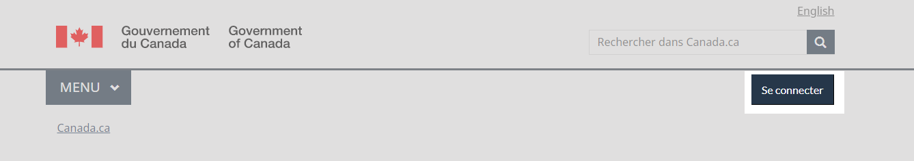
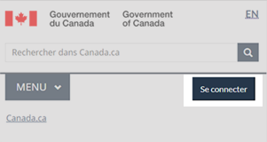

	

		<ul class="list-inline small mrgn-bttm-sm" style="line-height:1.65em" id="list-inline-desktop-only">
			<li class="mrgn-rght-lg"> Dernière modification&nbsp;: {{ page.dateModified }}</li>
		</ul>
	

Le bouton &laquo;&nbsp;Se connecter&nbsp;&raquo; est un élément facultatif de l'en-tête qui dirige les utilisateurs vers des comptes gouvernementaux nécessitant une authentification. Il s'agit d'un appel à l'action contextuel et persistant au sein d'un groupe de pages connexes.

	<figure class="mrgn-bttm-lg">
		<figcaption><b>Se connecter - grand écran</b></figcaption>
		
	</figure>
	<figure class="mrgn-bttm-lg">
		<figcaption><b>Se connecter - petit écran</b></figcaption>
		
	</figure>

<h2>Sur cette page</h2>
<ul>
	<li><a href="#a1">Quand l'utiliser</a></li>
	<li><a href="#a2">Quoi éviter</a></li>
	<li><a href="#a7">Contenu et conception</a></li>
	<li><a href="#a3">Comment procéder à la mise en œuvre</a></li>
	<li><a href="#a4">Recherche et justification</a></li>
	<li><a href="#a4">Derniers changements</a></li>
</ul>

<h2 id="a1">Quand l'utiliser</h2>

Ajouter le bouton &laquo;&nbsp;Se connecter&nbsp;&raquo; quand la connexion à un compte est une tâche centrale dans une série de pages. Cela comprend&nbsp;:

<ul>
	<li>les pages où il existe déjà un lien ou un bouton menant à un ou plusieurs comptes;</li>
	<li>une série de pages qui traitent d'un service spécifique (comme l'assurance-emploi, la TPS);</li>
	<li>les pages où les analyses montrent que les gens utilisent le menu ou la barre de recherche pour accéder à un compte.</li>
</ul>

Comme il s'agit d'un nouveau modèle, vous pouvez utiliser le bouton &laquo;&nbsp;Se connecter&nbsp;&raquo; en plus d'un bouton de super-tâche sur la même page. Si vous avez un bouton de super-tâche existant, ne le supprimez pas. Ajoutez plutôt le bouton &laquo;&nbsp;Se connecter&nbsp;&raquo;.  Il se peut que vous constatez des changements d'utilisation au fil du temps dans vos analyses qui montrent que vous pouvez supprimer le bouton de super tâche.

<h2 id="a2">Quoi éviter</h2>
<ul>
	<li>Utiliser &laquo;&nbsp;Se connecter&nbsp;&raquo;, et non &laquo;&nbsp;Ouvrir une session&nbsp;&raquo;</li>
	<li>Exclure le bouton &laquo;&nbsp;Se connecter&nbsp;&raquo; des&nbsp;:
		<ul>
			<li>pages de tri ou de processus de connexion</li>
			<li>pages qui ne sont pas liées au service authentifié</li>
		</ul>
	</li>
</ul>

<h2 id="a7">Contenu et conception</h2>

Trouvez des exemples visuels ainsi que des spécifications du contenu et de conception.

<h3>Spécifications du contenu</h3>

Utiliser &laquo;&nbsp;Se connecter&nbsp;&raquo; comme étiquette

<ul>
	<li><b>Petits écrans</b>&nbsp;: 12 caractères au total y compris les espaces (pas de texte descriptif supplémentaire)</li>
	<li><b>Écrans de taille moyenne et de grande taille</b>&nbsp;: 25 caractères au total (pour du texte descriptif supplémentaire au besoin, par exemple &laquo;&nbsp;Se connecter à [nom du compte]&nbsp;&raquo;)</li>
</ul>

<h4>Interactions</h4>

Lier le bouton &laquo;&nbsp;Se connecter&nbsp;&raquo; directement à la page où vous commencez votre processus de connexion, ou à une page qui vous permet de sélectionner les différents comptes auxquels vous pouvez vous connecter.

<h3>Spécifications de conception</h3>

Structure du bouton

<ul>
	<li>Bordure&nbsp;:
		<ul>
      <li>Épaisseur&nbsp;: 1 px</li>
      <li>Style&nbsp;: plein</li>
      <li>Rayon&nbsp;: 0</li>
		</ul>
	</li>
	<li>Police&nbsp;:
		<ul>
			<li>Graisse&nbsp;: 400</li>
			<li>Famille&nbsp;: Lato</li>
			<li>Taille&nbsp;: 16px</li>
			<li>Couleur&nbsp;: #fff</li>
		</ul>
	</li>
	<li>Marge&nbsp;:
		<ul>
			<li>Marge du haut&nbsp;: 5px</li>
			<li>Autres marges&nbsp;: 0px</li>
		</ul>
	</li>
	<li>Marges intérieures (<i lang="en">padding</i>)&nbsp;:
		<ul>
			<li>Haut&nbsp;: 10px</li>
			<li>Bas&nbsp;: 10px</li>
			<li>Gauche&nbsp;: 14px</li>
			<li>Droite&nbsp;: 14px</li>
		</ul>
	</li>
</ul>

Affichage normal

<ul>
	<li>Couleur d'arrière-plan&nbsp;: #26374a</li>
	<li>Couleur de la bordure&nbsp;: #26374a</li>
</ul>

Affichage en survol

<ul>
	<li>Couleur d'arrière-plan&nbsp;: #444</li>
	<li>Couleur de la bordure&nbsp;: #444</li>
</ul>

<h3>Exemples visuels</h3>

	<figure>
		<figcaption><b>Bouton contextuel &laquo;&nbsp;Se connecter&nbsp;&raquo; - grand écran</b></figcaption>
		
		

			
Description de l'image&nbsp;:  Bouton contextuel &laquo;&nbsp;Se connecter&nbsp;&raquo; - grand écran (Page anglaise)

			
En-tête standard d'une page Canada.ca en français avec le bouton contextuel &laquo;&nbsp;Se connecter&nbsp;&raquo; en surbrillance.

	  

	</figure>

	<figure>
		<figcaption><b>Bouton contextuel &laquo;&nbsp;Se connecter&nbsp;&raquo; - petit écran</b></figcaption>
	 	
	  	

			
Description de l'image&nbsp;: Bouton contextuel &laquo;&nbsp;Se connecter&nbsp;&raquo; - petit écran

			
En-tête standard d'une page Canada.ca en français avec le bouton contextuel &laquo;&nbsp;Se connecter&nbsp;&raquo; en surbrillance.

		

	</figure>

<h2 id="a3">Comment procéder à la mise en œuvre</h2>

Voyez des exemples concrets et accédez au code pour mettre l'en-tête en œuvre.

<h3>Référence pour la mise en œuvre du thème GCWeb (BOEW)</h3>

La référence à l'implémentation comprend la façon de configurer chaque élément de l'en-tête.

<ul>
	<li><a href="https://wet-boew.github.io/GCWeb/sites/authentication/authentication-fr.html">Modèles d'authentification</a></li>
</ul>
<h3>Mises en œuvre</h3>

Déterminez ce qui convient le mieux au type de page que vous créez.

	

		

			

				

					
<b>AEM-GC</b>

					
Pour Adobe Experience Manager (AEM) du gouvernement du Canada (GC)&nbsp;:

					<ul>
						<li><a href="https://www.gcpedia.gc.ca/wiki/Documentation_d%27AEM_sp%C3%A9cifique_au_GC_6.5">Documentation d'AEM et des services Web gérés (lien GCpédia - uniquement accessible sur le réseau du gouvernement du Canada)</a></li>
					</ul>
				

				

					
<b>SGDC</b>

					
Pour la Solution de gabarits à déploiement centralisé (SGDC)&nbsp;:

					<ul>
						<li><a href="https://cenw-wscoe.github.io/sgdc-cdts/docs/index-fr.html">Documentation de la SGDC</a></li>
					</ul>
				

				

					
<b>Drupal WxT</b>

					
Pour Drupal WxT&nbsp;:

					<ul>
						<li><a href="https://drupalwxt.github.io/en/">Documentation de Drupal WxT (en anglais seulement)</a></li>
					</ul>
				

			

		

	

<section>
	<h2 id="a4">Recherche et justification</h2>
	<ul>
		<li><a href="https://blogue.canada.ca/2022/09/23/presentation-bouton-contextuel-se-connecter">Présentation du bouton contextuel &laquo;&nbsp;Se connecter&nbsp;&raquo;</a></li>
	</ul>
	
Nous avons introduit le bouton contextuel &laquo;&nbsp;Se connecter&nbsp;&raquo; afin d'améliorer la repérabilité de cette tâche principale.

</section>
<section>
	<h2 id="a5">Derniers changements</h2>
	<dl class="dl-horizontal">
		<dt>
			<time>2023-06-26</time>
		</dt>
		<dd>Mise à jour de l'orientation pour y inclure des conseils sur quoi éviter, les spécifications du contenu et de conception, des exemples visuels, une orientation sur la mise en œuvre, et les justifications stratégiques</dd>
	</dl>
	<dl class="dl-horizontal">
		<dt>
			<time>2022-08-17</time>
		</dt>
		<dd>Lignes directrices plus détaillées  pour le bouton &laquo;&nbsp;Se connecter&nbsp;&raquo;</dd>
	</dl>
</section>
