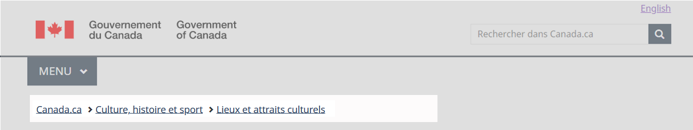
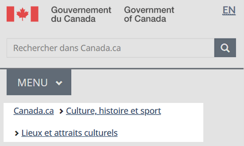

  

    <ul class="list-inline small mrgn-bttm-sm" id="list-inline-desktop-only">
      <li class="mrgn-rght-lg">Dernière mise à jour&nbsp;:  {{ page.dateModified }}</li>
    </ul>
  

Obligatoire sur les pages standards et de campagne

Le fil d’Ariane est une série horizontale de liens qui permet aux gens de se situer par rapport au modèle de navigation du site Canada.ca. Il représente l’emplacement d’une page par rapport à son parent et donne un moyen clair de naviguer vers les niveaux supérieurs de la structure du site.

  <figure class="mrgn-bttm-sm"></figure>

<section>
  <h2>Sur cette page</h2>
  <ul>
    <li><a href="#quand">Quand l’utiliser</a></li>
    <li><a href="#eviter">Quoi éviter</a></li>
    <li><a href="#contenu">Contenu et conception</a></li>
    <li><a href="#implementation">Comment procéder à la mise en œuvre</a></li>
    <li><a href="#recherche">Recherche et justification</a></li>
    <li><a href="#changements">Derniers changements</a></li>
  </ul>
</section>

<h2 id="quand">Quand l’utiliser</h2>

Le fil d’Ariane est obligatoire sur toutes les pages, à l’exception des pages transactionnelles.

<h2 id="eviter">Quoi éviter</h2>

Ne programmez pas le fil d’Ariane pour qu’il soit généré dynamiquement en fonction du parcours d’un visiteur sur une page. Il doit représenter l’emplacement d’une page par rapport au modèle de navigation du site.

Évitez les longues étiquettes de liens. Utilisez une version abrégée du titre de la page, au besoin.

N’affichez pas la page actuelle à la fin du fil d’Ariane (avec ou sans lien). Cela augmente inutilement la longueur du fil d’Ariane, surtout sur les appareils mobiles. L’en-tête de la page est suffisant pour indiquer aux internautes où ils se trouvent.

<h2 id="contenu">Contenu et conception</h2>

Trouver des spécifications du contenu et de conception ainsi que des exemples visuels.

<h3>Spécifications du contenu</h3>

Alignez le fil d’Ariane à gauche, directement sous le bouton de menu (ou la ligne de séparation s’il n’y a pas de bouton de menu).

Utilisez &laquo;&nbsp;Canada.ca&nbsp;&raquo; comme texte du premier lien du fil d’Ariane sur les pages <strong>standards</strong> et les pages de <strong>campagne</strong>.

<ul>
  <li>Créez un lien vers la page d’accueil du site Canada.ca dans la langue de la page actuelle.</li>
</ul>

Vous pouvez utiliser &laquo;&nbsp;Accueil&nbsp;&raquo; ou le nom du processus ou de l’application comme texte du premier lien du fil d’Ariane sur les pages transactionnelles qui utilisent un fil d’Ariane.

<ul>
  <li>Présentez un lien vers la page de départ du processus ou la page de renvoi de la demande.</li>
</ul>

Utilisez un GLYPHICON de chevron droit simple pour séparer chaque lien du fil d’Ariane.

Incluez le titre de la page dans l’étiquette du fil d’Ariane.

<ul>
  <li>Abrégez les étiquettes du fil d’Ariane dans la mesure du possible pour améliorer la lisibilité et réduire l’espace occupé.</li>
</ul>

Ainsi, ce fil d’Ariane&nbsp;:

  
Canada.ca  Immigration et citoyenneté  Citoyenneté canadienne  Présenter une demande de citoyenneté canadienne  Se préparer à l’examen pour la citoyenneté et à l’entrevue

Peuvent être abrégés comme suit&nbsp;:

  
Canada.ca  Immigration et citoyenneté  Citoyenneté canadienne  Présenter une demande  Se préparer pour l’examen et l’entrevue

<h4>Accessibilité</h4>
<ul>
  <li>Incluez le texte d’aide invisible &laquo;&nbsp;Vous êtes ici&nbsp;:&nbsp;&raquo;.</li>
</ul>

<h4>Interactions</h4>
<ul>
  <li>Lorsqu’il est sélectionné, chaque fil d’Ariane doit amener l’utilisateur à une page unique.</li>
</ul>

<h3>Spécifications de conception</h3>
<ul>
  <li>Type&nbsp;: lien</li>
  <li>Position&nbsp;: coin supérieur gauche</li>
  <li>Police&nbsp;: Noto sans</li>
  <li>Taille&nbsp;: 16px</li>
  <li>Couleur du texte&nbsp;:
    <ul>
      <li>lien par défaut&nbsp;: #284162</li>
      <li>lien sélectionné (passé par-dessus ou mise au point)&nbsp;: #0535d2</li>
      <li>lien visité&nbsp;: #7834bc</li>
    </ul>
  </li>
  <li>Espaces&nbsp;:
    <ul>
      <li>Marges intérieures (<i lang="en">padding</i>) verticales&nbsp;: 13&nbsp;px</li>
      <li>Marges intérieures (<i lang="en">padding</i>) horizontales&nbsp;: 2&nbsp;px</li>
      <li>Marge du haut&nbsp;: 15&nbsp;px</li>
      <li>Hauteur des lignes&nbsp;: 23&nbsp;px </li>
    </ul>
  </li>
  <li>Icône&nbsp;: glyphicon-chevron-right</li>
</ul>

<h4>Accessibilité</h4>

Programmez le fil d’Ariane en tant que liste ordonnée.

<h4>Structure du fil d’Ariane</h4>

Voici des exemples de fils d’Ariane dans différents endroits sur le site Canada.ca.

<h5 class="mrgn-tp-lg">Pages thématiques, institutionnelles et organisationnelles</h5>

  
Canada.ca

<h5>Pages de sujet de premier niveau</h5>

  
Canada.ca  [Thème parent]

<h5>Pages de sujet de deuxième niveau</h5>

  
Canada.ca  [Thème parent]  [Sujet parent]

<h5>Pages de contenu ministériel et lié aux programmes ou aux politiques</h5>

  
Canada.ca  [Page de profil institutionnel]

<h5>Pages de profils de partenariats et d’ententes de collaboration</h5>

  
Canada.ca

<h5>Pages de recherche de base</h5>

  
Canada.ca

<h5>Pages de recherche avancée</h5>

  
Canada.ca  [Recherche de base]

<h5>Campagnes et promotions</h5>

Le fil d’Ariane n’est pas exigé pour les campagnes de promotion. Si vous en ajoutez un, il peut renvoyer à l’arborescence thématique, au profil institutionnel ou organisationnel ou encore à la page d’accueil du site Canada.ca.

<h5 class="mrgn-tp-lg">Nouvelles</h5>

  
Canada.ca  [Page de profil institutionnel]

<h5 class="mrgn-tp-lg">Application</h5>

  
Accueil 

<h3>Exemples visuels</h3>

  <figure>
    <figcaption><b>En-tête général avec fil d’Ariane – grand écran</b></figcaption>
    
    

      
Description de l’image&nbsp;: en-tête général avec fil d’Ariane – grand écran

      
Le fil d’Ariane apparaît sous le bouton de menu sur une ligne horizontale.

    

  </figure>

  <figure>
    <figcaption><b>En-tête général avec fil d’Ariane – petit écran</b></figcaption>
    
    

      
Description de l’image&nbsp;: en-tête général avec fil d’Ariane – petit écran

      
Le fil d’Ariane apparaît sous le bouton de menu.

    

  </figure>

<h2 id="implementation">Comment procéder à la mise en œuvre</h2>

Trouver des exemples fonctionnels de l’implémentation du fil d’Ariane.

<h3>Référence pour la mise en œuvre du thème GCWeb (BOEW)</h3>

La référence à l’implémentation comprend la façon de configurer chaque élément de l’en-tête.

<ul>
  <li><a href="https://wet-boew.github.io/GCWeb/sites/breadcrumbs/breadcrumbs-fr.html">Fil d’Ariane – Documentation de GCWeb (Boîte à outils de l’expérience Web)</a></li>
  <li><a href="https://wet-boew.github.io/GCWeb/sites/header/header-docs-fr.html">Documentation de l’en-tête GCWeb (Boîte à outils de l’expérience Web)</a></li>
</ul>

<h3>Mises en œuvre</h3>

Déterminez ce qui convient le mieux au type de page que vous créez. Consultez les instructions applicables à votre implémentation si vous souhaitez exclure les fils d’Ariane.

  

    

      

        

          
<strong>AEM-GC</strong>

          
Pour Adobe Experience Manager (AEM) du gouvernement du Canada (GC)&nbsp;:

          <ul>
            <li><a href="https://www.gcpedia.gc.ca/gcwiki/images/d/d8/Documentation-AEM-6.5-Unite-3-7-Modifier-le-fil-d%27Ariane-par-d%C3%A9faut.pdf">Changer le fil d’Ariane par défaut (PDF - lien GCpédia – uniquement accessible sur le réseau du gouvernement du Canada)</a></li>
            <li><a href="https://www.gcpedia.gc.ca/wiki/Documentation_d%27AEM_sp%C3%A9cifique_au_GC_6.5">Documentation d’AEM et des services Web gérés (lien GCpédia – uniquement accessible sur le réseau du gouvernement du Canada)</a></li>
          </ul>
        

        

          
<strong>SGDC</strong>

          
Pour la Solution de gabarits à déploiement centralisé (SGDC)&nbsp;:

          <ul>
            <li><a href="https://cdts.service.canada.ca/app/cls/WET/gcweb/v4_0_47/cdts/samples/breadcrumbs-fr.html">Fil d’Ariane - Documentation de la SGDC</a></li>
            <li><a href="https://cenw-wscoe.github.io/sgdc-cdts/docs/index-fr.html">Documentation de la SGDC</a></li>
          </ul>
        

        

          
<strong>Drupal WxT</strong>

          
Pour Drupal WxT&nbsp;:

          <ul>
            <li><a href="https://drupalwxt.github.io/">Documentation de Drupal WxT (en anglais seulement)</a></li>
          </ul>
        

      

    

  

<h2 id="recherche">Recherche et justification</h2>

Consulter les conclusions des recherches et la justification stratégique.

<h3>Constatations découlant des recherches</h3>
<ul>
  <li><a href="https://blogue.canada.ca/2020/08/10/canadapointca-source-fiable">Canada.ca est une source fiable</a> 
    Explique la décision d’utiliser &laquo;&nbsp;Canada.ca&nbsp;&raquo; comme étiquette du premier lien du fil d’Ariane.</li>
  <li><a href="https://blogue.canada.ca/resumes-recherche/orientation-dans-canada-ca.html">Résumé de recherche – Orientation dans Canada.ca</a> 
    La recherche montre que les personnes qui naviguent sur le site utilisent les liens du fil d’Ariane près de deux fois plus souvent que le menu des thèmes et des sujets</li>
</ul>

<h3>Justification stratégique</h3>

Les spécifications relatives aux espaces dans les liens du fils d’Ariane sont conçues de façon à ce que les cibles tactiles respectent les règles AAA pour l’accessibilité des contenus Web.

Le fil d’Ariane fait partie de l’en-tête général et est un élément obligatoire de la <cite>spécification du contenu et de l’architecture de l’information</cite>.

<ul>
  <li><a href="https://www.canada.ca/fr/secretariat-conseil-tresor/services/communications-gouvernementales/specifications-contenu-architecture-information-canada/elements-obligatoires.html">Éléments obligatoires du système de conception</a></li>
</ul>

<h2 id="changements">Derniers changements</h2>
<dl class="dl-horizontal">
  <dt>
    <time>2023-06-26</time>
  </dt>
  <dd>Mise à jour de l’orientation pour y inclure des conseils sur quoi éviter, les spécifications du contenu et de conception, des exemples visuels, une orientation sur l’implémentation, les conclusions des recherches et la justification stratégique</dd>
</dl>
