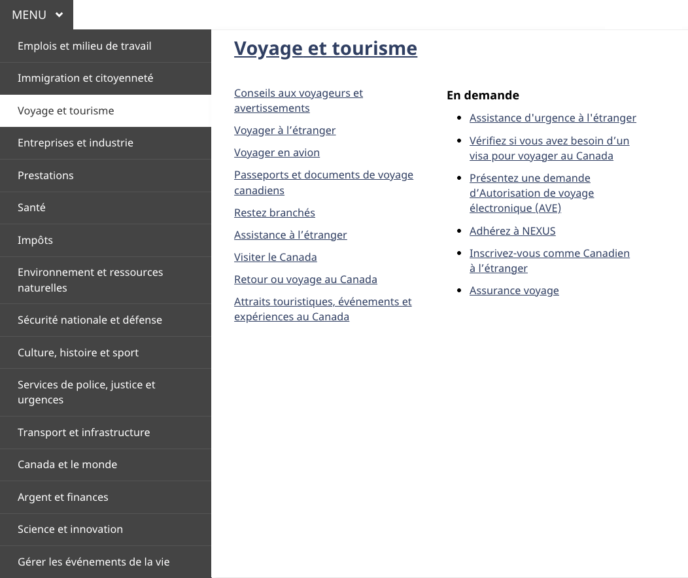
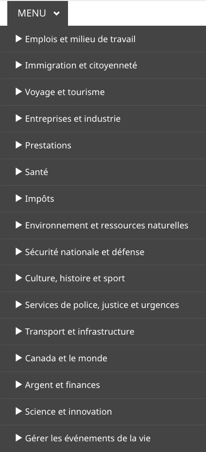
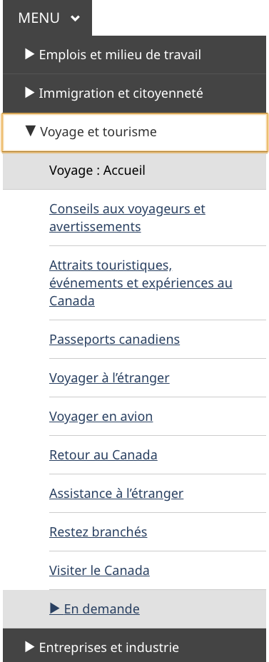
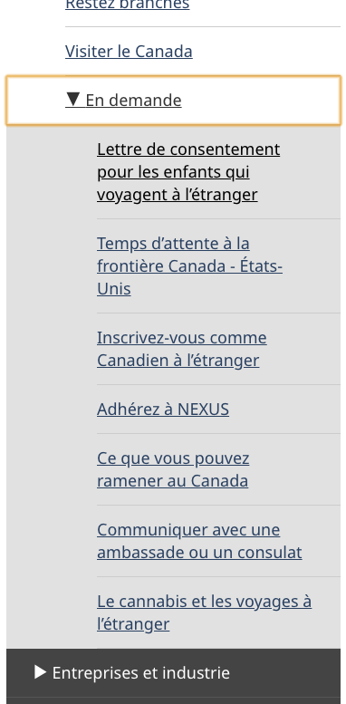

  

    <ul class="list-inline small mrgn-bttm-sm" id="list-inline-desktop-only">
      <li class="mrgn-rght-lg">Dernière mise à jour&nbsp;:  {{ page.dateModified }}</li>
    </ul>
  

Obligatoire sur les pages standards

Le menu thématique donne accès aux principales tâches de tous les sites Web du gouvernement du Canada regroupés sous les principaux thèmes de Canada.ca.

  <figure class="mrgn-bttm-sm"></figure>

<section>
  <h2>Sur cette page</h2>
  <ul>
    <li><a href="#quand">Quand l’utiliser</a></li>
    <li><a href="#eviter">Quoi éviter</a></li>
    <li><a href="#contenu">Contenu et conception</a></li>
    <li><a href="#implementation">Comment procéder à la mise en œuvre</a></li>
    <li><a href="#recherche">Recherche et justification</a></li>
    <li><a href="#changements">Derniers changements</a></li>
  </ul>
</section>

<h2 id="quand">Quand l’utiliser</h2>

<strong>Mise à jour de la conception en 2023&nbsp;:</strong> Nous avons récemment mis à jour ce modèle dans le cadre d’une nouvelle stratégie de navigation issue du projet de recherche Orientation. Le menu thématique est en transition. Pour en savoir plus sur ce projet, visitez la section <a href="#recherche">Recherche et justification</a> sur cette page.

<h3>Situation actuelle</h3>

Appliquez le menu thématique comme suit&nbsp;:

<ul>
  <li><strong>Pages de campagne</strong> facultatives</li>
  <li><strong>Pages transactionnelles</strong> facultatives, mais déconseillées</li>
  <li><strong>Pages thématiques</strong> obligatoires</li>
</ul>

Sur les <strong>pages de destination standards</strong> et les <strong>pages d’accueil institutionnelles</strong>, le menu thématique est obligatoire jusqu’à ce que TOUTES les conditions suivantes soient remplies&nbsp;:

<ul>
  <li>La page comporte le <a href="https://conception.canada.ca/configurations-conception-communes/pied-page.html"> pied de page général</a> de&nbsp;2023.</li>
  <li>Le menu reçoit régulièrement moins de 1&nbsp;% des clics au sein d’un groupe de pages liées.
    <ul>
      <li>Si vous adoptez la conception pour la première fois, vous n’avez pas besoin d’ajouter le menu.</li>
    </ul>
  </li>
  <li>Vous avez ajouté un <a href="https://conception.canada.ca/configurations-conception-communes/connexion-contextuel.html">bouton contextuel &laquo;&nbsp;Se connecter&nbsp;&raquo;</a> là où il est pertinent pour le contenu. </li>
</ul>

Un groupe de pages peut être toutes les pages liées à un programme ou service précis, ou toutes les pages liées à une seule organisation.

<h3>Situation future</h3>

Ultimement, nous retirerons le modèle de menu thématique. Les liens vers les pages thématiques demeureront disponibles à travers la bande principale du pied de page général et le fil d'Ariane.

<h2 id="eviter">Quoi éviter</h2>

Ne réutilisez pas le menu thématique pour une autre navigation. Le menu est un outil de navigation global. C’est déroutant pour les utilisateurs s’il se comporte différemment selon l’endroit où ils se trouvent sur le site.

Ne le supprimez pas des pages de destination standards avant d’avoir rempli les conditions ci-dessus.

Ne changez pas le style ou la palette de couleurs.

Ne mettez pas de liens ou de texte supplémentaires dans le menu déroulant.

<h2 id="contenu">Contenu et conception</h2>

Le menu thématique se compose de trois éléments intégrés : le bouton de menu qui ouvre et qui ferme le menu; la liste des thèmes qui permet à l’utilisateur de choisir parmi les différents thèmes proposés; et le menu déroulant qui présente les sujets et les liens les plus sollicités pour chaque thème.

<h3>Spécifications du contenu</h3>
<ol>
  <li>Bouton de menu&nbsp;:
    <ul>
      <li>Ce bouton est assorti de l’étiquette &laquo;&nbsp;Menu&nbsp;&raquo;, avec un chevron vers le bas.</li>
    </ul>
  </li>
  <li class="mrgn-tp-lg">Liste des thèmes, qui comprend les 16 thèmes principaux de Canada.ca dans l’ordre suivant&nbsp;:
    <ul>
      <li>Emplois et milieu de travail</li>
      <li>Immigration et citoyenneté</li>
      <li>Voyages et tourisme</li>
      <li>Entreprises et industrie</li>
      <li>Prestations</li>
      <li>Santé</li>
      <li>Impôts</li>
      <li>Environnement et ressources naturelles</li>
      <li>Sécurité nationale et défense</li>
      <li>Culture, histoire et sport</li>
      <li>Services de police, justice et urgences</li>
      <li>Transport et infrastructure</li>
      <li>Canada et le monde</li>
      <li>Argent et finances</li>
      <li>Science et innovation</li>
      <li>Gérer les événements de la vie</li>
    </ul>
  </li>
  <li class="mrgn-tp-lg">Menu déroulant&nbsp;:
    
Survoler ou cliquer sur l’un des 16 thèmes révèle un menu déroulant contenant&nbsp;:

    <ul>
      <li>un lien vers la page d’accueil du thème lui-même;</li>
      <li>les sujets de premier niveau dans ce thème;</li>
      <li>les liens les plus en demande basés sur les éléments les plus sollicités pour ce thème.</li>
    </ul>
  </li>
</ol>

Les sujets et les liens les plus demandés doivent s’afficher dans le même ordre à la fois sur le menu et sur la page thématique.

<h4>Interactions</h4>

<h5>Grands écrans</h5>
<ul>
  <li>Cliquer sur le bouton de menu développe l’élément de la liste de thèmes avec le menu déroulant des travaux ouverts.</li>
  <li>Une fois ouvert, survoler ou cliquer sur l’un des 16 thèmes révèle un menu déroulant pour ce thème.</li>
  <li>Il faut cliquer une deuxième fois sur le menu pour le fermer.</li>
</ul>

<h5>Petits écrans</h5>
<ul>
  <li>Appuyer sur le bouton de menu développe la liste des thèmes sous la forme d’une série d’options de sous-menu.</li>
  <li>Taper sur n’importe quelle option de thème développe la liste des sujets pour ce thème et révèle une autre option de sous-menu pour le plus demandé.</li>
  <li>Appuyer sur l’option &laquo;&nbsp;En demande&nbsp;&raquo; développe la liste des liens les plus demandés pour ce thème.</li>
  <li>Appuyer de nouveau sur n’importe quel élément développé le fermera.</li>
</ul>

<h3>Spécifications de conception</h3>
<ol>
  <li>Styles des boutons de menu&nbsp;:
    <ul>
      <li>Couleur de fond&nbsp;: Couleur d’accent primaire (#26374a)</li>
      <li>Couleur du texte&nbsp;: Blanc (#FFFFFF)</li>
      <li>Taille du texte&nbsp;: 20px ou 1em</li>
      <li>Police&nbsp;: Noto Sans</li>
    </ul>
    
Remarque : la page d’accueil de Canada.ca utilise un style différent pour le bouton de menu. Ce style est réservé à la page d’accueil uniquement.

  </li>
  <li class="mrgn-tp-lg">Styles de liste de thèmes&nbsp;:
    <ul>
      <li>Couleur de fond&nbsp;: #444</li>
      <li>Couleur du texte&nbsp;: Blanc (#FFF)</li>
      <li>Couleur de fond sélectionnée&nbsp;: #FFF</li>
      <li>Couleur du texte lorsqu’il est sélectionné&nbsp;: Gris foncé (#333)</li>
      <li>Taille du texte&nbsp;: 18px</li>
      <li>Police&nbsp;: Noto Sans</li>
    </ul>
  </li>
  <li class="mrgn-tp-lg">Styles du menu déroulant&nbsp;:
    <ul>
      <li>Couleur de fond&nbsp;: Couleur d’accent primaire (#FFF)</li>
      <li>Couleur du texte&nbsp;: Blanc (#284162)</li>
      <li>Taille du texte&nbsp;: 18px</li>
      <li>Titre du thème de la taille du texte&nbsp;: 32&nbsp;px</li>
      <li>Police&nbsp;: Noto Sans</li>
    </ul>
  </li>
</ol>
<h4>Accessibilité</h4>

Appliquer un style de majuscules sur l’étiquette du bouton de menu, mais écrire le libellé avec une majuscule à la première lettre seulement (Menu), pour que les lecteurs d’écran ne lisent pas chaque lettre séparément.

<h3>Exemples visuels</h3>

  <figure>
    <figcaption><b>Version grand écran du menu thématique avec menu déroulant ouvert</b></figcaption>
    
    

      
Description de l’image&nbsp;: Version grand écran du menu thématique avec menu déroulant ouvert

      
Le menu thématique se compose d’un bouton avec le mot &laquo;&nbsp;Menu&nbsp;&raquo; et d’un chevron orienté vers le bas. Lorsque vous cliquez dessus, il se développe en un menu qui expose les titres des 16 thèmes. Lorsque vous cliquez sur le titre d’un thème, un menu déroulant s’affiche sur le côté droit du menu thématique. Le titre du thème est mis en évidence en haut du menu déroulant tandis que les principaux sujets sont répertoriés sous le titre sur le côté gauche. Sur le côté droit du menu déroulant, il y a un en-tête &laquo;&nbsp;En demande&nbsp;&raquo; suivi d’une liste des tâches les plus sollicitées.

    

  </figure>

  <figure>
    <figcaption><b>Version petit écran du menu thématique</b></figcaption>
    
    

      
Description de l’image&nbsp;: Version petit écran du menu thématique

      
Le menu thématique se compose d’un bouton avec le mot &laquo;&nbsp;Menu&nbsp;&raquo; et d’un chevron orienté vers le bas. Lorsque vous cliquez dessus, il se développe en un menu qui expose les titres des 16 thèmes. Lorsque vous cliquez sur le titre d’un thème, un menu déroulant s’affiche sur le côté droit du menu thématique. Le titre du thème est mis en évidence en haut du menu déroulant tandis que les principaux sujets sont répertoriés sous le titre sur le côté gauche. Sur le côté droit du menu déroulant, il y a un en-tête &laquo;&nbsp;En demande&nbsp;&raquo; suivi d’une liste des tâches les plus sollicitées.

    

  </figure>

  <figure>
    <figcaption><b>Version petit écran du sous-menu thématique ouvert</b></figcaption>
    
    

      
Description de l’image&nbsp;: Version petit écran du sous-menu thématique ouvert

      
Le menu thématique se compose d’un bouton avec le mot &laquo;&nbsp;Menu&nbsp;&raquo; et d’un chevron orienté vers le bas. Lorsque vous cliquez dessus, il se développe en un menu qui expose tous les thèmes. Le thème &laquo;&nbsp;Voyages et tourisme&nbsp;&raquo; est élargi. Il comporte un chevron orienté vers le bas à gauche du titre &laquo;&nbsp;Voyages et tourisme&nbsp;&raquo;. Sous ce titre se trouve un encadré avec les mots &laquo;&nbsp;Voyage&nbsp;: accueil&nbsp;&raquo;. Vous trouverez ci-dessous des liens vers les autres sujets du thème. À la fin du menu développé se trouve une autre case avec un chevron orienté sur le côté et un en-tête &laquo;&nbsp;En demande&nbsp;&raquo;.

    

  </figure>

  <figure>
    <figcaption><b>Version petit écran du menu thématique avec le sous-menu En demande ouvert</b></figcaption>
    
    

      
Description de l’image&nbsp;: Version petit écran du menu thématique avec le sous-menu En demande ouvert

      
Le menu &laquo;&nbsp;En demande&nbsp;&raquo; est développé. Il comporte un chevron orienté vers le bas à gauche des mots « En demande ». Sous cette rubrique se trouvent des liens vers les sept pages les plus demandées pour ce thème.

    

  </figure>

<h2 id="implementation">Comment procéder à la mise en œuvre</h2>

Trouver des exemples de travail et du code pour mettre en place le menu thématique.

<h3>Référence pour la mise en œuvre du thème GCweb (BOEW)</h3>

La référence de mise en œuvre indique comment configurer chaque élément de l’en-tête.

<ul>
  <li><a href="https://wet-boew.github.io/GCWeb/sites/gcweb-menu/gcweb-menu-docs-fr.html">Menu thématique</a></li>
  <li><a href="https://wet-boew.github.io/GCWeb/sites/header/header-docs-fr.html">Documentation relative à l’en-tête GCWeb (WET)</a></li>
</ul>

<h3>Mises en œuvre</h3>

Déterminez ce qui convient le mieux au type de page que vous créez.

  

    

      

        

          
<strong>AEM du GC</strong>

          
Pour Adobe Experience Manager (AEM) du gouvernement du Canada&nbsp;:

          <ul>
            <li><a href="https://www.gcpedia.gc.ca/wiki/AEM_GC-specific_Documentation_6.5">Documentation d’AEM/Service Web géré (lien GCPédia - accessible uniquement sur le réseau du gouvernement du Canada)</a></li>
          </ul>
        

        

          
<strong>SGDC</strong>

          
Pour la solution de gabarits à déploiement centralisé (SGDC)&nbsp;:

          <ul>
            <li><a href="https://cenw-wscoe.github.io/sgdc-cdts/docs/index-fr.html">Documentation relative à la SGDC</a></li>
          </ul>
        

        

          
<strong>Drupal WxT</strong>

          
Pour Drupal WxT&nbsp;:

          <ul>
            <li><a href="https://drupalwxt.github.io/">Documentation de Drupal WxT (en anglais seulement)</a></li>
          </ul>
        

      

    

  

<h2 id="recherche">Recherche et justification</h2>

Consultez les conclusions des recherches et la justification de la politique.

<h3>Constatations découlant des recherches</h3>

Nous avons mis à jour l’orientation du menu thématique afin de l’harmoniser à une nouvelle stratégie de navigation globale issue du projet de recherche Orientation.

<ul>
    <li><a href="{{ site.url }}/resumes-recherche/orientation-dans-canada-ca.html">Résumé de recherche&nbsp;: Orientation dans Canada.ca</a> 
      Résumé qui explique le contexte de la recherche et les idées qui ont motivé les mises à jour de la conception</li>
    <li><a href="https://blogue.canada.ca/2022/12/21/le-projet-orientation.html">Le projet de recherche Orientation améliore notre approche de la navigation dans Canada.ca</a> 
      Billet de blogue qui explique les changements apportés à la conception de Canada.ca et comment ils sont mis en œuvre</li>
</ul>

<h2 id="changements">Derniers changements</h2>
<dl class="dl-horizontal">
<dt>
    <time>2025-07-08</time>
  </dt>
  <dd>Mise à jour pour inclure le thème de la « Gérer les événements de la vie »</dd>
  <dt>
    <time>2023-06-26</time>
  </dt>
  <dd>Modèle mis à jour pour refléter les changements de conception du projet Orientation.</dd>
</dl>
