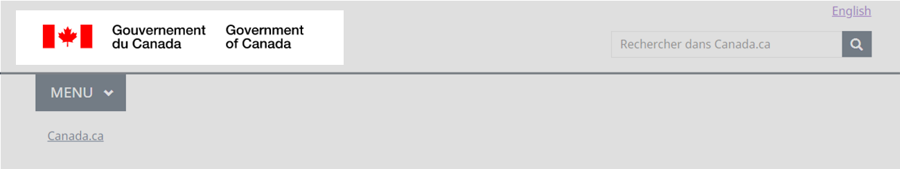
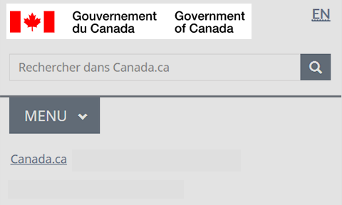

  

    <ul class="list-inline small mrgn-bttm-sm" id="list-inline-desktop-only">
      <li class="mrgn-rght-lg">Dernière mise à jour&nbsp;:  {{ page.dateModified }}</li>
    </ul>
  

Obligatoire sur toutes les pages

La signature du gouvernement du Canada est un élément obligatoire de l’En-tête général. Elle est un symbole officiel du gouvernement du Canada et combine le symbole du drapeau et &laquo;&nbsp;Gouvernement du Canada&nbsp;&raquo; dans les deux langues officielles.

La signature du gouvernement du Canada aide les utilisateurs à réaliser que la page sur laquelle ils se trouvent appartient au gouvernement du Canada.

  <figure class="mrgn-bttm-sm"></figure>

<section>
  <h2>Sur cette page</h2>
  <ul>
    <li><a href="#quand">Quand l’utiliser</a></li>
    <li><a href="#eviter">Quoi éviter</a></li>
    <li><a href="#contenu">Contenu et conception</a></li>
    <li><a href="#implementation">Comment procéder à la mise en œuvre</a></li>
    <li><a href="#recherche">Recherche et justification</a></li>
    <li><a href="#changements">Derniers changements</a></li>
  </ul>
</section>

<h2 id="quand">Quand l’utiliser</h2>

La signature du gouvernement du Canada est obligatoire sur toutes les pages.

<h2 id="eviter">Quoi éviter</h2>

Ne modifiez pas la signature.

Ne changez pas la couleur du drapeau. Il doit être en couleur (rouge) et non en noir et blanc.

Ne modifiez pas le texte (Government of Canada Gouvernement du Canada) ou la police.

<h2 id="contenu">Contenu et conception</h2>

Trouver des exemples visuels ainsi que des spécifications du contenu et de conception.

<h3>Spécifications du contenu</h3>

La signature du gouvernement du Canada se trouve dans le coin supérieur gauche de la page.

La signature est composée du symbole du drapeau en rouge du Programme de coordination de l’image de marque (PCIM), suivi des termes &laquo;&nbsp;Gouvernement du Canada&nbsp;&raquo; en français et &laquo;&nbsp;Government of Canada&nbsp;&raquo; en anglais, les deux étant écrits en noir.

La signature doit, en premier lieu, être affichée en anglais sur les pages anglaises et en français sur les pages françaises.

<h4>Accessibilité</h4>

Ajoutez &laquo;&nbsp;Government of Canada&nbsp;&raquo; en guise de texte de remplacement sur les pages anglaises et &laquo;&nbsp;Gouvernement du Canada&nbsp;&raquo; en guise de texte de remplacement sur les pages françaises.

<h4>Interactions</h4>

Lorsque l’utilisateur sélectionne la signature, cela lui permet d’accéder à la page d’accueil de Canada.ca.

<h3>Spécifications de conception</h3>

Les spécifications de conception concernant la signature sont les suivantes&nbsp;:

<ul>
  <li>Type&nbsp;: image</li>
  <li>Position&nbsp;: en haut à gauche</li>
  <li>Couleur du symbole du drapeau&nbsp;: rouge du PCIM (#eb4837)</li>
  <li>Couleur du texte&nbsp;: noir (#000000)</li>
  <li>Texte de remplacement&nbsp;: Gouvernement du Canada</li>
</ul>

La signature est un fichier SVG (graphique vectoriel adaptable), configuré pour s’adapter automatiquement à la taille de l’écran. 

La signature est un fichier image qui doit être formaté conformément aux <a href="https://www.canada.ca/fr/secretariat-conseil-tresor/services/communications-gouvernementales/norme-graphique/couleurs-norme-graphique-pfim.html">spécifications de conception du Programme de coordination de l’image de marque</a>.

<h3>Exemples visuels</h3>

  <figure>
    <figcaption><b>Signature du gouvernement du Canada - grand écran</b></figcaption>
    
    

      
Description de l’image&nbsp;: Signature du gouvernement du Canada - grand écran

      
La signature du gouvernement du Canada se trouve dans le coin supérieur gauche du site Web. Elle est composée du symbole du drapeau en rouge, suivi des termes &laquo;&nbsp;<strong>Government of Canada</strong>&nbsp;&raquo; en anglais et &laquo;&nbsp;<strong>Gouvernement du Canada</strong>&nbsp;&raquo; en français, les deux étant écrits en noir.

    

  </figure>

  <figure>
    <figcaption><b>Signature du gouvernement du Canada - petit écran</b></figcaption>
    
    

      
Description de l’image&nbsp;: Signature du gouvernement du Canada - petit écran

      
La signature du gouvernement du Canada se trouve dans le coin supérieur gauche de la page. Elle est composée du symbole du drapeau en rouge, suivi des termes &laquo;&nbsp;<strong>Government of Canada</strong>&nbsp;&raquo; en anglais et &laquo;&nbsp;<strong>Gouvernement du Canada</strong>&nbsp;&raquo; en français, les deux étant écrits en noir.

    

  </figure>

<h2 id="implementation">Comment procéder à la mise en œuvre</h2>

Trouver des exemples concrets de mise en œuvre de la signature du gouvernement du Canada, un élément de l’En-tête général.

<h3>Référence pour la mise en oeuvre du thème GCWeb (BOEW)</h3>

La référence pour l’implémentation explique la façon de configurer chaque élément de l’en-tête.

<ul>
  <li><a href="https://wet-boew.github.io/GCWeb/sites/header/header-docs-fr.html">Documentation relative à l’en-tête GCWeb (WET)</a></li>
</ul>

<h3>Mises en oeuvre</h3>

Déterminez ce qui convient le mieux au type de page que vous créez.

  

    

      

        

          
<strong>AEM du GC</strong>

          
Pour l’Adobe Experience Manager (AEM) du gouvernement du Canada&nbsp;:

          <ul>
            <li><a href="https://www.gcpedia.gc.ca/wiki/Documentation_d%27AEM_sp%C3%A9cifique_au_GC_6.5">Documentation d’AEM/Service Web géré (lien GCPédia - accessible uniquement sur le réseau du gouvernement du Canada)</a></li>
          </ul>
        

        

          
<strong>Solution de gabarits à déploiement centralisé (SGDC)</strong>

          
Pour la solution de gabarits à déploiement centralisé (SGDC)&nbsp;:

          <ul>
            <li><a href="https://cenw-wscoe.github.io/sgdc-cdts/docs/index-fr.html">Documentation de la SGDC</a></li>
          </ul>
        

        

          
<strong>Drupal WxT</strong>

          
Pour Drupal WxT&nbsp;:

          <ul>
            <li><a href="https://drupalwxt.github.io/fr/">Documentation relative à Drupal WxT</a></li>
          </ul>
        

      

    

  

<h2 id="recherche">Recherche et justification</h2>

Consultez les conclusions des recherches et la justification de la politique.

<h3>Constatations découlant des recherches</h3>

La confiance et la cohérence sont essentielles. Notre étude sur la confiance du Canada.ca et des recherches antérieures montrent qu’un en-tête cohérent est nécessaire pour maintenir une marque de confiance.

Par exemple, les gens font davantage confiance à la page lorsque le symbole du drapeau dans la signature du gouvernement du Canada est rouge.

Si vous souhaitez en savoir plus au sujet de cette recherche, communiquez avec le Bureau de la transformation numérique à <a href="mailto:dto.btn@tbs-sct.gc.ca">dto.btn@tbs-sct.gc.ca</a>.

<h3>Justification stratégique</h3>

La signature du gouvernement du Canada est définie par le Programme de coordination de l’image de marque. En tant que partie de l’En-tête général, il s’agit d’un élément obligatoire de la <cite>spécification du contenu et de l’architecture de l’information.</cite>

<ul>
  <li><a href="https://www.canada.ca/fr/secretariat-conseil-tresor/services/communications-gouvernementales/norme-graphique/couleurs-norme-graphique-pfim.html">Norme graphique du Programme de coordination de l’image de marque</a></li>
  <li><a href="https://www.canada.ca/fr/secretariat-conseil-tresor/services/communications-gouvernementales/specifications-contenu-architecture-information-canada/elements-obligatoires.html">Éléments obligatoires du système de conception</a></li>
</ul>

<h2 id="changements">Derniers changements</h2>
<dl class="dl-horizontal">
  <dt>
    <time>2023-MM-DD</time>
  </dt>
  <dd>Mise à jour de l'orientation pour y inclure des conseils sur ce qui est à éviter, la précision que le drapeau doit être en couleur, les spécifications en matière de contenu et de conception, des exemples visuels, une orientation sur la mise en œuvre, les conclusions des recherches et la justification stratégique</dd>
</dl>
