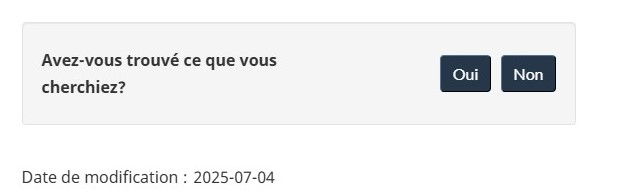

 <strong>
  De :
  <a href="https://www.canada.ca/fr/secretariat-conseil-tresor.html">
   Secrétariat du
    Conseil du Trésor du Canada
  </a>
 </strong>

 

  <ul class="toc lst-spcd col-md-12">
   <li class="col-md-4 col-sm-6">
    <a class="list-group-item active">
     Pied de page de la zone du contenu
    </a>
   </li>
   <li class="col-md-4 col-sm-6">
    <a class="list-group-item" href="signaler-probleme.html">
     Signaler un problème sur cette page
    </a>
   </li>
   <li class="col-md-4 col-sm-6">
    <a class="list-group-item" href="partagez-page.html">
     Partagez cette page
    </a>
   </li>
   <li class="col-md-4 col-sm-6">
    <a class="list-group-item" href="date-modification.html">
     Date de modification
    </a>
   </li>
  </ul>
 

 
  Obligatoire
 

 Le pied de page de la zone du contenu apparaît au bas de la zone du contenu de chaque page Web.

 Utilisez le pied de page de la zone du contenu avec le modèle du pied de page général.

 Consultez les conseils relatifs au
 <a href="pied-page.html">
  pied de page général
 </a>
 pour savoir comment mettre en œuvre la bande contextuelle, la
    bande principale et la bande sous pied de page.

<h2>
 Comment mettre en œuvre le pied de page de la zone du contenu
</h2>

 Le pied de page de la zone du contenu peut comporter jusqu'à 3 éléments :

<ul>
 <li>
   <a href="https://conception.canada.ca/configurations-conception-communes/outil-retroaction.html">
  Outil de rétroaction sur la page
 </a>
  (facultatif)
 </li>
 <li>
  <a href="partagez-page.html">
   Partager cette page
  </a>
  (facultatif)
 </li>
 <li>
  <a href="date-modification.html">
   Date de modification
  </a>
  (obligatoire, mais peut être un numéro de version lorsqu'il est utilisé pour une application)
 </li>
</ul>

 Insérez ce pied de page dans le bloc de la zone du contenu de sorte que ses marges soient alignées sur le contenu
    principal de la page.

<h2>
 Exemple
</h2>

 <figure class="mrgn-bttm-lg">
  <figcaption>
   <b>
    Pied de page de la zone du contenu
   </b>
  </figcaption>
  
  

   

    Description de l'image : Pied de page de la zone du contenu
   

   
Sur le côté gauche se trouve la vue initiale de l’outil de rétroaction sur la page. Un petit encadré gris demande «&nbsp;Avez-vous trouvé ce que vous cherchiez?&nbsp;» et affiche les boutons «&nbsp;Oui&nbsp;» et «&nbsp;Non&nbsp;».

    
Sur la droite se trouve un encadré gris comportant un symbole de partage ainsi que le texte «&nbsp;Partagez cette page&nbsp;».

    
Sous l’outil apparaît le texte : «&nbsp;Date de modification : 2023-08-01&nbsp;».

  

 </figure>

