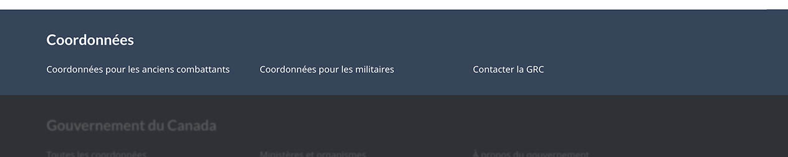
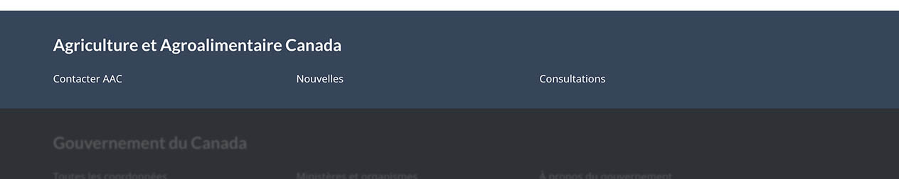

<strong>Dernière mise à jour</strong>&nbsp;:&nbsp;2023-02-08

<section>
  
Optionnel

  
La bande contextuelle de pied de page est un élément facultatif du pied de page général.

  
Elle contient des liens propres à un groupe entier de pages, comme les coordonnées pour un programme. Un groupe de pages
    peut englober un thème entier, toutes les pages liées à un programme précis ou toutes les pages liées à une seule
    organisation.

  
<strong>Mise à jour de conception en 2022</strong>&nbsp;: Nous avons récemment mis à jour ce modèle dans le cadre d’une nouvelle stratégie de navigation issue du projet de
    recherche Orientation dans Canada.ca.

  
  <!--<a href="">Blog post link</a>-->
  
  

  <section>
    <h2>Sur cette page</h2>
    <ul>
      <li><a href="#utiliser">Quand utiliser</a></li>
      <li><a href="#eviter">Quoi éviter</a></li>
      <li><a href="#conception">Contenu et conception</a></li>
      <li><a href="#comment">Comment mettre en œuvre</a></li>
      <li><a href="#recherches">Recherches et justification</a></li>
      <li><a href="#modifications">Dernières modifications</a></li>
      <li><a href="#discussion">Discussion</a></li>
    </ul>
  </section>
  <section>
    <h2 id="utiliser">Quand utiliser</h2>
    
Le pied de page fait office de dépannage pour les utilisateurs. Ils le consultent s’ils ne trouvent pas ce qu’ils
      cherchent dans le contenu principal de la page.

    
Utilisez une bande contextuelle de pied de page lorsque vous disposez d’un ensemble cohérent de liens de secours qui
      doivent être disponibles dans un groupe précis de pages.

    <ul>
      <li>Par exemple, les pages du thème Impôt pourraient avoir une bande contextuelle en bas de page avec un lien pour contacter
        l’ARC.</li>
    </ul>
    
<strong>Conseil&nbsp;:</strong> Si vos pages comportaient auparavant un lien contextuel « Contactez-nous » dans le pied de page général, vous devriez
      ajouter une bande contextuelle dans le pied de page.

  </section>
  <section>
    <h2 id="eviter">Quoi éviter</h2>
    
Le contenu de cette bande ne devrait pas faire double emploi avec les liens du Gouvernement du Canada dans <a href="./pied-page-principale.html">la bande
      principale de pied de page</a>.

    
N’utilisez pas cette bande pour une page unique. Elle doit s’appliquer à un groupe de pages connexes.

  </section>
  <section>
    <h2 id="conception">Contenu et conception</h2>
    
N’incluez qu’une seule bande contextuelle de pied de page sur une page donnée.

    <h3>Spécifications du contenu</h3>
    
Limitez cette bande à une seule rangée avec un maximum de 3 liens.

    
Incluez un titre pertinent pour le contenu de cette bande, comme le nom de l’organisation, le thème ou le programme.

    
N’oubliez pas qu’il s’agit d’une configuration de dépannage lorsque vous choisissez le contenu de ce groupe. Il n'y a pas de problème si un lien contact apparaît à la fois dans la zone de contenu et dans le pied de page. Si vous avez une page qui contient des coordonnées dans le corps de la page, vous pouvez avoir aussi un lien contact dans le pied de page.

    
Choisissez des liens que les gens s’attendront à trouver dans un pied de page en fonction des conventions du Web. Les
      liens contextuels courants en bas de page pourraient inclure&nbsp;:

    <ul>
      <li>Contacter [...] ou Coordonnées pour [...] (lien vers la page de coordonnées de l’organisation ou du programme)</li>
      <li>Carrières (lien vers les offres d’emploi)</li>
      <li>Actualités (ou autres index gérés, comme les consultations)</li>
    </ul>
    <h3>Spécifications du contenu</h3>
    
Les spécifications de conception de cette bande sont les suivantes&nbsp;:

    <ul>
      <li>Couleur de fond&nbsp;: Pied de page contextuel bleu (#33465c)</li>
      <li>Couleur du texte&nbsp;: blanc (#FFFFFF)</li>
      <li>Taille du texte&nbsp;: 14 px ou 0,875 em</li>
      <li>Police&nbsp;: Noto Sans</li>
      <li>Colonnes&nbsp;: 3 colonnes en formats grand et moyen écran, 1 colonne en format petit écran</li>
    </ul>
    <h3>Exemples visuels</h3>
    
La bande contextuelle doit rester la même pour l’ensemble du groupe de pages du thème ou de l’institution.

    

      <figure class="mrgn-bttm-lg">
        <figcaption><b>Exemple pour le thème des anciens combattants et des militaires</b></figcaption>
        
        

          
Version texte

          
Bande contextuelle pour le thème Anciens combattants et militaires avec le titre « Coordonnées » et 3 liens contextuels
            : « Coordonnées pour les anciens combattants », « Coordonnées pour les militaires » et « Contacter la GRC »

        

      </figure>
    

    

      <figure class="mrgn-bttm-lg">
        <figcaption><b>Exemple pour une institution</b></figcaption>
        
        

          
Version texte

          
Bande contextuelle pour une institution avec le titre “Agriculture et Agroalimentaire Canada” et 3 liens contextuels :
            “Contacter AAC,” “Nouvelles” et “Consultations”

        

      </figure>
    

  </section>
  <section>
    <h2 id="comment">Comment mettre en œuvre</h2>
    
Vérifiez quels éléments du pied de page global sont obligatoires pour le type de page que vous construisez avant de procéder à la mise en œuvre de ce modèle.

    <ul>
      <li><a href="./pied-page.html#utiliser">Pied de page général&nbsp;: Quand utiliser</a></li>
      <li><a href="./pied-page.html#comment">Pied de page général&nbsp;: Comment mettre en œuvre</a></li>
    </ul>
  </section>
  <section>
    <h3>Mises en œuvre</h3>
    
Déterminez la configuration du pied de page qui répond le mieux à vos besoins pour le type de page que vous créez. Consultez les conseils de votre mise en œuvre pour personnaliser les liens de la bande contextuelle ou de la bande de sous-pied.

    

      

        

          
<strong>AEM du GC</strong>

          
Pour l'Adobe Experience Manager du Gouvernement du Canada (AEM) :

          <ul>
            <li><a href="https://www.gcpedia.gc.ca/gcwiki/images/8/8c/Documentation-AEM-6.5-Unite-3-1-1-Personnaliser_le_pied_de_page_general.pdf">Personnaliser le pied de page général (PDF - disponible uniquement sur le réseau du gouvernement du Canada)</a></li>
            <li><a href="https://www.gcpedia.gc.ca/wiki/Documentation_d%27AEM_sp%C3%A9cifique_au_GC_6.5">Documentation d'AEM / Service Web Géré (disponible uniquement sur le réseau du gouvernement du Canada)</a></li>
          </ul>
        

        

          
<strong>SGDC</strong>

          
Pour la Solution de gabarits à déploiement centralisé (SGDC) :

          <ul>
            <li><a href="https://cdts.service.canada.ca/app/cls/WET/gcweb/v4_0_47/cdts/samples/footer-fr.html">Pied de page complet (les bandes contextuelle, principale, et sous pied de page)</a></li>
            <li><a href="https://cenw-wscoe.github.io/sgdc-cdts/docs/index-fr.html">Documentation SGDC documentation</a></li>
          </ul>
        

        

          
<strong>Drupal WxT</strong>

          
Pour Drupal WxT&nbsp;:

          <ul>
            <li><a href="https://drupalwxt.github.io/en/">Documentation Drupal WxT (en anglais seulement)</a></li>
          </ul>
          
Mise à jour du pied de page de 2023&nbsp;:

          <ul>
            <li><a href="https://github.com/drupalwxt/wxt/releases/tag/4.4.1">Les notes de version Drupal WxT (4.4.1) (en anglais seulement)</a></li>
            <li><a href="https://drupalwxt.github.io/en/docs/general/update/">Le processus de mise à jour Drupal WxT (en anglais seulement)</a></li>
          </ul>
        

      

    

  </section>
  <section>
    <h2 id="recherches">Recherches et justification</h2>
    
Nous avons mis à jour le pied de page général de Canada.ca pour le faire correspondre à une nouvelle stratégie de
      navigation générale issue du projet de recherche Orientation dans Canada.ca.

    <!--<ul>
	<li><a href="">New blog post title</a></li>
	<li><a href="">Research summary</a></li>
</ul>--> 
  </section>
  <section>
    <h2 id="modifications">Dernières modifications</h2>
    <dl class="dl-horizontal">
      <dt>
        <time datetime="2023-02-08" class="link-muted">2023-02-08</time>
      </dt>
      <dd>Ajout des liens vers les conseils de mise en œuvre de l'AEM du GC, la SGDC et le Drupal WxT</dd>
      <dt>
        <time datetime="2022-11-30" class="link-muted">2023-02-08</time>
      </dt>
      <dd>Ajout de conseils pour ce nouveau modèle.</dd>
    </dl>
  </section>
  <section>
    <h2 id="discussion">Discussion</h2>
    <ul>
      <li><a href="https://github.com/canada-ca/design-system-systeme-conception/issues">Discuter du modèle dans les questions GitHub</a></li>
      <li><a
				href="https://design-gc-conception.slack.com/join/shared_invite/enQtODE1OTc5Mzg5NzQ4LWQ3MjZjMTdjMjk2ZTZmMTJjYWQ3ZmRiNDYwYjRmN2NjYzQyNjFlNDBlY2FkNWE1ODg2YjExY2QwZmVjN2MwMGM">Se joindre à la conversation dans Slack</a></li>
      <li><a href="mailto:dto.btn@tbs-sct.gc.ca">Envoyer un courriel au Bureau de la transformation numérique</a></li>
    </ul>
  </section>
</section>

<!-- START PAGE FEEDBACK WIDGET -->

  

    <section class="gc-pg-hlpfl provisional">
      

        <form id="gc-pg-hlpfl-frm" action="#" method="post" autocomplete="off">
          <input type="hidden" name="institutionopt" value="tbs">
          <input type="hidden" name="themeopt" value="Policies">
          <input type="hidden" name="language" value="FR">
          <input type="hidden" name="pageTitle" value="Concevoir du contenu pour Canada.ca">
          <input type="hidden" name="submissionPage"
							value="https://conception.canada.ca/configurations-conception-communes/pied-page-contextuelle.html">
          <input type="hidden" name="sectionopt" value="Design system">
          <input type="hidden" id="helpful" name="helpful" value="Yes">
          

            

              

                <h2 class="mrgn-tp-sm h5">Avez-vous trouvé ce que vous cherchiez?</h2>
              

              

                <button id="btnyes" type="submit" value="Yes" class="btn btn-primary">Oui</button>
                <button id="btnno" type="button"
										class="btn btn-primary mrgn-lft-sm nojs-hide">Non</button>
              

            

          

          
Sinon, dites nous pourquoi&nbsp;:

          

            <fieldset>
              <legend class="h4 mrgn-tp-0 mrgn-bttm-md">Qu’est-ce qui n’allait pas?</legend>
              

                <label for="problem1">
                  <input name="problem" id="problem1" type="radio"
											value="Je ne peux pas trouver l’information"
											data-gc-analytics-wtph-value="I can't find the information-Je ne peux pas trouver l'information"
											data-gc-analytics-collect="notPrivate">
                  Je ne peux pas <strong>trouver</strong> l’information </label>
              

              

                <label for="problem2">
                  <input name="problem" id="problem2" type="radio"
											value="L'information est difficile à comprendre"
											data-gc-analytics-wtph-value="The information is hard to understand-J'ai trouvé l'information difficile à comprendre"
											data-gc-analytics-collect="notPrivate">
                  L'information est difficile à <strong>comprendre</strong> </label>
              

              

                <label for="problem3">
                  <input name="problem" id="problem3" type="radio"
											value="Il y avait une erreur / quelque chose ne fonctionnait pas"
											data-gc-analytics-wtph-value="There was an error or something didn't work-Il y avait une erreur our quelque chose ne fonctionnait pas"
											data-gc-analytics-collect="notPrivate">
                  Il y avait une erreur / quelque chose <strong>ne fonctionnait pas</strong> </label>
              

              

                <label for="problem4">
                  <input name="problem" id="problem4" type="radio" value="Other reason"
											data-gc-analytics-wtph-value="Other reason-Autre raison"
											data-gc-analytics-collect="notPrivate">
                  Autre raison </label>
              

            </fieldset>
            <label for="problem6" class="mrgn-bttm-0">Veuillez fournir plus de détails</label>
            
 <strong>Vous ne recevrez aucune réponse. Les numéros de téléphone et les adresses
              électroniques seront supprimés.</strong>  
              Maximum de 300 caractères 

            <textarea id="problem6" name="details" class="full-width" maxlength="300"></textarea>
            <button type="submit" value="No"
								class="btn btn-primary mrgn-tp-md mrgn-bttm-sm">Soumettre</button>
          

        </form>
        

          
 Merci de vos commentaires

        

      

    </section>
  

  

    
 

  

<!-- END PAGE FEEDBACK WIDGET --> 
