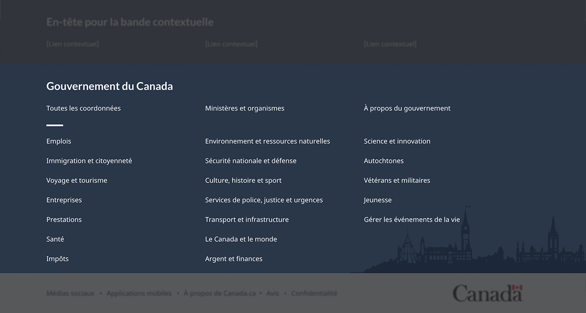
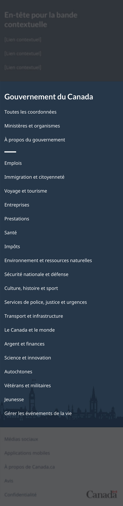

<strong>Dernière mise à jour</strong>&nbsp;:&nbsp;{{ page.dateModified }}

Obligatoire dans les pages régulières 

La bande principale du pied de page est l’élément principal du pied de page général. Elle contient des liens vers la
  page Toutes les personnes-ressources du gouvernement du Canada, le répertoire des ministères et organismes et la page
  thématique À propos du gouvernement. Elle contient également des liens vers toutes les pages thématiques de Canada.ca.

<strong>Mise à jour de conception en 2022</strong>&nbsp;: Nous avons récemment mis à jour ce modèle dans le cadre d’une nouvelle stratégie de navigation issue du projet de
  recherche Orientation dans Canada.ca.

  

<section>
  <h2>Sur cette page</h2>
  <ul>
    <li><a href="#utiliser">Quand utiliser</a></li>
    <li><a href="#eviter">Quoi éviter</a></li>
    <li><a href="#conception">Contenu et conception</a></li>
    <li><a href="#comment">Comment mettre en œuvre</a></li>
    <li><a href="#recherches">Recherches et justification</a></li>
    <li><a href="#modifications">Dernières modifications</a></li>
    <li><a href="#discussion">Discussion</a></li>
  </ul>
</section>
<section>
  <h2 id="utiliser">Quand utiliser</h2>
  
La bande principale de pied de page est un élément <strong>obligatoire</strong> pour <strong>toutes les pages régulières</strong> du gouvernement du Canada.

  
Elle est facultative pour les pages transactionnelles et de campagne.

</section>
<section>
  <h2 id="eviter">Quoi éviter</h2>
  
N’ajustez pas les liens ou le contenu dans la bande principale. Elle doit rester la même dans l’ensemble du site Web du
    gouvernement du Canada. Pour les liens qui sont propres à une organisation ou à un programme, utilisez la <a href="./pied-page-principale.html">bande contextuelle</a>.

</section>
<section>
  <h2 id="conception">Contenu et conception</h2>
  <h3>Spécifications du contenu</h3>
  
Il y a deux groupes de liens dans la bande principale, séparés par une courte barre de séparation.

  
Liens mondiaux&nbsp;:

  <ul>
    <li>Toutes les coordonnées</li>
    <li>Ministères et organismes</li>
    <li>À propos du gouvernement</li>
  </ul>
  
Liens thématiques dans l’ordre suivant&nbsp;:

  <ul>
    <li>Emplois</li>
    <li>Immigration et citoyenneté</li>
    <li>Voyages et tourisme</li>
    <li>Industrie</li>
    <li>Avantages sociaux</li>
    <li>Santé</li>
    <li>Impôts</li>
    <li>Environnement et ressources naturelles</li>
    <li>Sécurité nationale et défense</li>
    <li>Culture, histoire et sport</li>
    <li>Police, justice et urgences</li>
    <li>Transport et infrastructure</li>
    <li>Le Canada et le monde</li>
    <li>Argent et finances</li>
    <li>Science et innovation</li>
    <li>Les peuples autochtones</li>
    <li>Anciens combattants et militaires</li>
    <li>Jeunesse</li>
  </ul>
  <h3>Spécifications de conception</h3>
  <ul>
    <li>Couleur de fond&nbsp;: Couleur d’accentuation primaire (#26374a)</li>
    <li>Couleur du texte&nbsp;: blanc (#FFFFFF)</li>
    <li>Famille de polices&nbsp;:
      <ul>
        <li>titre&nbsp;: Lato</li>
        <li>liens&nbsp;: Noto Sans</li>
      </ul>
    </li>
    <li>Taille du texte (la taille de base du pied de page est 16px) :
      <ul>
        <li>titre&nbsp;: 19px ou 1.2em</li>
        <li>liens&nbsp;: 14px ou 0.875em</li>
      </ul>
    </li>
    <li>Épaisseur de la police&nbsp;:
      <ul>
        <li>titre&nbsp;: 700 ou caractère gras</li>
        <li>liens&nbsp;: 400 ou régulière</li>
      </ul>
    </li>
    <li>Image en silhouette du parlement placé en bas à droite</li>
    <li>Colonnes&nbsp;: 3 colonnes en formats grand et moyen écran, 1 colonne en format petit écran</li>
  </ul>
  <h3>Exemples visuels</h3>
  

    <figure class="mrgn-bttm-lg">
      <figcaption><b>Bande principale – grand écran</b></figcaption>
      
      

        
Version texte

        
Sur les grands écrans, la bande principale est disposée en 3 colonnes et contient des liens vers « Toutes les
          personnes-ressources », « Ministères et organismes » et « À propos du gouvernement ». Une petite ligne décorative sert
          de pause avant de poursuivre avec des liens vers tous les thèmes et publics.

      

    </figure>
  

  

    <figure class="mrgn-bttm-lg">
      <figcaption><b>Bande principale – petit écran</b></figcaption>
      
      

        
Version texte

        
Sur les petits écrans, le pied de page principal est disposé en une seule colonne et contient des liens vers : « Toutes
          les personnes-ressources », « Ministères et organismes » et « À propos du gouvernement ». Une petite ligne décorative
          sert de pause avant de poursuivre avec des liens vers tous les thèmes et publics.

      

    </figure>
  

</section>
<section>
  <h2 id="comment">Comment mettre en œuvre</h2>
  
Trouvez des exemples pratiques et du code pour mettre en œuvre le pied de page.

  <h3>Référence de mise en oeuvre du thème GCWeb</h3>
  <h4>Norme</h4>
  <ul>
    <li><a href="https://wet-boew.github.io/GCWeb/sites/footers/no-footer-contextual-fr.html">Bande principale et bande sous pied de page</a></li>
  </ul>
  <h4>Mise en œuvre alternée pour les pages régulières</h4>
  <ul>
    <li><a href="https://wet-boew.github.io/GCWeb/sites/footers/footers-fr.html">Pied de page complet (bande contextuelle, bande principale et bande sous de pied de page)</a></li>
  </ul>
  <h4>Mises en œuvre alternatives pour les pages transactionnelles et les pages de campagne</h4>
  <ul>
    <li><a href="https://wet-boew.github.io/GCWeb/sites/footers/footers-fr.html">Pied de page complet (bande contextuelle, bande principale et bande sous de pied de page)</a></li>
    <li><a href="https://wet-boew.github.io/GCWeb/sites/footers/only-footer-main-fr.html">Bande principale et bande sous pied de page sans les liens facultatifs</a></li>
    <li><a href="https://wet-boew.github.io/GCWeb/sites/footers/no-footer-main-fr.html">Bande contextuelle et bande sous pied de page</a></li>
    <li><a href="https://wet-boew.github.io/GCWeb/sites/footers/only-footer-contextual-fr.html">Bande contextuelle et bande sous pied de page sans les liens facultatifs</a></li>
    <li><a href="https://wet-boew.github.io/GCWeb/sites/footers/only-footer-corporate-fr.html">Uniquement la bande sous pied de page</a></li>
    <li><a href="https://wet-boew.github.io/GCWeb/sites/footers/no-footers-fr.html">Uniquement la bande sous pied de page sans les liens facultatifs</a></li>
  </ul>
</section>
<section>
  <h3>Mises en œuvre</h3>
  
Déterminez la configuration du pied de page qui répond le mieux à vos besoins pour le type de page que vous créez. Consultez les conseils de votre mise en œuvre pour personnaliser les liens de la bande contextuelle ou de la bande de sous-pied.

  

    

      

        
<strong>AEM du GC</strong>

        
Pour l'Adobe Experience Manager du Gouvernement du Canada (AEM) :

        <ul>
          <li><a href="https://www.gcpedia.gc.ca/gcwiki/images/8/8c/Documentation-AEM-6.5-Unite-3-1-1-Personnaliser_le_pied_de_page_general.pdf">Personnaliser le pied de page général (PDF - disponible uniquement sur le réseau du gouvernement du Canada)</a></li>
          <li><a href="https://www.gcpedia.gc.ca/wiki/Documentation_d%27AEM_sp%C3%A9cifique_au_GC_6.5">Documentation d'AEM / Service Web Géré (disponible uniquement sur le réseau du gouvernement du Canada)</a></li>
        </ul>
      

      

        
<strong>SGDC</strong>

        
Pour la Solution de gabarits à déploiement centralisé (SGDC) :

        <ul>
          <li><a href="https://cdts.service.canada.ca/app/cls/WET/gcweb/v4_0_47/cdts/samples/footer-fr.html">Pied de page complet (les bandes contextuelle, principale, et sous pied de page)</a></li>
          <li><a href="https://cenw-wscoe.github.io/sgdc-cdts/docs/index-fr.html">Documentation SGDC documentation</a></li>
        </ul>
      

      

        
<strong>Drupal WxT</strong>

        
Pour Drupal WxT&nbsp;:

        <ul>
          <li><a href="https://drupalwxt.github.io/">Documentation Drupal WxT (en anglais seulement)</a></li>
        </ul>
        
Mise à jour du pied de page de 2023&nbsp;:

        <ul>
          <li><a href="https://github.com/drupalwxt/wxt/releases/tag/4.4.1">Les notes de version Drupal WxT (4.4.1) (en anglais seulement)</a></li>
          <li><a href="https://drupalwxt.github.io/en/docs/general/update/">Le processus de mise à jour Drupal WxT (en anglais seulement)</a></li>
        </ul>
      

    

  

</section>
<section>
  <h2 id="recherches">Recherches et justification</h2>
  
Nous avons mis à jour le pied de page général de Canada.ca pour le faire correspondre à une nouvelle stratégie de
    navigation générale issue du projet de recherche Orientation dans Canada.ca.

</section>
<section>
  <h2 id="modifications">Dernières modifications</h2>
  <dl class="dl-horizontal">
    <dt>
      <time datetime="2023-02-08" class="link-muted">2023-02-08</time>
    </dt>
    <dd>Ajout des liens vers les conseils de mise en œuvre de l'AEM du GC, la SGDC et le Drupal WxT</dd>
    <dt>
      <time datetime="2022-11-30" class="link-muted">2022-11-30</time>
    </dt>
    <dd>Création d’une nouvelle page pour les conseils propres à cette bande, mise à jour des spécifications de contenu pour
      ajuster les liens globaux et inclure des liens thématiques, ajout de spécifications de conception et prestation de
      ressources de mise en œuvre.</dd>
  </dl>
</section>
<section>
  <h2 id="discussion">Discussion</h2>
  <ul>
    <li><a
				href="https://design-gc-conception.slack.com/join/shared_invite/enQtODE1OTc5Mzg5NzQ4LWQ3MjZjMTdjMjk2ZTZmMTJjYWQ3ZmRiNDYwYjRmN2NjYzQyNjFlNDBlY2FkNWE1ODg2YjExY2QwZmVjN2MwMGM">Se joindre à la conversation dans Slack</a></li>
    <li><a href="mailto:dto.btn@tbs-sct.gc.ca">Envoyer un courriel au Bureau de la transformation numérique</a></li>
  </ul>
</section>
