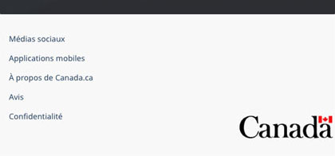

<strong>Dernière mise à jour</strong>&nbsp;:&nbsp;{{ page.dateModified }}

Obligatoire 

La bande sous pied de page est un élément secondaire du pied de page général. Il contient une série de liens et le
  mot-symbole Canada.

<strong>Mise à jour de conception en 2022</strong>&nbsp;: Nous avons récemment mis à jour ce modèle dans le cadre d’une nouvelle stratégie de navigation issue du projet de recherche Orientation dans Canada.ca. Pour en savoir plus, consultez la section <a href="#recherches">Recherches et justification</a> de cette page.

  

<section>
  <h2>Sur cette page</h2>
  <ul>
    <li><a href="#utiliser">Quand utiliser</a></li>
    <li><a href="#conception">Contenu et conception</a></li>
    <li><a href="#comment">Comment mettre en œuvre</a></li>
    <li><a href="#recherches">Recherches et justification</a></li>
    <li><a href="#modifications">Dernières modifications</a></li>
    <li><a href="#discussion">Discussion</a></li>
  </ul>
</section>
<section>
  <h2 id="utiliser">Quand utiliser</h2>
  
La bande sous pied de page est obligatoire sur tous les types de pages.

</section>
<section>
  <h2 id="conception">Contenu et conception</h2>
  <h3>Spécifications du contenu</h3>
  
Les liens apparaissent dans l’ordre suivant&nbsp;:

  <ul>
    <li>Médias sociaux</li>
    <li>Applications mobiles</li>
    <li>À propos de Canada.ca</li>
    <li>Avis – lien peut être contextualisé pour renvoyer aux avis du ministère ou du programme responsable du contenu de la page</li>
    <li>Confidentialité – lient peut être contextualisé pour renvoyer aux renseignements de confidentialité du ministère ou du programme responsable du contenu de la page</li>
  </ul>
  
Sur les pages <strong>transactionnelles</strong> et de <strong>campagne</strong>, vous pouvez omettre les liens Médias sociaux, Applications mobiles et À propos de Canada.ca sur.

  
Sur les pages <strong>transactionnelles</strong>, veillez à ce que les liens Avis et Confidentialité permettent aux utilisateurs de rester dans leur session actuelle (pour les applications authentifiées, gardez-les dans l'environnement de l'application).

  <h4>Mot-symbole Canada</h4>
  
Inclure le mot-symbole Canada dans la bande sous pied de page sur toutes les pages de Canada.ca. Cela permet de
    consolider la marque et de donner un indice supplémentaire aux gens qu’ils lisent du contenu provenant du gouvernement
    du Canada.

  <h3>Spécifications de conception</h3>
  <ul>
    <li>Couleur d’arrière-plan&nbsp;: gris sous pied de page (#F8F8F8)</li>
    <li>Couleur du texte&nbsp;: <a href="../styles/couleurs.html">couleurs standards des liens</a></li>
    <li>Taille du texte&nbsp;: 14 px ou 0,875 em</li>
    <li>Police&nbsp;: Noto Sans</li>
    <li>Position du mot-symbole Canada&nbsp;: placé à droite</li>
    <li>Taille du mot-symbole Canada&nbsp;: 40 px de hauteur</li>
    <li>Mise en page&nbsp;: 1 ligne en format grand écran, 2 colonnes en format moyen écran, 1 colonne en format petit écran</li>
  </ul>
  <h3>Exemples visuels</h3>
  

    
Pages régulières (en mode d'affichage pour ordinateur et pour appareil mobile)

    

      <figure class="mrgn-bttm-lg">
        <figcaption><b>Bande sous pied de page – grand écran</b></figcaption>
        
        

          
Version texte

          
Sur les grands écrans, la bande sous pied de page contient des liens &laquo;&nbsp;Médias sociaux&nbsp;&raquo;, &laquo;&nbsp;Applications mobiles&nbsp;&raquo;, &laquo;&nbsp;À
            propos de Canada.ca&nbsp;&raquo;, &laquo;&nbsp;Avis&nbsp;&raquo; et &laquo;&nbsp;Confidentialité&nbsp;&raquo;, tous alignés à gauche sur une seule rangée. Elle
            comprend également le mot-symbole Canada sur la même ligne, aligné à droite.

        

      </figure>
    

    

      <figure class="mrgn-bttm-lg">
        <figcaption><b>Bande sous pied de page – petit écran</b></figcaption>
        
        

          
Version texte

          
Sur les petits écrans, la bande sous pied de page contient des liens &laquo;&nbsp;Médias sociaux&nbsp;&raquo;, &laquo;&nbsp;Applications mobiles&nbsp;&raquo;, &laquo;&nbsp;À propos de Canada.ca&nbsp;&raquo;, &laquo;&nbsp;Avis&nbsp;&raquo; et &laquo;&nbsp;Confidentialité&nbsp;&raquo;, disposés en une seule colonne. Sous ces liens se trouve le mot-symbole Canada aligné à droite.

        

      </figure>
    

  

  

    
Pages transactionnelles et de campagne (en mode d'affichage pour ordinateur et pour appareil mobile)

    

      <figure class="mrgn-bttm-lg">
        <figcaption><b>Bande sous pied de page minimum – grand écran</b></figcaption>
        
        

          
Version texte

          
Sur les grands écrans, la bande sous pied de page minimum pour les pages transactionnelles et de campagne comprend seulement les liens vers &laquo;&nbsp;Avis&nbsp;&raquo; et &laquo;&nbsp;Confidentialité&nbsp;&raquo;, disposés en une seule colonne. Sous ces liens se trouve le mot-symbole Canada aligné à droite.

        

      </figure>
    

    

      <figure class="mrgn-bttm-lg">
        <figcaption><b>Bande sous pied de page minimum – petit écran</b></figcaption>
        
        

          
Version texte

          
Sur les petits écrans, la bande sous pied de page minimum pour les pages transactionnelles et de campagne comprend seulement les liens vers &laquo;&nbsp;Avis&nbsp;&raquo; et &laquo;&nbsp;Confidentialité&nbsp;&raquo;, disposés en une seule colonne.  Sous ces liens se trouve le mot-symbole Canada
            aligné à droite.

        

      </figure>
    

  

</section>
<section>
  <h2 id="comment">Comment mettre en œuvre</h2>
  
Trouvez des exemples pratiques et du code pour mettre en œuvre le pied de page.

  <h3>Référence de mise en oeuvre du thème GCWeb</h3>
  <h4>Norme</h4>
  <ul>
    <li><a href="https://wet-boew.github.io/GCWeb/sites/footers/no-footer-contextual-fr.html">Bande principale et bande sous pied de page</a></li>
  </ul>
  <h4>Mise en œuvre alternée pour les pages régulières</h4>
  <ul>
    <li><a href="https://wet-boew.github.io/GCWeb/sites/footers/footers-fr.html">Pied de page complet (bande contextuelle, bande principale et bande sous de pied de page)</a></li>
  </ul>
  <h4>Mises en œuvre alternatives pour les pages transactionnelles et les pages de campagne</h4>
  <ul>
    <li><a href="https://wet-boew.github.io/GCWeb/sites/footers/footers-fr.html">Pied de page complet (bande contextuelle, bande principale et bande sous de pied de page)</a></li>
    <li><a href="https://wet-boew.github.io/GCWeb/sites/footers/only-footer-main-fr.html">Bande principale et bande sous pied de page sans les liens facultatifs</a></li>
    <li><a href="https://wet-boew.github.io/GCWeb/sites/footers/no-footer-main-fr.html">Bande contextuelle et bande sous pied de page</a></li>
    <li><a href="https://wet-boew.github.io/GCWeb/sites/footers/only-footer-contextual-fr.html">Bande contextuelle et bande sous pied de page sans les liens facultatifs</a></li>
    <li><a href="https://wet-boew.github.io/GCWeb/sites/footers/only-footer-corporate-fr.html">Uniquement la bande sous pied de page</a></li>
    <li><a href="https://wet-boew.github.io/GCWeb/sites/footers/no-footers-fr.html">Uniquement la bande sous pied de page sans les liens facultatifs</a></li>
  </ul>
</section>
<section>
  <h3>Mises en œuvre</h3>
  
Déterminez la configuration du pied de page qui répond le mieux à vos besoins pour le type de page que vous créez. Consultez les conseils de votre mise en œuvre pour personnaliser les liens de la bande contextuelle ou de la bande de sous-pied.

  

    

      

        
<strong>AEM du GC</strong>

        
Pour l'Adobe Experience Manager du Gouvernement du Canada (AEM) :

        <ul>
          <li><a href="https://www.gcpedia.gc.ca/gcwiki/images/8/8c/Documentation-AEM-6.5-Unite-3-1-1-Personnaliser_le_pied_de_page_general.pdf">Personnaliser le pied de page général (PDF - disponible uniquement sur le réseau du gouvernement du Canada)</a></li>
          <li><a href="https://www.gcpedia.gc.ca/wiki/Documentation_d%27AEM_sp%C3%A9cifique_au_GC_6.5">Documentation d'AEM / Service Web Géré (disponible uniquement sur le réseau du gouvernement du Canada)</a></li>
        </ul>
      

      

        
<strong>SGDC</strong>

        
Pour la Solution de gabarits à déploiement centralisé (SGDC) :

        <ul>
          <li><a href="https://cdts.service.canada.ca/app/cls/WET/gcweb/v4_0_47/cdts/samples/footer-fr.html">Pied de page complet (les bandes contextuelle, principale, et sous pied de page)</a></li>
          <li><a href="https://cenw-wscoe.github.io/sgdc-cdts/docs/index-fr.html">Documentation SGDC documentation</a></li>
        </ul>
      

      

        
<strong>Drupal WxT</strong>

        
Pour Drupal WxT&nbsp;:

        <ul>
          <li><a href="https://drupalwxt.github.io/">Documentation Drupal WxT (en anglais seulement)</a></li>
        </ul>
        
Mise à jour du pied de page de 2023&nbsp;:

        <ul>
          <li><a href="https://github.com/drupalwxt/wxt/releases/tag/4.4.1">Les notes de version Drupal WxT (4.4.1) (en anglais seulement)</a></li>
          <li><a href="https://drupalwxt.github.io/en/docs/general/update/">Le processus de mise à jour Drupal WxT (en anglais seulement)</a></li>
        </ul>
      

    

  

</section>
<section>
  <h2 id="recherches">Recherches et justification</h2>
  
Nous avons mis à jour le pied de page général de Canada.ca pour le faire correspondre à une nouvelle stratégie de
    navigation générale issue du projet de recherche Orientation dans Canada.ca.

  <ul>
    <li><a href="{{ site.url }}/resumes-recherche/orientation-dans-canada-ca">Résumé de la recherche sur l’orientation dans Canada.ca</a> 
      Ce résumé explique le contexte de la recherche et les constatations qui ont mené aux mises à jour de la conception.</li>
    <li><a href="https://blogue.canada.ca/2022/12/21/le-projet-orientation.html">Le projet Orientation dans Canada.ca améliore notre approche en matière de la navigation</a> 
      Ce billet de blogue explique les changements proposés à la conception de Canada.ca et comment ils seront mis en œuvre.</li>
  </ul>
</section>
<section>
  <h2 id="modifications">Dernières modifications</h2>
  <dl class="dl-horizontal">
    <dt>
      <time datetime="2023-02-08" class="link-muted">2023-02-08</time>
    </dt>
    <dd>Ajout des liens vers les conseils de mise en œuvre de l'AEM du GC, la SGDC et le Drupal WxT</dd>
    <dt>
      <time datetime="2023-01-18" class="link-muted">2023-01-18</time>
    </dt>
    <dd>Clarification du fait que sur les pages transactionnelles, les liens Avis et Confidentialité doivent permettre aux utilisateurs de rester dans leur session actuelle.</dd>
    <dt>
      <time datetime="2022-12-23" class="link-muted">2022-12-23</time>
    </dt>
    <dd>Ajout des liens pour le résumé de recherche et le billet de blogue pour le projet Orientation dans Canada.ca</dd>
    <dt>
      <time datetime="2022-11-30" class="link-muted">2022-11-30</time>
    </dt>
    <dd>Création d’une nouvelle page pour les conseils propre à cette bande, mise à jour des spécifications de contenu pour
      inclure le mot-symbole Canada, ajout de spécifications de conception et d’exemples visuels.</dd>
  </dl>
</section>
<section>
  <h2 id="discussion">Discussion</h2>
  <ul>
    <li><a
				href="https://design-gc-conception.slack.com/join/shared_invite/enQtODE1OTc5Mzg5NzQ4LWQ3MjZjMTdjMjk2ZTZmMTJjYWQ3ZmRiNDYwYjRmN2NjYzQyNjFlNDBlY2FkNWE1ODg2YjExY2QwZmVjN2MwMGM">Se joindre à la conversation dans Slack</a></li>
    <li><a href="mailto:{{ site.emails.dto }}">Envoyer un courriel au Bureau de la transformation numérique</a></li>
  </ul>
</section>
