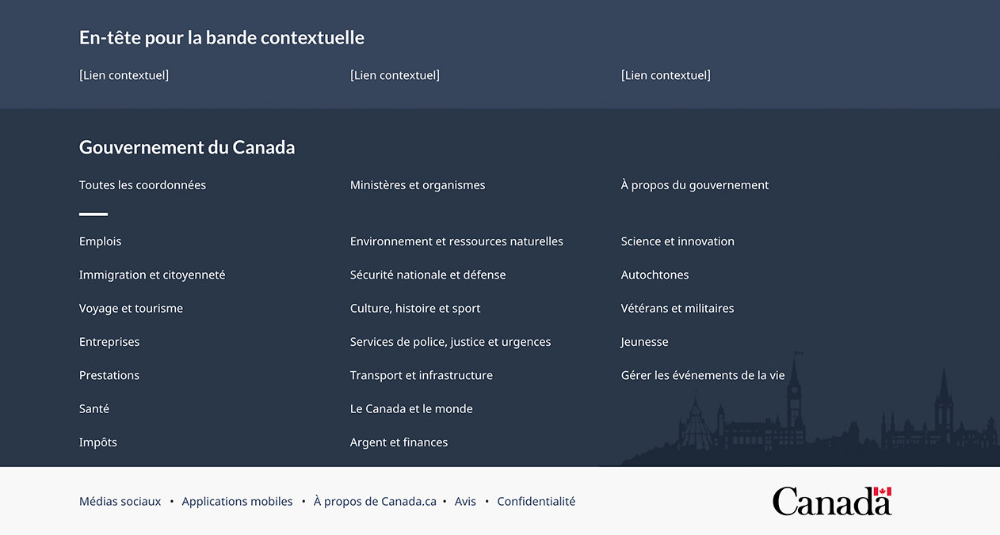
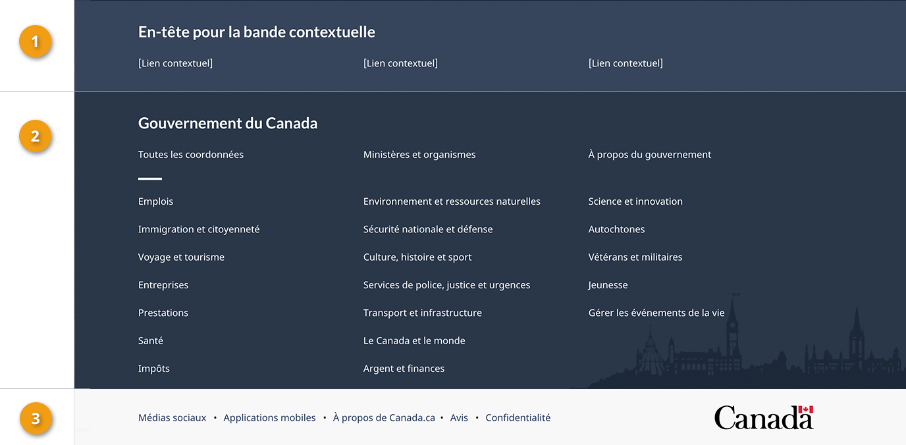
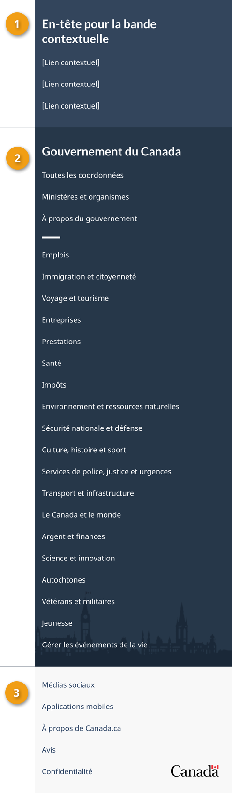

<strong>Dernière mise à jour</strong>&nbsp;:&nbsp;{{ page.dateModified }}

Obligatoire

Le pied de page général (à l’échelle du site) situé au bas de chaque page Web contient jusqu’à 3 bandes&nbsp;:

<ul>
  <li>Bande contextuelle</li>
  <li>Bande principale</li>
  <li>Bande sous pied de page</li>
</ul>

<strong>Mise à jour de conception en 2022</strong>&nbsp;: Nous avons récemment mis à jour ce modèle dans le cadre d’une nouvelle stratégie de navigation issue du projet de recherche Orientation dans Canada.ca. Pour en savoir plus, consultez la section <a href="#recherches">Recherches et justification</a> de cette page.

 

<a href="pied-page-contenu.html">Consulter le modèle Pied de page de la zone du contenu</a> pour obtenir des conseils sur la manière d'appliquer les composantes Date de modification, Partager cette page, et Signaler un problème ou l'outil de rétroaction sur la page.

<section>
  <h2>Sur cette page</h2>
  <ul>
    <li><a href="#utiliser">Quand utiliser</a></li>
    <li><a href="#eviter">Quoi éviter</a></li>
    <li><a href="#conception">Contenu et conception</a></li>
    <li><a href="#comment">Comment mettre en œuvre</a></li>
    <li><a href="#recherches">Recherches et justification</a></li>
    <li><a href="#modifications">Dernières modifications</a></li>
  </ul>
</section>
<section>
  <h2 id="utiliser">Quand utiliser</h2>
  
Le pied de page fait office de dépannage pour les utilisateurs. Ils le consultent s’ils ne trouvent pas ce qu’ils
    cherchent dans le contenu principal de la page.

  
Chaque élément du pied de page général fournit un accès direct et centralisé à des types de contenu précis (par exemple,
    Coordonnées, Ministères et organismes, Confidentialité). 

  
Déterminez les éléments de pied de page à utiliser en fonction du type de page que vous créez.

  

    

      

        
<strong>Pages régulières</strong>

        

          
Les <strong>pages régulières</strong> sont des pages dans lesquelles les utilisateurs peuvent naviguer sans perdre de données, déclencher des erreurs ou
            mettre fin à leur session.

        

        

          <h3>Exigences générales pour le pied de page d’une page régulière</h3>
          

            <table class="table table-striped table-condensed" id="mandatory-01" aria-live="polite">
              <caption class="wb-inv">
              Exigences générales pour le pied de page
              </caption>
              <thead>
                <tr>
                  <th class="col-md-4">Élément de pied de page</th>
                  <th class="col-md-3">Obligatoire</th>
                </tr>
              </thead>
              <tbody>
                <tr>
                  <td>1. <a href="pied-page-contextuelle.html">Bande contextuelle</a></td>
                  <td>Optionnel</td>
                </tr>
                <tr>
                  <td>2. <a href="pied-page-principale.html">Bande principale</a></td>
                  <td>Obligatoire</td>
                </tr>
                <tr>
                  <td>3. <a href="pied-page-sous.html">Bande sous pied de page avec le mot-symbole Canada
                    

                    </a></td>
                  <td>Obligatoire</td>
                </tr>
              </tbody>
            </table>
          

        

      

      

        
<strong>Pages transactionnelles</strong>

        

          
Les <strong>pages transactionnelles</strong> sont des pages avec une tâche d’interaction où les personnes risquent de perdre des données, de déclencher des erreurs ou de mettre fin à leur session si elles quittent la page.

        

        

          <h3>Exigences générales pour le pied de page d’une page transactionnelle</h3>
          

            <table class="table table-striped table-condensed" id="mandatory-02" aria-live="polite">
              <caption class="wb-inv">
              Exigences générales pour le pied de page
              </caption>
              <thead>
                <tr>
                  <th class="col-md-4">Élément de pied de page</th>
                  <th class="col-md-3">Obligatoire</th>
                </tr>
              </thead>
              <tbody>
                <tr>
                  <td>1. <a href="pied-page-contextuelle.html">Bande contextuelle</a></td>
                  <td>Optionnel</td>
                </tr>
                <tr>
                  <td>2. <a href="pied-page-principale.html">Bande principale</a></td>
                  <td>Optionnel</td>
                </tr>
                <tr>
                  <td>3. <a href="pied-page-sous.html">Bande sous pied de page avec le mot-symbole Canada
                    

                    </a></td>
                  <td>Obligatoire</td>
                </tr>
              </tbody>
            </table>
          

        

      

      

        
<strong>Pages de campagne</strong>

        

          
Les <strong>pages de campagne</strong> sont des pages de renvoi pour des campagnes de marketing ou de publicité externes. La flexibilité de la mise en page
            permet aux institutions d’inclure des éléments de leur campagne externe dans la page.

        

        

          <h3>Exigences générales pour le pied de page d’une page de campagne</h3>
          

            <table class="table table-striped table-condensed" id="mandatory-03" aria-live="polite">
              <caption class="wb-inv">
              Exigences générales pour le pied de page
              </caption>
              <thead>
                <tr>
                  <th class="col-md-4">Élément de pied de page</th>
                  <th class="col-md-3">Obligatoire</th>
                </tr>
              </thead>
              <tbody>
                <tr>
                  <td>1. <a href="pied-page-contextuelle.html">Bande contextuelle</a></td>
                  <td>Optionnel</td>
                </tr>
                <tr>
                  <td>2. <a href="pied-page-principale.html">Bande principale</a></td>
                  <td>Optionnel</td>
                </tr>
                <tr>
                  <td>3. <a href="pied-page-sous.html">Bande sous pied de page avec le mot-symbole Canada
                    

                    </a></td>
                  <td>Obligatoire</td>
                </tr>
              </tbody>
            </table>
          

        

      

    

  

</section>
<section>
  <h2 id="eviter">Quoi éviter</h2>
  
Ne personnalisez pas les éléments obligatoires du pied de page général, au-delà de ce qui est recommandé dans les conseils pour chacun. La cohérence dans cet espace est essentielle pour consolider la reconnaissance de la marque et la confiance
    des utilisateurs.

  
Par exemple, le mot-symbole Canada doit toujours apparaître dans le coin inférieur droit et les liens dans la bande
    principale ne doivent jamais changer.

</section>
<section>
  <h2 id="conception">Contenu et conception</h2>
  
Spécifications détaillées de contenu et de conception pour chaque élément du pied de page&nbsp;:

  <ol>
    <li><a href="pied-page-contextuelle.html">Bande contextuelle</a></li>
    <li><a href="pied-page-principale.html">Bande principale</a></li>
    <li><a href="pied-page-sous.html">Bande sous pied de page</a></li>
  </ol>
  <h3>Exemples visuels</h3>
  

    
Pages régulières

    

      <figure class="mrgn-tp-md mrgn-bttm-lg">
        <figcaption><b>Pied de page général – grand écran</b></figcaption>
        
        

          
Version texte

          
Sur les grands écrans, le pied de page général comprend 3 bandes distinctes de liens. La première est la bande
            contextuelle. Elle contient un titre et 3 liens contextuels sur une seule ligne. La seconde est la bande principale.
            Elle est disposée en 3 colonnes et contient des liens vers &laquo;&nbsp;Toutes les personnes-ressources&nbsp;&raquo;, &laquo;&nbsp;Ministères et
            organismes&nbsp;&raquo; et &laquo;&nbsp;À propos du gouvernement&nbsp;&raquo;. Une petite ligne décorative sert de pause avant de poursuivre avec des
            liens vers tous les thèmes et publics. La bande sous pied de page se trouve au bas de la page et contient des liens vers
            &laquo;&nbsp;Médias sociaux&nbsp;&raquo;, &laquo;&nbsp;Applications mobiles&nbsp;&raquo;, &laquo;&nbsp;À propos de Canada.ca&nbsp;&raquo;, &laquo;&nbsp;Avis&nbsp;&raquo; et &laquo;&nbsp;Confidentialité&nbsp;&raquo;. Ils sont tous alignés à gauche sur une seule ligne. Elle comprend également le mot-symbole Canada sur la même ligne, aligné à droite.

        

      </figure>
    

    

      <figure class="mrgn-tp-md mrgn-bttm-lg">
        <figcaption><b>Pied de page général – petit écran</b></figcaption>
        
        

          
Version texte

          
Sur les petits écrans, le pied de page général comprend 3 bandes distinctes de liens. La première est la bande
            contextuelle. Elle contient un titre et 3 liens contextuels sur une seule ligne. La seconde est la bande principale.
            Elle est disposée en une seule colonne et contient des liens vers &laquo;&nbsp;Toutes les personnes-ressources&nbsp;&raquo;, &laquo;&nbsp;Ministères et
            organismes&nbsp;&raquo; et &laquo;&nbsp;À propos du gouvernement&nbsp;&raquo;. Une petite ligne décorative sert de pause avant de poursuivre avec des
            liens vers tous les thèmes et publics. La bande sous pied de page se trouve au bas de la page et contient des liens vers
            &laquo;&nbsp;Médias sociaux&nbsp;&raquo;, &laquo;&nbsp;Applications mobiles&nbsp;&raquo;, &laquo;&nbsp;À propos de Canada.ca&nbsp;&raquo;, &laquo;&nbsp;Avis&nbsp;&raquo; et &laquo;&nbsp;Confidentialité&nbsp;&raquo;. Sous ces liens se trouve une dernière rangée avec le mot-symbole Canada aligné à droite.

        

      </figure>
    

  

  

    
Pages transactionnelles et de campagne

    

      <figure class="mrgn-tp-md mrgn-bttm-lg">
        <figcaption><b>Pied de page général minimum – grand écran</b></figcaption>
        
        

          
Version texte

          
Sur les grands écrans, le pied de page général minimum pour les pages transactionnelles et de campagne comprend seulement la bande
            sous pied de page avec les liens vers « Avis » et « Confidentialité ». Ils
            sont tous alignés à gauche sur une seule ligne. Elle comprend également le mot-symbole Canada sur la même ligne, aligné
            à droite.

        

      </figure>
    

    

      <figure class="mrgn-tp-md mrgn-bttm-lg">
        <figcaption><b>Pied de page général minimum – petit écran</b></figcaption>
        
        

          
Version texte

          
Sur les petits écrans, le pied de page général minimum pour les pages transactionnelles et de campagne comprend seulement la bande
            sous pied de page avec les liens vers &laquo;&nbsp;Avis&nbsp;&raquo; et &laquo;&nbsp;Confidentialité&nbsp;&raquo;, disposés en une seule colonne. Sous ces liens se trouve le mot-symbole Canada aligné à droite.

        

      </figure>
    

  

</section>
<section>
  <h2 id="comment">Comment mettre en œuvre</h2>
  
Trouvez des exemples pratiques et du code pour mettre en œuvre le pied de page.

  <h3>Référence de mise en oeuvre du thème GCWeb</h3>
  <h4>Norme</h4>
  <ul>
    <li><a href="https://wet-boew.github.io/GCWeb/sites/footers/no-footer-contextual-fr.html">Bande principale et bande sous pied de page</a></li>
  </ul>
  <h4>Mise en œuvre alternée pour les pages régulières</h4>
  <ul>
    <li><a href="https://wet-boew.github.io/GCWeb/sites/footers/footers-fr.html">Pied de page complet (bande contextuelle, bande principale et bande sous de pied de page)</a></li>
  </ul>
  <h4>Mises en œuvre alternatives pour les pages transactionnelles et les pages de campagne</h4>
  <ul>
    <li><a href="https://wet-boew.github.io/GCWeb/sites/footers/footers-fr.html">Pied de page complet (bande contextuelle, bande principale et bande sous de pied de page)</a></li>
    <li><a href="https://wet-boew.github.io/GCWeb/sites/footers/only-footer-main-fr.html">Bande principale et bande sous pied de page sans les liens facultatifs</a></li>
    <li><a href="https://wet-boew.github.io/GCWeb/sites/footers/no-footer-main-fr.html">Bande contextuelle et bande sous pied de page</a></li>
    <li><a href="https://wet-boew.github.io/GCWeb/sites/footers/only-footer-contextual-fr.html">Bande contextuelle et bande sous pied de page sans les liens facultatifs</a></li>
    <li><a href="https://wet-boew.github.io/GCWeb/sites/footers/only-footer-corporate-fr.html">Uniquement la bande sous pied de page</a></li>
    <li><a href="https://wet-boew.github.io/GCWeb/sites/footers/no-footers-fr.html">Uniquement la bande sous pied de page sans liens facultatifs</a></li>
  </ul>
</section>
<section>
  <h3>Mises en œuvre</h3>
  
Déterminez la configuration du pied de page qui répond le mieux à vos besoins pour le type de page que vous créez. Consultez les conseils de votre mise en œuvre pour personnaliser les liens de la bande contextuelle ou de la bande de sous-pied.

  

    

      

        
<strong>AEM du GC</strong>

        
Pour l'Adobe Experience Manager du Gouvernement du Canada (AEM) :

        <ul>
          <li><a href="https://www.gcpedia.gc.ca/gcwiki/images/8/8c/Documentation-AEM-6.5-Unite-3-1-1-Personnaliser_le_pied_de_page_general.pdf">Personnaliser le pied de page général (PDF - disponible uniquement sur le réseau du gouvernement du Canada)</a></li>
          <li><a href="https://www.gcpedia.gc.ca/wiki/Documentation_d%27AEM_sp%C3%A9cifique_au_GC_6.5">Documentation d'AEM / Service Web Géré (disponible uniquement sur le réseau du gouvernement du Canada)</a></li>
        </ul>
      

      

        
<strong>Système de design GC</strong>

        
Pour le Système de design GC :

        <ul>
          <li><a href="https://systeme-design.alpha.canada.ca/fr/composants/pied-de-page/">Documentation de Système de design GC</a></li>
        </ul>
      

      

        
<strong>SGDC</strong>

        
Pour la Solution de gabarits à déploiement centralisé (SGDC) :

        <ul>
          <li><a href="https://cdts.service.canada.ca/app/cls/WET/gcweb/v4_0_47/cdts/samples/footer-fr.html">Pied de page complet (les bandes contextuelle, principale, et sous pied de page)</a></li>
          <li><a href="https://cenw-wscoe.github.io/sgdc-cdts/docs/index-fr.html">Documentation de la SGDC</a></li>
        </ul>
      

      

        
<strong>Drupal</strong>

        
Pour Drupal :

        <ul>
          <li><a href="https://drupalwxt.github.io/">Documentation de Drupal WxT (en anglais seulement)</a></li>
        </ul>
        
Mise à jour du pied de page de 2023&nbsp;:

        <ul>
          <li><a href="https://github.com/drupalwxt/wxt/releases/tag/4.4.1">Les notes de version Drupal WxT (4.4.1) (en anglais seulement)</a></li>
          <li><a href="https://drupalwxt.github.io/en/docs/general/update/">Le processus de mise à jour Drupal WxT (en anglais seulement)</a></li>
        </ul>
      

    

  

</section>
<section>
  <h2 id="recherches">Recherches et justification</h2>
  
Nous avons mis à jour le pied de page général de Canada.ca pour le faire correspondre à une nouvelle stratégie de
    navigation générale issue du projet de recherche Orientation dans Canada.ca.

  <ul>
    <li><a href="{{ site.url }}/resumes-recherche/orientation-dans-canada-ca">Résumé de la recherche sur l’orientation dans Canada.ca</a> 
      Ce résumé explique le contexte de la recherche et les constatations qui ont mené aux mises à jour de la conception.</li>
    <li><a href="https://blogue.canada.ca/2022/12/21/le-projet-orientation.html">Le projet Orientation dans Canada.ca améliore notre approche en matière de la navigation</a> 
      Ce billet de blogue explique les changements proposés à la conception de Canada.ca et comment ils seront mis en œuvre.</li>
  </ul>
</section>
<section>
  <h2 id="modifications">Dernières modifications</h2>
  <dl class="dl-horizontal">
    <dt>
      <time datetime="2023-02-08" class="link-muted">2023-02-08</time>
    </dt>
    <dd>Ajout des liens vers les conseils de mise en œuvre de l'AEM du GC, la SGDC et le Drupal WxT</dd>
    <dt>
      <time datetime="2022-12-23" class="link-muted">2022-12-23</time>
    </dt>
    <dd>Ajout des liens pour le résumé de recherche et le billet de blogue pour le projet Orientation dans Canada.ca</dd>
    <dt>
      <time datetime="2022-11-30" class="link-muted">2022-11-30</time>
    </dt>
    <dd>Mise à jour du modèle pour tenir compte des changements de conception du projet de recherche Orientation dans Canada.ca, déplacement des
      spécifications détaillées vers des sous-pages propres aux bandes individuelles</dd>
  </dl>
</section>
