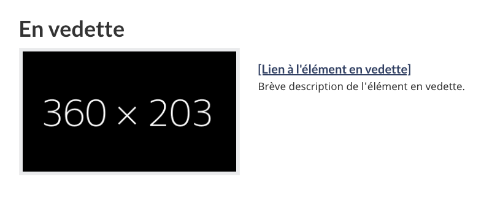
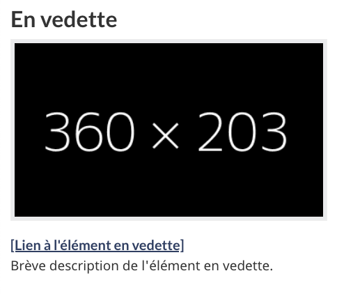

<strong>Dernière mise à jour</strong>&nbsp;: {{ page.dateModified }}

La configuration de conception des promotions contextuelles comprend une image ainsi qu’un lien et une description pour la promotion d’activités, d’initiatives, de programmes et de services gouvernementaux.

<section>
  <h2>Sur cette page</h2>
  <ul>
    <li><a href="#utiliser">Quand l’utiliser</a></li>
    <li><a href="#eviter">Quoi éviter</a></li>
    <li><a href="#contenu">Contenu et conception</a></li>
    <li><a href="#œuvre">Comment procéder à la mise en œuvre</a></li>
    <li><a href="#recherche">Recherche et justification</a></li>
    <li><a href="#changements">Derniers changements</a></li>
  </ul>
</section>
<section id="utiliser">
  <h2>Quand l’utiliser</h2>
  
Utilisez les tuiles promotionnelles pour les promotions liées au contexte de la page.

</section>
<section id="eviter">
  <h2>Quoi éviter</h2>
  
N’utilisez pas cette configuration de conception pour promouvoir du contenu non lié ou du contenu qui ne correspond pas au contexte de la page.

  
N’utilisez pas cette configuration de conception si elle peut nuire au flux de la tâche.

</section>
<section id="contenu">
  <h2>Contenu et conception</h2>
  
Trouvez des spécifications de contenu et de conception et des exemples visuels.

  <h3>Spécifications de contenu</h3>
  
Positionnez les tuiles de promotions contextuelles après le contenu principal de la page, mais avant la section du pied de page.

  
Utilisez un maximum de trois éléments par page.

  
Utilisez toujours un en-tête de section pour ce bloc :

  <ul>
    <li>Multiples éléments en vedette&nbsp;:
      <ul>
        <li>L’en-tête par défaut est &laquo;&nbsp;En vedette&nbsp;&raquo; en français et &laquo;&nbsp;Features&nbsp;&raquo; en anglais.</li>
        <li>Vous pouvez utiliser un en-tête plus spécifique pour renforcer le contexte.</li>
      </ul>
    </li>
    <li>Un seul élément en vedette&nbsp;:
      <ul>
        <li>Vous pouvez rendre l’en-tête invisible afin qu’il semble mieux intégré au contenu.</li>
        <li>Si l’en-tête est visible, il est préférable d’utiliser un en-tête plus spécifique pour renforcer le contexte.</li>
      </ul>
    </li>
    <li>Incluez une image, un titre en hyperlien et une description dans chaque élément en vedette&nbsp;:
      <ul>
        <li>Le titre ne doit pas dépasser 40 caractères environ.</li>
        <li>Le texte de la description doit être court et concis, idéalement d’une ou deux lignes, ou de moins de 145 caractères.</li>
      </ul>
    </li>
  </ul>
  <h3>Spécifications de conception</h3>
  <ul>
    <li>Le texte utilise les styles standards de Canada.ca&nbsp;:
      <ul>
        <li><a href="/styles/typographie.html">Typographie</a></li>
        <li><a href="/styles/couleurs.html">Couleurs</a></li>
        <li>Codez l’en-tête de section comme H2, mais avec le style H3.</li>
        <li>Codez le titre en hyperlien comme H5.</li>
      </ul>
    </li>
    <li>Mise en page en cas de multiples éléments en vedette&nbsp;:
      <ul>
        <li>L’image devrait apparaître en premier, suivi du titre en hyperlien, puis d’une description.</li>
        <li>La dimension de l’image est 360&nbsp;x&nbsp;203 pixels.</li>
        <li>Entourez l’élément en vedette d’un conteneur gris&nbsp;:
          <ul>
            <li>Couleur de fond&nbsp;: #f5f5f5</li>
            <li>Bordure&nbsp;: 1&nbsp;px solide #e3e3e3</li>
            <li>Rayon de bordure&nbsp;: 4&nbsp;px</li>
            <li>Marge du bas&nbsp;: 20&nbsp;px</li>
            <li>Ombrage de la boîte&nbsp;:
              <ul>
                <li>niveau de flou&nbsp;: 1&nbsp;px</li>
                <li>couleur&nbsp;: noir avec opacité de 5&nbsp;%</li>
                <li>décalage x&nbsp;: 0</li>
                <li>décalage y&nbsp;: 1&nbsp;px</li>
                <li>type&nbsp;: incrusté</li>
              </ul>
            </li>
            <li>Hauteur minimale&nbsp;: 20&nbsp;px</li>
            <li>Marges intérieures (padding)&nbsp;: 19&nbsp;px</li>
          </ul>
        </li>
      </ul>
    </li>
    <li>Mise en page en cas d’élément en vedette unique&nbsp;:
      <ul>
        <li>Placez l’image à gauche, avec le titre et la description en hyperlien à droite de l’image.</li>
        <li>La dimension de l’image est 360&nbsp;x&nbsp;203 pixels.</li>
        <li>Appliquez une bordure grise de 5 px à l’image.
          <ul>
            <li>Arrière-plan&nbsp;: #eaebed</li>
            <li>Couleur de bordure&nbsp;: #eee</li>
            <li>Rayon de bordure&nbsp;: 0</li>
            <li>Marges intérieures (padding)&nbsp;: 5&nbsp;px</li>
          </ul>
        </li>
      </ul>
    </li>
  </ul>
  <h4>Interactions</h4>
  
Mettez en hyperlien tout le conteneur de l’élément en vedette

  <ul>
    <li>L’image</li>
    <li>Le titre en hyperlien</li>
    <li>La description</li>
  </ul>
  <h3>Exemples visuels</h3>
  

    <figure class="mrgn-tp-md mrgn-bttm-lg">
      <figcaption><b>Promotions contextuelles – grand écran</b></figcaption>
      
      

        
Description de l’image&nbsp;: promotions contextuelles - grand écran

        
Un en-tête de section intitulé &laquo;&nbsp;En vedette&nbsp;&raquo; est suivi de deux espaces réservés aux éléments en vedette dans une rangée horizontale. Chacun d’eux comporte un espace réservé à l’image, entouré d’un fond gris clair. L’espace réservé à l’image contient les dimensions prévues de l’image&nbsp;: 360 sur 203 pixels. Sous chaque espace réservé à l’image, sur fond gris, se trouve un espace réservé à un hyperlien qui se lit comme suit&nbsp;: [Lien vers l’élément en vedette en vedette]. On trouve en dessous le texte de l’espace réservé suivant&nbsp;: Brève description de l’élément en vedette.

      

    </figure>
  

  

    <figure class="mrgn-tp-md mrgn-bttm-lg">
      <figcaption><b>Promotions contextuelles – petit écran</b></figcaption>
      
      

        
Description de l’image&nbsp;: promotions contextuelles - petit écran

        
Un en-tête de section intitulé &laquo;&nbsp;En vedette&nbsp;&raquo; est suivi de deux espaces réservés aux éléments en vedette dans une rangée verticale. Chacun d’eux comporte un espace réservé à l’image, entouré d’un fond gris clair. L’espace réservé à l’image contient les dimensions prévues de l’image&nbsp;: 360 sur 203 pixels. Sous chaque espace réservé à l’image, sur fond gris, se trouve un espace réservé à un hyperlien qui se lit comme suit&nbsp;: [Lien vers l’élément en vedette en vedette]. On trouve en dessous le texte de l’espace réservé suivant&nbsp;: Brève description de l’élément en vedette.

      

    </figure>
  

        

        <figure class="mrgn-tp-md mrgn-bttm-lg">
            <figcaption><b>Promotions contextuelles - fonctionnalité unique - grand écran</b></figcaption>
            
            

                
Description de l’image : promotion contextuelle unique - grand écran

                
Un en-tête intitulé « En vedette » précède un espace réservé pour la promotion. L’espace réservé pour l’image est situé à gauche et est entouré d’un arrière-plan gris clair. Dans l’espace réservé pour l’image, on retrouve les dimensions prescrites pour l’image 360 px x 203 px. À la droite de l’espace réservé pour l’image, on retrouve un espace réservé pour l’hyperlien [Lien vers l’élément en vedette]. Sous ce dernier, on retrouve l’espace réservé pour le texte : brève description de l’élément en vedette.

            

        </figure>
    

    

        <figure class="mrgn-tp-md mrgn-bttm-lg">
            <figcaption><b>Promotions contextuelles - fonctionnalité unique - petit écran</b></figcaption>
            
            

                
Description de l’image : promotion contextuelle unique - petit écran

                
Un en-tête intitulé « En vedette » précède un espace réservé pour la promotion. L’espace réservé pour l’image est situé en haut du texte et est entouré d’un arrière-plan gris clair. Dans l’espace réservé pour l’image, on retrouve les dimensions prescrites pour l’image. 360 px x 203 px. Sous l’espace réservé pour l’image, on retrouve l’espace réservé pour l’hyperlien [Lien vers l’élément en vedette]. Sous ce dernier, on retrouve l’espace réservé pour le texte : brève description de l’élément en vedette.

            

        </figure>
    

</section>
<section id="œuvre">
  <h2>Comment procéder à la mise en œuvre</h2>
  
Trouvez des exemples pratiques pour procéder à la mise en œuvre de la configuration de conception des promotions contextuelles.

  <h3>Référence pour la mise en œuvre du thème GCWeb (BOEW)</h3>
  <ul>
    <li><a href="https://wet-boew.github.io/GCWeb/components/gc-features/gc-features-fr.html">Promotions contextuelles - GCWeb</a></li>
  </ul>
  <h3>Mises en œuvre</h3>
  
Déterminez ce qui convient le mieux au type de page que vous créez.

  

    

      

        

          

            
<strong>GC-AEM</strong>

            
Pour Adobe Experience Manager (AEM) du gouvernement du Canada (GC)&nbsp;:

            <ul>
              <!-- <li><a href="https://www.gcpedia.gc.ca/gcwiki/images/2/24/Documentation-AEM-6.5-Unite-4-15-Composant-Image-en-vedette.pdf">Titre du composant de l’image en vedette (uniquement accessible sur le réseau du gouvernement du Canada)</a></li> -->
              <li><a href="https://www.gcpedia.gc.ca/wiki/Documentation_d%27AEM_sp%C3%A9cifique_au_GC_6.5">Documentation d’AEM et des services Web gérés (lien GCpédia – accessible uniquement sur le réseau du gouvernement du Canada)</a></li>
            </ul>
          

          

            
<strong>SGDC</strong>

            
Pour la Solution de gabarits à déploiement centralisé (SGDC)&nbsp;:

            <ul>
              <li><a href="https://cenw-wscoe.github.io/sgdc-cdts/docs/index-fr.html">Documentation de la SGDC</a></li>
            </ul>
          

          

            
<strong>Drupal WxT</strong>

            
Pour Drupal WxT&nbsp;:

            <ul>
              <li><a href="https://drupalwxt.github.io/">Drupal WxT documentation (en anglais seulement)</a></li>
            </ul>
          

        

      

    

  

</section>
<section id="recherche">
  <h2>Recherche et justification</h2>
  
Consultez les conclusions de la recherche et la justification de la politique.

  <h3>Constatations découlant de la recherche</h3>
  
La qualité vaut mieux que la quantité. Les recherches sur l’amélioration des promotions sur Canada.ca montrent que les éléments en vedette sont les plus efficaces lorsqu’ils sont pertinents par rapport au contenu de la page. Il est préférable d’utiliser une tuile unique promotionnelle, mais tenez-vous-en au minimum requis si vous prévoyez en utiliser plus d’une.

  <h3>Justification stratégique</h3>
  
Cette configuration de conception est facultative pour les modèles obligatoires suivants&nbsp;:

  <ul>
    <li><a href="https://conception.canada.ca/modeles-obligatoire/pages-profil-institutionnel.html">Page d’accueil institutionnelle</a></li>
    <li><a href="/modeles-obligatoire/theme.html">Page de thème</a></li>
    <li><a href="/modeles-obligatoire/sujet.html">Page de sujet</a></li>
    <li><a href="https://conception.canada.ca/modeles-obligatoire/pages-profil-ministres.html">Pages ministérielles</a></li>
  </ul>
</section>
<section id="changements">
  <h2>Derniers changements</h2>
  <dl class="dl-horizontal">
    <dt>
      <time datetime="2024-04-03" class="link-muted">2024-04-03</time>
    </dt>
    <dd>Mise à jour de l’orientation pour y inclure les spécifications de contenu et de conception, des exemples visuels et une orientation sur la mise en œuvre</dd>
  </dl>
</section>

