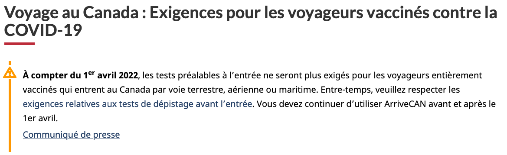
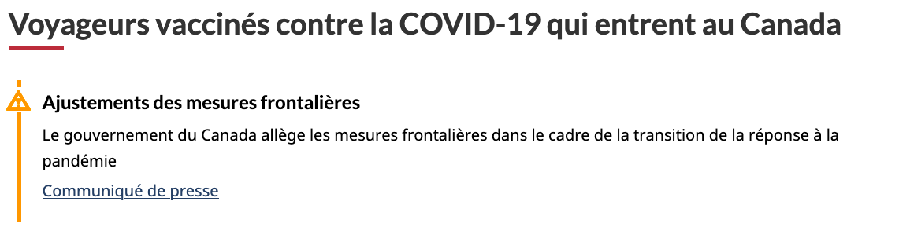

Cette directive cherche à appuyer la cohérence des efforts de communication de chaque ministère. Suivez ces recommandations lorsque vous communiquez au sujet d’interruptions de service ou de situations urgentes et évolutives sur Canada.ca.

<h2>Sur cette page</h2>
<ul>
  <li><a href="#synchronisation">Assurer la synchronisation des produits de nouvelles et du contenu Web</a></li>
  <li><a href="#alertes-normalisees">Alertes normalisées pour le contenu des nouvelles</a></li>
  <li><a href="#alerts">Comment ajouter des alertes temporaires sur les pages de contenu concernées</a></li>  
  <li><a href="#alertes-repetees">Alertes répétées sur plusieurs pages</a></li>  
  <li><a href="#examples">Exemples</a></li>
</ul>

<h2 id="synchronisation">Assurer la synchronisation des produits de nouvelles et du contenu Web</h2>

Idéalement, les produits de nouvelles et les mises à jour de contenu Web connexes sont publiés <strong>en même temps</strong>. Malheureusement, ce n’est pas toujours réaliste ni possible. Parfois, les nouvelles doivent être publiées avant d’autres mises à jour du contenu Web, ce qui peut causer des problèmes pour les personnes accédant à nos pages.

<h2 id="alertes-normalisees">Alertes normalisées pour le contenu des nouvelles</h2>

Dans une situation évolutive, il est possible d’ajouter des alertes à un produit de nouvelles pour informer le lectorat que le contenu pourrait ne plus refléter l’information la plus récente. Ces alertes doivent inclure un lien vers une page centrale présentant les dernières informations.

Les alertes sont généralement ajoutées lorsqu’un produit de nouvelles est jugé obsolète, soit remplacé par un communiqué plus récent, soit contenant des informations obsolètes. Les équipes doivent coordonner le meilleur moment d’ajouter des alertes aux différents produits de nouvelles avec leurs collègues des communications stratégiques.
 

<h2 id="alerts">Comment ajouter des alertes temporaires sur les pages de contenu concernées</h2>

Les alertes visent à attirer l’attention sur les changements au contenu habituel de deux façons&nbsp;:

<ul>
  <li>une modification du contenu de la page sur laquelle apparaît l’alerte</li>
  <li>un changement qui a été fait ailleurs, comme la publication de nouvelles informations</li>
</ul>

Si vous ne pouvez pas mettre à jour le contenu Web en même temps qu’un produit de nouvelles, ajoutez une alerte temporaire qui renvoie au communiqué. Cela vous permet d’intercepter les gens sur une page de contenu où ils recherchent naturellement les informations les plus récentes. Vous pouvez ensuite les diriger vers du contenu qui fait la une.
 

Il s’agit d’une mesure temporaire qui peut vous donner un peu de temps pour effectuer des mises à jour détaillées sur la page de contenu. Vous devriez tout de même prévoir d’incorporer les nouveaux renseignements à la page de contenu dès que possible, puis de supprimer l’alerte.

<h3>Placer les alertes en contexte, pas seulement en haut de la page</h3>

Les lecteurs plus rapides risquent de manquer une alerte placée en haut de la page. Placer une alerte dans la sous-section pertinente d’une page, le cas échéant, permet d’attirer l’attention sur un changement important au moment où il est le plus logique pour le lecteur. Cela maximise l’incidence de l’alerte.

<h3>Quoi inclure dans les alertes</h3>

Le contenu de l’alerte doit&nbsp;:

<ul>
  <li>être facile à comprendre</li>  
  <li>être court (les alertes longues poussent le contenu vers le bas pour les utilisateurs mobiles)</li>  
  <li>décrire l’incidence sur l’utilisateur</li>  
  <li>indiquer les dates auxquelles les changements auront lieu (si elles sont connues)</li>  
  <li>utiliser le temps de verbe approprié pour refléter le moment où le changement a lieu</li>  
  <li>ne faire appel à des liens que s’il est nécessaire — un seul, le cas échéant</li>
</ul>

<h3>Limiter l’utilisation des alertes</h3>

Sachez que la fatigue liée aux alertes réduit leur efficacité avec le temps. Plus les gens voient des alertes et des messages d’avertissement, moins ils y sont réceptifs. Pour éviter cela, suivez les directives suivantes&nbsp;:

<ul>
  <li>n’utiliser les alertes que de manière temporaire (le temps d’intégrer des informations ou de résoudre la situation)</li>  
  <li>placer les alertes en contexte, pas seulement en haut de la page</li>
  <li>limiter le nombre d’alertes sur chaque page</li>  
  <li>éviter d’utiliser des alertes pour la mise en page du contenu habituel (pour souligner ou mettre en évidence)</li>  
  <li>supprimer les alertes dès que le contenu du programme ou du service a été mis à jour pour refléter ce qui a été annoncé</li>
</ul>

<h3>Quelle alerte utiliser</h3>

Suivez les instructions de mise en œuvre des alertes contextuelles pour choisir le type d’alerte approprié à votre contenu&nbsp;:
 
<ul>
  <li><a href="https://conception.canada.ca/configurations-conception-communes/alertes-contextuelles.html#how">Alertes contextuelles — Canada.ca</a></li>
</ul>

<h2 id="alertes-repetees">Alertes répétées sur plusieurs pages</h2>

Si vous devez ajouter la même alerte sur de nombreuses pages différentes, il peut être utile de créer une page unique à laquelle toutes ces alertes peuvent renvoyer.

Cette page centrale&nbsp;:

<ul>
  <li>résume le changement en langage clair</li>  
  <li>explique l’incidence sur les utilisateurs des services touchés</li>  
  <li>est mise à jour dès que de nouvelles informations sont diffusées</li>
</ul>

Le chemin d’accès à cette page centrale doit mener à la page principale d’intervention du gouvernement du Canada face à la crise en question.

<h3>Comment cela aide</h3>

<ul>
  <li>prévient contre la dispersion des pages consacrées aux crises et aux interruptions de service</li>  
  <li>encourage une approche coordonnée au sein de chaque ministère et dans l’ensemble du gouvernement du Canada</li>  
  <li>réduit le travail requis pour maintenir diverses alertes et mises à jour connexes</li>
</ul>
<h2 id="examples">Exemples</h2>

    

<figure class="gc-complex-img" role="group">
    
    <figcaption>
    

            
À faire&nbsp;: date claire, temps de verbe exact, répété dans le contexte de la page

            
Texte d'alerte placé en haut de la page avec une date d'entrée en vigueur claire&nbsp;:

    
<b>À compter du 1er avril 2022</b>, les tests préalables à l’entrée ne seront plus exigés pour les voyageurs entièrement vaccinés qui entrent au Canada par voie terrestre, aérienne ou maritime. Entre-temps, veuillez respecter les exigences relatives aux tests de dépistage avant l’entrée. Vous devez continuer d’utiliser ArriveCAN avant et après le 1er avril. 

    
Communiqué de presse

    
</figcaption>
</figure>

<figure class="gc-complex-img" role="group">
	
	<figcaption>

			
À ne pas faire&nbsp;: La date critique était manquante et les verbes sont au présent, il a donc semblé que les règles étaient déjà en vigueur (publiées le 15 février, les règles n’ont pas changé avant le 28 février)

			
Exemple de texte d'alerte trop vague qui a provoqué un malentendu en utilisant le mauvais temps de verbe&nbsp;:

    
<b>Adjustements des mesures frontalières</b>

    
Le gouvernement du Canada allège les mesures frontalières dans le cadre de la transition de la réponse à la pandémie

    
Communiqué de presse

		
</figcaption>
</figure>

<h2>Derniers changements</h2>

 <section>
  <dl class="dl-horizontal">
   <dt>
    <time class="link-muted" datetime="2025-03-31">
     2025-03-31
    </time>
   </dt>
   <dd>
    Révision afin d’inclure des instructions et des exemples pour la synchronisation des pages de contenu avec les communiqués de presse.
   </dd>
   <dt>
    <time class="link-muted" datetime="2022-05-10">
     2022-05-10
    </time>
   </dt>
   <dd>
    Révision des titres pour remplacer«&nbsp;interruption de service&nbsp;» par«&nbsp;crise&nbsp;».
     
     
    Ajout d’une recommandation d’inclure des dates dans l’alerte et d’utiliser le bon temps de verbe.
   </dd>
  </dl>
</section>
