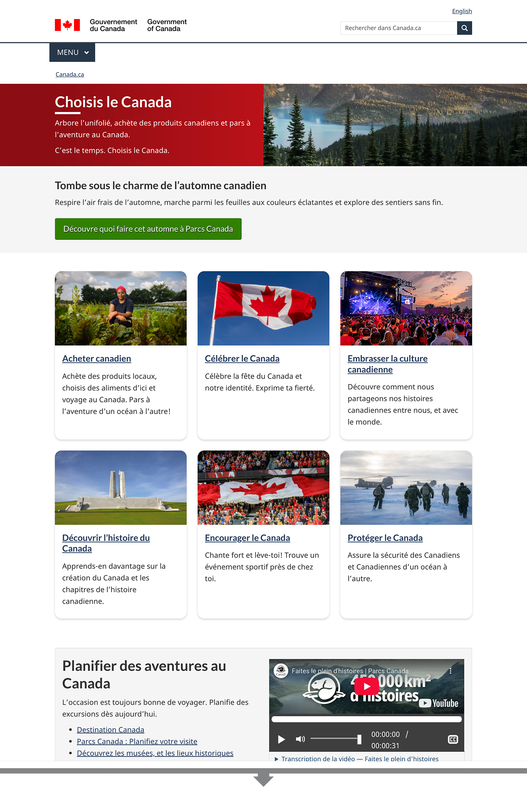

Les campagnes publicitaires ou de marketing répondent aux besoins du gouvernement du Canada en matière de communication, d’éducation, d’influence, de marketing, de sensibilisation ou d’appel à l’action. Elles peuvent être initiées au niveau institutionnel ou demandées de façon centralisée.

Les campagnes devraient être assorties d’un plan de communication qui comprend des objectifs clairs et des résultats mesurables pour effectuer le suivi des progrès et des réussites. Les objectifs de communication décrits dans le plan doivent appuyer les besoins des utilisateurs en matière de services en reliant le contenu de la campagne aux renseignements pertinents sur les programmes ou les services sur Canada.ca. Ainsi les efforts d’information permettent non seulement de sensibiliser les utilisateurs, mais aussi de les guider dans les tâches qu’ils souhaitent exécuter.

## Sur cette page

* [Quand l’utiliser](#quand-l-utiliser)
* [Ce qu’il faut inclure](#ce-qu-il-faut-inclure)
* [Quoi éviter](#quoi-éviter)
* [Exemples visuels](#exemples-visuels)
* [Derniers changements](#derniers-changements)

## Quand l’utiliser {#quand-l-utiliser}

Utilisez du contenu de la campagne dans le cadre d’une initiative de marketing planifiée. Vous pouvez ajouter ce contenu à une page principale existante, comme une page sur un sujet ou la page d’un programme, ou à une page dédiée à la campagne. Lorsque c’est possible, modifiez le contenu d’une page principale existante pour y inclure l’information relative à la campagne au lieu de créer une page dédiée à la campagne. On réduit ainsi le risque d’avoir des informations en double.

### Quand utiliser une page principale

* Pour faire la promotion d’une mise à jour à une initiative, à un programme ou à un service permanent et existant.
* Pour faire la promotion régulière ou cyclique d’une initiative, d’un programme ou d’un service existant et hautement prioritaire (par exemple, vaccins contre la grippe, impôt sur le revenu).

Vous pouvez ajouter de manière stratégique, sur des pages principales, des éléments visuels et des appels à l’action liés à la campagne pendant toute la durée de celle-ci afin de rattacher le contenu à d’autre matériel relatif à la campagne.

### Quand utiliser une page dédiée à la campagne

* Pour des événements ou des jours/mois de commémoration.
* Pour réunir à un seul endroit le contenu qui a été créé pour une campagne publicitaire, avec des liens menant à du contenu lié au programme ou au service.

Les pages dédiées aux campagnes peuvent offrir une plus grande flexibilité visuelle, tout en restant connectées à Canada.ca grâce aux éléments de navigation.

### Quand utiliser une combinaison des deux solutions

* Lors de changements majeurs aux initiatives, au contenu, aux programmes ou aux services existants.
* Pour faire la promotion d’un programme, d’un service ou d’une initiative qui relie du contenu provenant de différentes régions au Canada.

Parfois, des programmes, des services ou des initiatives ayant du contenu principal peuvent faire l’objet de changements suffisamment importants pour justifier une page dédiée à la campagne (comme des mises à jour majeures relativement à l’admissibilité). Dans ce cas, vous pouvez choisir de créer une page dédiée à la campagne et de mettre à jour une page principale existante. La page dédiée devrait porter sur ce qui est nouveau et sur la façon dont la question touche les gens, tandis que le contenu principal demeure la source d’information faisant autorité.

Si vous utilisez une approche combinée, n’oubliez pas de faire ce qui suit&nbsp;:

* Mettre à jour le contenu principal permanent de Canada.ca en y ajoutant tous les détails.
* Créer une page dédiée à la campagne pour souligner les messages importants.
* Une fois la campagne terminée, envisagez de transférer les éléments qui ont suscité le plus d’intérêt (comme les vidéos, les jeux-questionnaires ou les documents imprimables) vers le contenu principal s’ils sont pertinents et contribuent à la compréhension de ce dernier.

## Ce qu’il faut inclure {#ce-qu-il-faut-inclure}

Lors de la création d’une page dédiée à la campagne, définissez d’abord les éléments qui existent déjà sur Canada.ca. Les informations les plus pertinentes d’une campagne devraient déjà être intégrées dans du contenu principal. De cette façon, l’information ne se trouve pas en double sur une page dédiée. Cela permet également d’utiliser le contenu après la fin de la campagne et la page dédiée a été supprimée. En dirigeant les utilisateurs vers le contenu principal, vous leur fournissez des informations complètes et à jour.

Vous pouvez également créer une adresse URL personnalisée, qui redirige l’utilisateur vers la page dédiée ou la page de contenu principale qui y est liée.

* [Consultez les lignes directrices sur les adresses URL personnalisée pour plus d’information](https://canada-ca.github.io/systeme-conception/specifications/elements-obligatoires/domaines-url.html#du3b)

### Spécifications du contenu d’une page principale

Vous pouvez optimiser votre contenu sur les pages principales de Canada.ca en utilisant des modèles ou des composants de conception. Cela aidera à lier visuellement le contenu à la campagne tout au long de sa durée. Par exemple, vous pourriez inclure&nbsp;:

* une image;
* un graphique ou autre visuel informatif;
* une vidéo, un balado ou d’autres médias visuels/audio.

Assurez-vous que le traitement visuel n’empêche pas la réussite de la tâche. L’objectif d’une campagne est généralement de faire connaître un programme ou une initiative, mais les gens consultent également Canada.ca pour accomplir des tâches. Le contenu de la campagne doit les aider à le faire sans nuire à l’exécution de leurs tâches ni entraîner des retards. À titre d’exemple, vous pouvez ajouter un élément visuel lié à la campagne dans la partie image du bloc d’introduction, mais ne placez pas d’autre contenu de la campagne au-dessus de la bande la plus demandée.

Définissez une date de fin ou de mise à jour claire où le contenu lié à la campagne est soit mis à jour, soit supprimé de la page principale.

Trouvez des motifs de conception et des composants ici&nbsp;:

* [Modèles de conception de Canada.ca](https://canada-ca.github.io/systeme-conception/bibliotheque-modeles.html)
* [Composants du Système de design GC](https://systeme-design.alpha.canada.ca/fr/composants/)

### Spécifications du contenu d’une page dédiée à la campagne

Les pages dédiées devraient&nbsp;:

* être axées sur les messages importants;
* comporter une date de fin ou d’évaluation claire lorsque le contenu est mis à jour ou supprimé ou, s’il est utilisé de manière saisonnière ou annuelle, lorsqu’il est mis à jour pour refléter l’état actuel de la campagne;
* être hébergées dans une structure pour la campagne et non dans l’architecture d’information centrale permanente de Canada.ca.

Voici des exemples de contenu que vous pouvez inclure sur une page dédiée.

Contenu clé&nbsp;:

* Message temporaire sur la campagne en question, comme la date de lancement, les informations à durée limitée, les événements à venir ou la raison de la mise en application ou du changement.
* Des liens vers le contenu principal permanent pour éviter le contenu en double.

Du contenu de soutien optionnel&nbsp;:

* Des vidéos qui soutiennent les utilisateurs dans le cadre de l’appel à l’action de la campagne (par exemple, sur la façon de présenter une demande ou pour expliquer des critères);
  * ne pas inclure de vidéos promotionnelles qui ne font que conduire les utilisateurs vers un autre site.
* Une fonction « s’abonner » pour recevoir les mises à jour sur la campagne.
* Des outils pour les intervenants, comme des affiches, des bannières numériques et des gabarits de réseaux sociaux.
* Des liens vers des communiqués de presse qui annoncent le nouveau programme, le nouveau service ou la nouvelle initiative, ou les changements apportés à ces derniers.

Remarque&nbsp;: Si vous avez plus d’une page dédiée à la campagne, créez une page d’accueil centrale qui renvoie à toutes elles.

#### Composants de conception sur une page dédiée à la campagne

Bien qu’une certaine flexibilité soit encouragée au niveau de la conception du contenu, veillez à utiliser les composants existants de la Boîte à outils d’expérience Web (BOEW) ou du Système de design GC pour assurer l’accessibilité.

* [GCWeb](https://wet-boew.github.io/GCWeb/index-fr.html)
* [Système de design GC](https://systeme-design.alpha.canada.ca/fr/)

Assurez-vous que la page dédiée respecte les éléments obligatoires du design de Canada.ca&nbsp;:

* [Éléments obligatoires de la conception de Canada.ca](https://canada-ca.github.io/systeme-conception/specifications/elements-obligatoires.html)

## Quoi éviter {#quoi-éviter}

Les pages de campagne dédiées ne devraient pas remplacer ou présenter en double du contenu existant sur Canada.ca. Vous ne devez les utiliser que pour mettre en évidence certains aspects d’un programme, d’un service ou d’une initiative.

Veuillez ne pas utiliser les pages dédiées pour remplacer d’autres types de pages telles que&nbsp;:

* les profils institutionnels, organisationnels ou d’ententes de partenariat et de collaboration;
* les pages de description ou de lancement de services;
* les pages de description du programme;
* les rapports;
* les pages de thème ou de sujets;
* tout autre contenu qui n’est pas à durée limitée.

## Exemples visuels {#exemples-visuels}

### Une campagne intégrée au contenu principal

  <figure class="mrgn-tp-md mrgn-bttm-lg">
    <figcaption><b>Voici un exemple où le contenu d’une campagne a été intégré à une page principale.</b></figcaption>
    
    

      
Description de l’image&nbsp;: Contenu d’une campagne ajouté sur une page principale

      
Une image affichant l’image de marque de la campagne a été insérée dans l’espace réservé aux images du bloc d’introduction de cette maquette de la page de thème sur le logement. Du contenu lié à la campagne a également été ajouté dans l’espace flexible, situé dans la partie inférieure de la page, juste au-dessus du pied de page. Le contenu de la campagne comprend une vidéo sur le logement abordable, ainsi qu’une description et une image du Plan du Canada sur le logement. Un lien est également fourni pour permettre le téléchargement du plan.

    

  </figure>

### Page de campagne dédiée qui renvoie à du contenu principal

  <figure class="mrgn-tp-md mrgn-bttm-lg">
    <figcaption><b>Dans l’exemple suivant, une page de campagne dédiée a été créée et comporte des liens vers du contenu existant.</b></figcaption>
    
    

      
Description de l’image&nbsp;: Page de campagne dédiée qui renvoie à du contenu principal

      
La page Choisis Canada est un exemple de page de campagne qui renvoie à six pages existantes, qui sont un amalgame de contenu principal et d’autres pages relatives à des campagnes. Le contenu de chacune des pages est mis en évidence dans des cartes avec des images. Il y a également une section sur Parcs Canada, avec une vidéo promotionnelle.

    

  </figure>

## Derniers changements {#derniers-changements}

<dl class="dl-horizontal">
  <dt><time>2025-09-08</time></dt>
  <dd>Nous avons remplacé notre orientation précédente concernant les campagnes pour préciser que, dans certains cas, le contenu principal peut être modifié pour incorporer des éléments visuels liés à la campagne et il n’est donc pas nécessaire de créer une page de campagne dédiée.</dd>
</dl>
