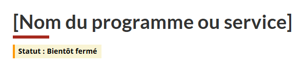
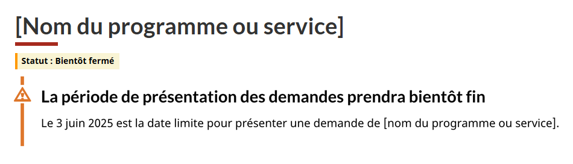
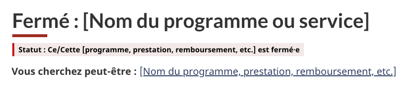
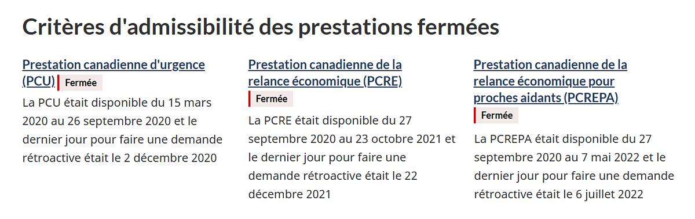

Suivez ces conseils pour mettre à jour le contenu lorsqu’un programme ou un service du gouvernement du Canada prend fin.

## Sur cette page

* [Donner un avertissement](#donner-un-avertissement)
* [Indiquer qu’un programme ou un service est fermé](#indiquer-qu-un-programme-ou-un-service-est-ferme)
* [À quel moment supprimer la page](#à-quel-moment-supprimer-la-page)
* [Modèles utilisés dans ces lignes directrices](#modèles-utilisés-dans-ces-lignes-directrices)

## Donner un avertissement

En général, ajoutez un avertissement à votre contenu Web au moins un mois à l’avance pour informer les gens de la fin de votre programme ou service.

Si le programme ou le service est de très courte durée, adaptez le moment de la publication de l’avertissement en conséquence. Par exemple, si le programme dure deux mois, il faut donner l’avertissement deux à trois semaines avant la fin de cette période.

Suivez les étapes ci-dessous pour inclure un avertissement dans votre contenu.

### Ajouter une étiquette d’avertissement sous le titre de la page

Sur la page du programme ou du service, ajoutez un composant d’étiquette d’avertissement indiquant &laquo;&nbsp;État&nbsp;: Bientôt fermé&nbsp;&raquo; directement sous le titre visible de la page (ou H1).

<div class="pattern-demo mrgn-tp-md mrgn-bttm-md">
  <figure class="mrgn-tp-md mrgn-bttm-lg">
      <figcaption><b>Étiquette d'avertissement sous le titre d'une page</b></figcaption>
      
      <details>
        <summary class="wb-toggle" data-toggle="{ &quot;print&quot;: &quot;on&quot; }">Description de l'image : Étiquette d'avertissement sous le titre d'une page</summary>
        <p>Cette étiquette d'avertissement a été ajoutée directement sous le titre de la page d'un programme. L'étiquette indique :</p>
        <p>Statut&nbsp;: Bientôt fermé</p>
      </details>
  </figure>
</div>

### Ajouter une étiquette d’avertissement à côté des autres titres

Ajoutez un composant d’étiquette d’avertissement accompagnée du texte &laquo;&nbsp;Bientôt fermé&nbsp;&raquo; à côté ou sous le du titre du programme ou du service aux endroits suivants&nbsp;:

* En demande
* Les menus d’accueil thématiques sur toutes les pages utilisant le modèle de services et d’informations

<div class="pattern-demo mrgn-tp-md mrgn-bttm-md">
  <figure class="mrgn-tp-md mrgn-bttm-lg">
    <figcaption><b>Étiquette d'avertissement dans un menu d'accueil thématique</b></figcaption>
    
    <details>
      <summary class="wb-toggle" data-toggle="{ &quot;print&quot;: &quot;on&quot; }">Description de l'image : Étiquette d'avertissement dans un menu d'accueil thématique</summary>
      <p>Trois menus d'accueil thématiques sont présentés sur trois colonnes dans la section « services et informations » d'une page. Une étiquette d'avertissement indiquant « Bientôt fermé » apparaît sous le titre de l'un des menus d'accueil thématiques sur les prestations.</p>
    </details>
  </figure>
</div>

### Ajouter une alerte d’avertissement pour la date limite de présentation des demandes

Envisagez l’ajout d’une alerte en haut de la page du programme ou du service pour indiquer le dernier jour auquel il sera possible de faire une demande. Cette mention doit figurer après le composant d’étiquette. Il faut ajouter l’alerte seulement lorsqu’il reste moins d’un mois à la période de présentation des demandes.

<div class="pattern-demo mrgn-tp-md mrgn-bttm-md">
  <figure class="mrgn-tp-md mrgn-bttm-lg">
    <figcaption><b>Alerte d'avertissement en haut de la page</b></figcaption>
    
    <details>
      <summary class="wb-toggle" data-toggle="{ &quot;print&quot;: &quot;on&quot; }">Description de l'image : Alerte d'avertissement en haut de la page</summary>
      <p>Cet avertissement a été placé en haut de la page, sous le titre H1 et l'étiquette d'avertissement, et indique clairement la date limite de présentation des demandes. On peut y lire :</p>
      <p><b>La période de présentation des demandes prendra bientôt fin</b></p>
      <p>Le 3 juin 2025 est la date limite pour présenter une demande de [nom du programme ou service].</p>
    </details>
  </figure>
</div>

<h2 id="indiquer-qu-un-programme-ou-un-service-est-ferme">Indiquer qu’un programme ou un service est fermé</h2>

Dès qu’un programme ou un service n’est plus offert, indiquez-le clairement et sans tarder. Suivez les étapes ci-dessous pour mettre à jour toutes les pages Web connexes dès la fermeture du programme ou du service.

### Mettre à jour le titre de la page et les métadonnées

* **Ajoutez le texte &laquo;&nbsp;Fermé&nbsp;:&nbsp;&raquo;** au début du titre de la page visible (H1) et de la balise`<title>` des métadonnées.
  * **Le fait de placer cette mention au début** garantit qu’elle apparaîtra dans les résultats de recherche et qu’elle ne sera pas coupée lorsque le titre est long.
* **Mettre à jour la description des métadonnées** pour indiquer clairement que le programme ou le service est fermé.

Voici des exemples&nbsp;:

### Titre des métadonnées

```html
<title>Fermé : [Nom du programme ou service]</title>
```

### Description des métadonnées

```html
<meta name="description" content="Ce programme est fermé. Les demandes ne sont plus acceptées depuis le 3 juin 2025." />
```

Pour plus d’informations, consultez les conseils pour&nbsp;:

* [la rédaction de contenu efficace pour les éléments `<title>` et `<h1>`](https://conception.canada.ca/specifications/information-trouvabilite/metadonnees.html#m2);
* [la rédaction de métadonnées de description efficaces](https://conception.canada.ca/specifications/information-trouvabilite/metadonnees.html#m3).

### Mettre à jour l’étiquette statut

Mettez à jour le composant d’étiquette d’avertissement que vous avez ajoutée directement sous le titre de la page pour indiquer que le programme ou le service est fermé. Remplacez-la par une étiquette de danger.

<div class="pattern-demo mrgn-tp-md mrgn-bttm-md">
  <figure class="mrgn-tp-md mrgn-bttm-lg">
    <figcaption><b>Étiquette de danger sous le titre d'une page</b></figcaption>
    
    <details>
      <summary class="wb-toggle" data-toggle="{ &quot;print&quot;: &quot;on&quot; }">Description de l'image : Une étiquette de danger sous le titre d'une page</summary>
      <p>Pour indiquer qu'un programme est fermé, cette étiquette de danger a été ajoutée directement sous le titre de la page (ou H1). On peut y lire&nbsp;:</p>
      <p>Statut&nbsp;: Ce/Cette [programme, prestation, remboursement, etc.] est fermé&middot;e</p>
    </details>
  </figure>
</div>

### Mettre à jour l’alerte pour les demandes fermées

Si votre programme ou service fait l’objet d’un processus de demandes, ajoutez une alerte d’information après le composant d’étiquette indiquant qu’il n’est plus possible de faire une demande.

* Veuillez inclure la date limite de présentation des demandes.
* Dans la plupart des cas, supprimez l’alerte au plus tard un mois après sa publication.
* Envisagez de conserver l’alerte plus longtemps si la page continue de recevoir beaucoup de visiteurs, car l’information pourrait leur être utile.

<div class="pattern-demo mrgn-tp-md mrgn-bttm-md">
  <figure class="mrgn-tp-md mrgn-bttm-lg">
    <figcaption><b>Alerte d'information en haut de la page</b></figcaption>
    
    <details>
      <summary class="wb-toggle" data-toggle="{ &quot;print&quot;: &quot;on&quot; }">Description de l'image : Alerte d'information en haut de la page</summary>
      <p>Cette alerte d'information a été placée en haut de la page, après le titre H1 et l'étiquette de danger, et indique clairement la date limite de présentation des demandes pour le programme. On peut y lire :</p>
      <p><b>Vous ne pouvez plus faire de demande</b></p>
      <p>Le dernier jour pour demander le/la [nom du programme ou service] était le 3 juin 2025.</p>
    </details>
  </figure>
</div>

### Restructurer ou mettre à jour le contenu

Selon la nature de votre programme ou de votre service, vous devrez apporter différentes mises à jour à votre contenu. Il peut s’agir de l’un ou de l’ensemble des éléments suivants.

#### Ajouter du contenu pour les prochaines étapes

S’il y a des étapes à suivre après la date de clôture du programme ou du service, comme faire appel d’une décision ou renvoyer un paiement, ajoutez ces informations dans de nouvelles sections. Placez toute nouvelle section avant le reste du contenu de manière à ce qu’elle ne soit pas noyée sous des informations obsolètes.

#### Mettre les verbes au passé

Relisez votre contenu et déterminez les endroits où il serait judicieux d’utiliser le passé, par exemple lorsqu’une démarche ne peut plus être effectuée. Cela est particulièrement important pour les passages qui expliquent les critères d’admissibilité ou la procédure de demande. Ainsi, les personnes qui parcourent le contenu verront que ces informations ne sont plus d’actualité. Les applications d’IA pourront également comprendre que le programme est fermé. Le cas échéant, ajoutez les dates de début et de fin d’un processus, par exemple un processus d’examen ou une période de présentation des demandes.

Si le contenu de votre programme ou service est réparti sur plusieurs pages, assurez-vous que les temps de verbe ont été modifiés dans toutes les pages concernées, et pas seulement à la première page.

Voici des exemples de textes mis à jour&nbsp;:

La Prestation canadienne d’urgence (PCU) **a fourni** un soutien financier aux employés et aux travailleurs indépendants canadiens **qui** **étaient** touchés directement par la COVID-19.

Le supplément unique à l’Allocation canadienne pour le logement **avait** pour but d’aider les locataires à faible revenu à payer leur loyer. L’Agence du revenu du Canada (ARC) **administrait** ce paiement unique. Il **était possible** de faire une demande du **12 décembre 2022** au **31 mars 2023**.

#### Supprimer le contenu périmé

Supprimez le contenu qui n’est plus utile ou qui pourrait prêter à confusion, comme les liens vers un formulaire de demande.

### Réorienter les utilisateurs vers l’information à jour

Si le programme ou le service fermé a été remplacé par autre chose, ajoutez du contenu pour diriger les utilisateurs vers ce nouveau contenu. Pour ce faire, ajoutez un lien en haut de la page. Utilisez le texte &laquo;&nbsp;Vous cherchez peut-être&nbsp;:&nbsp;&raquo; suivi du titre de la nouvelle page et du lien connexe. Placez cette indication sous le composant d’étiquette.

<div class="pattern-demo mrgn-tp-md mrgn-bttm-md">
  <figure class="mrgn-tp-md mrgn-bttm-lg">
    <figcaption><b>Lien vers l'information à jour</b></figcaption>
    
    <details>
      <summary class="wb-toggle" data-toggle="{ &quot;print&quot;: &quot;on&quot; }">Description de l'image : Lien vers l'information à jour</summary>
      <p>Le texte accompagné d'un lien a été ajouté en haut de la page, sous le titre H1 et l'étiquette de danger :</p>
      <p><b>Vous cherchez peut-être&nbsp;:</b> [Nom du programme, prestation, remboursement, etc.]</p>
    </details>
  </figure>
</div>

### Placer les étiquettes en contexte

Sur une page qui répertorie plusieurs éléments, ajoutez des composants d’étiquettes d’avertissement portant la mention &laquo;&nbsp;Fermé&nbsp;&raquo; à côté de chaque en-tête de menu d’accueil thématique. Par exemple, lorsque la page répertorie différentes prestations dont les Canadiens peuvent bénéficier dans le cadre d’un même programme. Cette pratique optimise l’impact des étiquettes, en particulier si le lecteur fait défiler rapidement la page et ne voit pas l’étiquette en haut de la page.

<div class="pattern-demo mrgn-tp-md mrgn-bttm-md">
  <figure class="mrgn-tp-md mrgn-bttm-lg">
    <figcaption><b>Étiquettes d'avertissement dans de multiples menus d'accueil thématiques</b></figcaption>
    
    <details>
      <summary class="wb-toggle" data-toggle="{ &quot;print&quot;: &quot;on&quot; }">Description de l'image : Étiquettes d'avertissement dans de multiples menus d'accueil thématiques</summary>
      <p>Trois menus d'accueil thématiques sont présentés sur trois colonnes dans la section « services et informations » d'une page. Des étiquettes d'avertissement portant la mention « Fermé » ont été ajoutées à côté de l'en-tête de chacune.</p>
    </details>
  </figure>
</div>

## À quel moment supprimer la page

Il est important de respecter le plan établi par votre ministère au sujet du cycle de vie du contenu afin de déterminer quand transférer la page du programme ou du service vers un dépôt numérique et quand la supprimer de votre site Web. Si vous n’avez pas de plan à cet égard, il est recommandé de retirer le contenu deux ans après la fin du programme ou du service.

## Modèles utilisés dans ces lignes directrices

### Ajouter des étiquettes

Suivez les conseils de mise en œuvre pour le composant d’étiquette. Utilisez l’étiquette d’avertissement lorsque vous donnez un avertissement avant la fermeture et utilisez l’étiquette de danger une fois que le programme ou le service est fermé.

* [Composant d’étiquettes - Comment mettre en œuvre](https://conception.canada.ca/configurations-conception-communes/etiquettes.html#comment)

### Ajouter des alertes

Suivez les conseils de mise en œuvre pour les alertes contextuelles. Utilisez l’alerte d’avertissement lorsque vous donnez un avertissement avant la fermeture et utilisez l’alerte d’information une fois que le programme ou le service est fermé.

* [Modèle d’alertes contextuelles - Comment mettre en œuvre](https://conception.canada.ca/configurations-conception-communes/alertes-contextuelles.html#comment)
