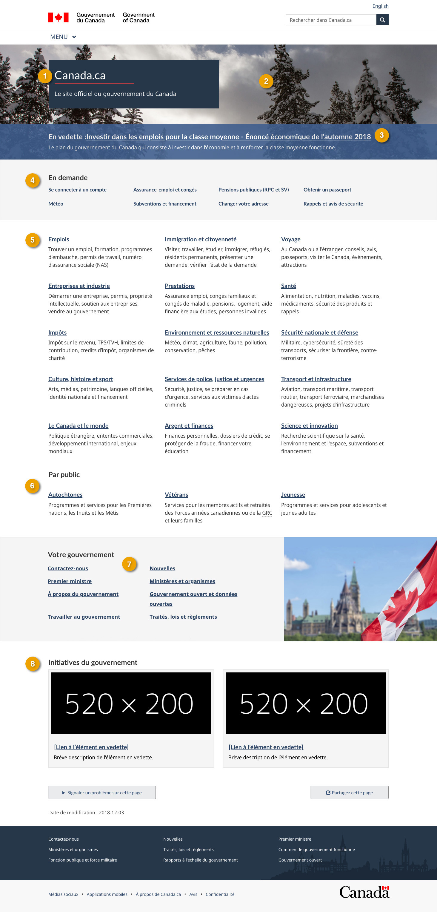

 

  <strong>
   De :
   <a href="https://www.canada.ca/fr/secretariat-conseil-tresor.html">
    Secrétariat du Conseil du Trésor du Canada
   </a>
  </strong>
 

 

  
   Obligatoire
  
 

 

  La page d’accueil est la première page de Canada.ca à partir de laquelle une personne peut avoir accès à tous les renseignements et services fournis par le gouvernement du Canada.
 

 <ul>
  <li>
   La page d’accueil met en évidence les tâches les plus importantes à l’échelle du gouvernement.
  </li>
  <li>
   Elle fournit des liens vers tous les thèmes et tous les publics.
  </li>
  <li>
   Elle fournit des renseignements importants sur l'organisation.
  </li>
  <li>
   Elle permet de promouvoir les programmes, initiatives et activités clés des ministères et organismes.
  </li>
 </ul>
 <section>
  <h2>
   Sur cette page
  </h2>
  <ul>
   <li>
    <a href="#utilisation">
     Quand utiliser ce modèle
    </a>
   </li>
   <li>
    <a href="#specifications">
     Comment utiliser ce modèle
    </a>
   </li>
   <li>
    <a href="#exemples">
     Exemples concrets
    </a>
   </li>
  </ul>
 </section>
 <section>
  <h2 id="utilisation">
   Quand utiliser ce modèle
  </h2>
  

   Le modèle de page d’accueil est utilisé une seule fois dans Canada.ca.
  

 </section>
 <section>
  <h2 id="specifications">
   Comment utiliser ce modèle
  </h2>
  

   <button class="btn btn-default wb-toggle" data-toggle='{"selector": "details", "parent": "#template-elements", "type": "on"}' type="button">
    Développer tout
   </button>
   <button class="btn btn-default wb-toggle" data-toggle='{"selector": "details", "parent": "#template-elements", "type": "off"}' type="button">
    Réduire tout
   </button>
  

  

   

    <figure class="mrgn-bttm-lg">
     <figcaption class="text-center">
      <b>
       Modèle de page d’accueil
      </b>
     </figcaption>
     
    </figure>
   

   

    <section id="template-elements">
     <section>
      <h3>
       1 : Titre du site et sous-titre
      </h3>
      

       
        Obligatoire
       
      

      

       Identifie le site comme étant le site Web du gouvernement du Canada
      

      <ul class="list-unstyled">
       <li id="element1">
        

         

          <strong>
           Contenu
          </strong>
         

         <ul>
          <li>
           Un titre, suivi d'un court sous-titre.
          </li>
          <li>
           Titre du site : Canada.ca
          </li>
          <li>
           Sous-titre : Le site officiel du gouvernement du Canada.
          </li>
         </ul>
        

       </li>
       <li id="element2">
        

         

          <strong>
           Présentation
          </strong>
         

         <ul>
          <li>
           le titre et le sous-titre apparaissent dans une boîte bleu foncé
          </li>
          <li>
           Le titre du site est un H1, avec une règle horizontale rouge en-dessous.
          </li>
          <li>
           Le sous-titre se trouve immédiatement sous le titre du site.
          </li>
         </ul>
        

       </li>
      </ul>
     </section>
     <section>
      <h3>
       2 : Bannière de la page d’accueil
      </h3>
      

       
        Obligatoire
       
      

      

       Fait la promotion de renseignements pertinents et à jour au sujet des priorités, initiatives, activités, nouvelles et événements du GC
      

      <ul class="list-unstyled">
       <li id="element3">
        

         

          <strong>
           Contenu
          </strong>
         

         <ul>
          <li>
           Les images doivent être des photographies (pas d'illustration ni d'images abstraites)
          </li>
          <li>
           Les images doivent montrer des détails saisonniers (par exemple, de la neige en hiver, des fleurs au printemps).
          </li>
          <li>
           Évitez les images de personnes ou de visage, qui peuvent distaire les gens.
          </li>
         </ul>
        

       </li>
       <li id="element4">
        

         

          <strong>
           Présentation
          </strong>
         

         <ul>
          <li>
           La bannière apparaît sur toute la largeur de la page, sous l'en-tête du site et derrière la zone contenant le titre et le titre du site.
          </li>
         </ul>
        

       </li>
      </ul>
     </section>
     <section>
      <h3>
       3 : Lien vedette de la page d’accueil
      </h3>
      

       
        Obligatoire
       
      

      

       Fait la promotion de renseignements pertinents et à jour au sujet des priorités, initiatives, activités, nouvelles et événements du
       <abbr title="Gouvernement du Canada">
        GC
       </abbr>
      

      <ul class="list-unstyled">
       <li id="element5">
        

         

          <strong>
           Contenu
          </strong>
         

         <ul>
          <li>
           Le BCP contrôle le contenu dans cette section.
          </li>
          <li>
           Il y 4 liens en vedette, et un seul est présenté à la fois.
          </li>
          <li>
           Utilisez un appel à l’action pour le texte
          </li>
          <li>
           Limitez le texte à 65 caractères
          </li>
         </ul>
        

       </li>
       <li id="element6">
        

         

          <strong>
           Présentation
          </strong>
         

         <ul>
          <li>
           Le lien vedette de la page d'accueil apparaît en surimpression dans la partie inférieure de la bannière de la page d'accueil
          </li>
          <li>
           Dans des situations exceptionnelles, telles qu'une annonce de politique gouvernementale importante (par exemple, un budget fédéral), la rotation aléatoire est éliminée un seul lien en vedette apparaît pour tous les visiteurs
          </li>
         </ul>
        

       </li>
      </ul>
     </section>
     <section>
      <h3>
       4 : Principales tâches à l'échelle du gouvernement
      </h3>
      

       
        Obligatoire
       
      

      

       Liens vers les principales tâches à l'échelle du gouvernement en fonction des données relatives au nombre de pages vues et des recherches effectuées sur les utilisateurs
      

      <ul class="list-unstyled">
       <li id="element7">
        

         

          <strong>
           Contenu
          </strong>
         

         <ul>
          <li>
           Elle dresse la liste des 8 principales tâches de l'ensemble du gouvernement du Canada en fonction des données relatives au nombre de pages vues et des recherches effectuées par les utilisateurs.
          </li>
         </ul>
        

       </li>
       <li id="element8">
        

         

          <strong>
           Présentation
          </strong>
         

         <ul>
          <li>
           Cette composante se trouve sous le lien vedette de la page d’accueil.
          </li>
          <li>
           Les liens sont présentés en 4 colonnes de deux liens chacune.
          </li>
         </ul>
        

       </li>
      </ul>
     </section>
     <section>
      <h3>
       5 : Liens et descriptions des thèmes
      </h3>
      

       
        Obligatoire
       
      

      

       Liens vers les thèmes de Canada.ca et descriptions
      

      <ul class="list-unstyled">
       <li id="element9">
        

         

          <strong>
           Contenu
          </strong>
         

         <ul>
          <li>
           Fournit des liens vers les 15 thèmes de Canada.ca et leur description.
          </li>
          <li>
           Utilisez la configuration
           <a href="../configurations-conception-communes/services-renseignements.html">
            Services et renseignements
           </a>
           .
          </li>
         </ul>
        

       </li>
       <li id="element10">
        

         

          <strong>
           Présentation
          </strong>
         

         <ul>
          <li>
           Cette composante se trouve immédiatement sous les principales tâches à l'échelle du gouvernement
          </li>
         </ul>
        

       </li>
      </ul>
     </section>
     <section>
      <h3>
       6 : Publics à l’échelle du gouvernement
      </h3>
      

       
        Obligatoire
       
      

      

       Liens vers les publics à l’échelle du gouvernement et descriptions
      

      <ul class="list-unstyled">
       <li id="element11">
        

         

          <strong>
           Contenu
          </strong>
         

         <ul>
          <li>
           Elle présente les 3 publics à l’échelle du gouvernement :
           <ul>
            <li>
             les peuples autochtones;
            </li>
            <li>
             les anciens combattants;
            </li>
            <li>
             les jeunes.
            </li>
           </ul>
          </li>
          <li>
           L'étiquette de l'en-tête est « En relief »
          </li>
          <li>
           Utilisez la configuration
           <a href="../configurations-conception-communes/services-renseignements.html">
            Services et renseignements
           </a>
           .
          </li>
         </ul>
        

       </li>
       <li id="element12">
        

         

          <strong>
           Présentation
          </strong>
         

         <ul>
          <li>
           Cette composante se trouve immédiatement sous les liens et les descriptions des thèmes.
          </li>
         </ul>
        

       </li>
      </ul>
     </section>
     <section>
      <h3>
       7 : Votre gouvernement
      </h3>
      

       
        Obligatoire
       
      

      

       Liens vers les publics à l’échelle du gouvernement
      

      <ul class="list-unstyled">
       <li id="element13">
        

         

          <strong>
           Contenu
          </strong>
         

         <ul>
          <li>
           Elle présente 8 liens en 2 colonnes :
           <ul>
            <li>
             Contactez-nous
            </li>
            <li>
             Premier ministre
            </li>
            <li>
             À propos du gouvernement
            </li>
            <li>
             Travailler au gouvernement
            </li>
            <li>
             Nouvelles
            </li>
            <li>
             Ministères et organismes
            </li>
            <li>
             Gouvernement ouvert et données ouvertes
            </li>
            <li>
             Traités, lois et règlements
            </li>
           </ul>
          </li>
          <li>
           L'étiquette de l'en-tête est « Votre gouvernement »
          </li>
         </ul>
        

       </li>
       <li id="element14">
        

         

          <strong>
           Présentation
          </strong>
         

         <ul>
          <li>
           Cette composante se trouve sous les puclics cibles à l'échelle du gouvernement.
          </li>
          <li>
           Les liens et les descriptions sont présentés en 2 colonnes comportant 4 liens chacune.
          </li>
          <li>
           Sur les grands écrans, une image qui complète cette section apparaît à droite des liens et des descriptions.
          </li>
          <li>
           Sur les écrans plus petits, l'image n'apparaît pas.
          </li>
         </ul>
        

       </li>
      </ul>
     </section>
     <section>
      <h3>
       8 :Initiatives du gouvernement
      </h3>
      

       
        Obligatoire
       
      

      

       Fait la promotion des priorités pangouvernementales
      

      <ul class="list-unstyled">
       <li id="element15">
        

         

          <strong>
           Contenu
          </strong>
         

         <ul>
          <li>
           L'étiquette de l'en-tête est « Initiatives du gouvernement ».
          </li>
          <li>
           Cette composante est constituée de 2 éléments En vedette.
          </li>
          <li>
           Utilisez la composante
           <a href="../configurations-conception-communes/vignettes-promotionnelles.html">
            Promotions contextuelles
           </a>
           .
          </li>
         </ul>
        

       </li>
       <li id="element16">
        

         

          <strong>
           Présentation
          </strong>
         

         <ul>
          <li>
           Cette composante se trouve sous la section « Votre gouvernement ».
          </li>
         </ul>
        

       </li>
      </ul>
     </section>
    </section>
   

  

 </section>
 <section>
  <h2 id="exemples">
   Exemples concrets
  </h2>
  <ul>
   <li>
    <a href="https://www.canada.ca/fr.html">
     Exemple concret en français
    </a>
   </li>
   <li>
    <a href="https://www.canada.ca/en.html">
     Exemple concret en anglais
    </a>
   </li>
  </ul>
 </section>

