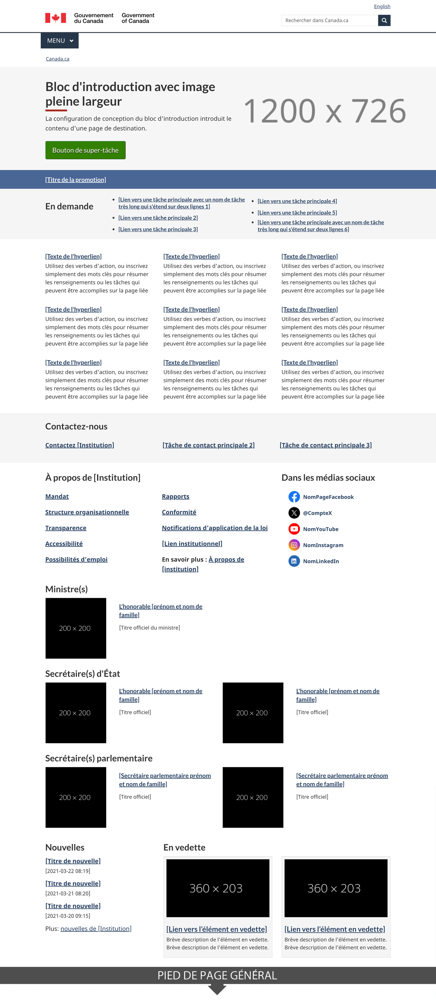
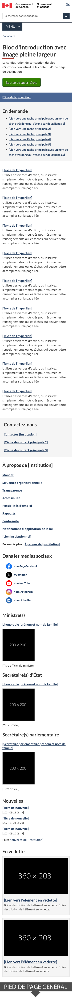

Obligatoire

<strong>Dernière modification</strong>&nbsp;: {{ page.dateModified }}

    Il s’agit du modèle de la page d’accueil principale de chaque ministère, organisme et organisation du gouvernement du Canada qui a un titre d’usage dans le registre du
    <a href="https://www.tbs-sct.canada.ca/ap/fip-pcim/reg-fra.asp">Programme fédéral de l’image de marque (PFIM)</a>.

<section>
    <h2>Sur cette page</h2>
    <ul>
        <li><a href="#use">Quand l’utiliser</a></li>
        <li><a href="#avoid">Quoi éviter</a></li>
        <li><a href="#design">Contenu et conception</a></li>
        <li><a href="#implement">Comment procéder à la mise en œuvre</a></li>
        <li><a href="#research">Recherche et justification</a></li>
        <li><a href="#latest">Derniers changements</a></li>
    </ul>
</section>
<section>
    <h2 id="use">Quand l’utiliser</h2>
    
La page d’accueil institutionnelle sert de page d’accueil du ministère ou de l’organisme. Cette page a pour but d’aider les gens à trouver des renseignements et des services en mettant l’accent sur les tâches principales.

    
Elle devrait également permettre aux utilisateurs de trouver du contenu supplémentaire, notamment&nbsp;:

    <ul>
        <li>le mandat et la structure organisationnelle</li>
        <li>les coordonnées</li>
        <li>des nouvelles et des promotions</li>
        <li>des rapports et publications</li>
    </ul>
</section>
<section>
    <h2 id="avoid">Quoi éviter</h2>
    
N’utilisez pas ce modèle à moins que votre ministère, organisme ou organisation figure au <a href="https://www.tbs-sct.canada.ca/ap/fip-pcim/reg-fra.asp">registre du PFIM</a>.

</section>
<section>
    <h2 id="design">Contenu et conception</h2>
    
La page d’accueil institutionnelle est composée de plusieurs configurations de conception&nbsp;:

    

        

            

                <table class="table table-striped" id="ilp-01" aria-live="polite">
                    <caption class="wb-inv">
                        Contenu et configurations de conception pour la Page d'accueil institutionnelle
                    </caption>
                    <thead>
                        <tr>
                            <th class="col-md-3">Configuration de conception</th>
                            <th class="col-md-7">Orientation pour la page d'accueil institutionnelle </th>
                            <th class="col-md-2 text-center">Obligatoire</th>
                        </tr>
                    </thead>
                    <tbody>
                        <tr>
                            <td><a href="./configurations-conception-communes/block-introduction.html">Bloc d’introduction</a></td>
                            <td>
                                
Utilisez le titre d’usage de l’institution (voir le <a href="https://www.tbs-sct.canada.ca/ap/fip-pcim/reg-fra.asp">Registre des titres d’usage</a>).

                                
La description doit être un très bref résumé de ce que fait l’institution.

                            </td>
                            <td class="text-center"> Obligatoire</td>
                        </tr>
                          <tr>
                            <td><a href="./configurations-conception-communes/boutons.html#action">Bouton de super-tâche</a></td>
                            <td>
N’incluez un bouton de super-tâche que si une tâche particulière produit au moins un tiers des clics sur la page d’accueil de l’institution.
</td>
                            <td class="text-center">Facultatif</td>
                        </tr>
                          <tr>
                            <td><a href="./configurations-conception-communes/lien-vedette.html">Lien en vedette</a></td>
                            <td>
                                
Le lien en vedette est un hyperlien court et descriptif que votre institution doit mettre en évidence.

                            </td>
                            <td class="text-center">Facultatif</td>
                        </tr>
                        <tr>
                            <td><a href="./configurations-conception-communes/en-demande.html">En demande</a></td>
                            <td>
                                
Comprend les tâches principales propres à l’institution.

                                
Si l’une des tâches principales de l’institution est déjà incluse sous forme de lien direct sous services et renseignements, ne la reproduisez pas ici.

                            </td>
                            <td class="text-center"> Obligatoire</td>
                        </tr>
                        <tr>
                            <td><a href="./configurations-conception-communes/services-renseignements.html">Services et renseignements</a></td>
                            <td>
Le modèle de services et de renseignements pointe vers les catégories de niveau supérieur de l’architecture d’information de votre organisation.
</td>
                            <td class="text-center"> Obligatoire</td>
                        </tr>
                        <tr>
                            <td><a href="./configurations-conception-communes/bande-de-coordonnees.html">Bande de coordonnées</a></td>
                            <td>
Le premier lien doit être le contact principal de votre institution. Vous devez limiter la bande à trois liens de contact.
</td>
                            <td class="text-center"> Obligatoire</td>
                        </tr>
                        <tr>
                            <td><a href="./configurations-conception-communes/a-propos-de-institution.html">À propos de l’institution</a></td>
                            <td>Suivez le modèle de la configuration de conception.</td>
                            <td class="text-center"> Obligatoire</td>
                        </tr>
                        <tr>
                            <td><a href="./configurations-conception-communes/bloc-medias-sociaux.html">Chaînes de médias sociaux</a></td>
                            <td>Suivez le modèle de la configuration de conception.</td>
                             <td class="text-center">Facultatif</td>
                        </tr>
                        <tr>
                            <td><a href="./configurations-conception-communes/ministre.html">Ministre ou chef d’institution</a></td>
                            <td>Suivez le modèle de la configuration de conception.</td>
                            <td class="text-center"> Obligatoire</td>
                        </tr>
                        <tr>
                            <td>Espace flexible&nbsp;:
                            <ul>
                                <li><a href="./configurations-conception-communes/nouveautes.html">Dernières nouvelles</a></li>
                                <li><a href="./configurations-conception-communes/promotions-contextuelles.html">Promotions contextuelles</a></li>
                            </ul>
                            </td>
                            <td>
                                
La partie inférieure de la page au-dessus du pied de page est considérée comme un espace flexible où les ministères peuvent ajouter le contenu de leur choix.

                                
L’utilisation de cet espace est facultative et les configurations de conception par défaut sont dernières nouvelles et promotions contextuelles.

                            </td>
                            <td class="text-center">Facultatif</td>
                        </tr>
                    </tbody>
                </table>
            

        

    

    <h3>Exemples visuels</h3>
    

        <figure class="mrgn-tp-md mrgn-bttm-lg">
            <figcaption><b>Page d’accueil institutionnelle – grand écran</b></figcaption>
            
            

                
Description de l’image&nbsp;: page d’accueil institutionnelle - grand écran

                

                    Dans la partie supérieure de la page se trouve un bloc d’introduction qui comprend un h1 intitulé [Nom de l’institution]. Il est souligné d’un court trait rouge épais. Sous l’en-tête se trouve une courte description du
                    mandat de l’institution.
                

                
Après le bloc d’introduction, il y a un bouton de super-tâche qui est un rectangle vert avec les mots Bouton de super-tâche [facultatif].

                

                    Sous celui-ci se trouve la configuration de conception de lien en vedette. Elle est contenue dans une bande bleue horizontale qui s’étend sur toute la longueur de l’écran. À l’intérieur de la bande se trouve un texte
                    blanc souligné qui se lit comme suit : Lien en vedette [facultatif].
                

                

                    L’élément suivant sur la page est la configuration de conception en demande. Elle est contenue dans une bande gris pâle qui s’étend sur toute la longueur de l’écran. Dans la bande se trouvent les mots En demande en texte
                    noir. Ils sont suivis de deux colonnes de liens. Chaque colonne contient trois liens dans une liste à puces. Le texte d’espace réservé pour chaque lien est [Hyperlien de la tâche principale].
                

                

                    Sous cet espace se trouve la configuration de conception des services et renseignements. Elle est composée de neuf menus d’accueil thématique distincts affichés sur trois colonnes et trois lignes. Chaque menu d’accueil
                    thématique a un titre d’espace réservé lié qui affiche [Texte de l’hyperlien]. Sous le titre, il y a une description d’espace réservé qui contiennent les instructions suivantes : Utilisez des verbes d’action ou
                    répertoriez simplement des mots-clés pour résumer les renseignements ou les tâches qui peuvent être accomplies sur la page à laquelle ils renvoient.
                

                

                    L’élément suivant sur la page est la configuration de conception de la bande de coordonnées. Elle consiste en une bande horizontale gris pâle avec l’en-tête Coordonnées suivi de trois liens sur une seule ligne. Le
                    premier lien est Communiquez avec [Institution], les liens suivants sont des espaces réservés pour les principales tâches de contact.
                

                

                    La bande de coordonnées est suivie de la configuration de conception à propos de l’institution à gauche et de la configuration de conception des chaînes de médias sociaux à droite. Les liens à propos de l’institution
                    figurent dans une section avec le titre «&nbsp;À propos de [l’institution]&nbsp;». La conception organise les liens en gras dans une liste à puces qui s’étend sur deux colonnes. La première colonne contient&nbsp;:
                

                <ul>
                    <li>Mandat</li>
                    <li>Structure organisationnelle</li>
                    <li>Transparence</li>
                    <li>Accessibilité</li>
                    <li>Possibilités d’emploi</li>
                </ul>
                
La deuxième colonne contient&nbsp;:

                <ul>
                    <li>Rapports</li>
                    <li>Conformité</li>
                    <li>Notifications d’application de la loi</li>
                    <li>[Lien institutionnel]</li>
                    <li>En savoir plus : À propos de [l’institution] (Remarque : «&nbsp;en savoir plus&nbsp;» n’est pas lié)</li>
                </ul>
                
La configuration de conception des chaînes de médias sociaux commence par le titre « Sur les médias sociaux ». Sous le titre se trouve une liste verticale avec des icônes et des étiquettes associées&nbsp;:

                <ul>
                    <li>Icône de Facebook suivie du texte de l’espace réservé NomPageFacebook</li>
                    <li>Icône de X suivie du texte de l’espace réservé @CompteX</li>
                    <li>Icône de YouTube suivie du texte de l’espace réservé NomYouTube</li>
                    <li>Icône d’Instagram suivie du texte de l’espace réservé NomInstagram</li>
                    <li>Icône de LinkedIn suivie du texte de l’espace réservé NomLinkedIn</li>
                </ul>
                
L’élément suivant qui s’affiche sur la page est la configuration de conception d’un ministre ou d’un chef d’institution. La configuration de conception s’affiche en 2 colonnes avec l’en-tête «&nbsp;Ministre(s)&nbsp;».

                
La première colonne présente un espace réservé pour l’image d’un chef d’institution à gauche. Les dimensions de l’image sont 200 x 250 pixels. Les renseignements à droite comprennent&nbsp;:

                <ul>
                    <li>L’honorable [nom du ou de la ministre] (lien)</li>
                    <li>[Titre officiel] (texte)</li>
                    <li>Élément de liste&nbsp;: Lettre de mandat [facultatif] (lien)</li>
                    <li>Élément de liste&nbsp;: Dossier d’information [facultatif] (lien)</li>
                </ul>
                
La deuxième colonne présente un espace réservé pour l’image d’un chef d’institution à gauche. Les dimensions de l’image sont 200 x 250 pixels. Les renseignements à droite comprennent&nbsp;:

                <ul>
                    <li>L’honorable [nom du ou de la ministre] (lien)</li>
                    <li>[Titre officiel] (texte)</li>
                    <li>Élément de liste : Lettre de mandat [facultatif - élément unique] (lien)</li>
                </ul>
                

                    Sous cette configuration de conception se trouve celle des dernières nouvelles à gauche et celle des promotions contextuelles à droite. La configuration de conception des dernières nouvelles a un titre qui lit «
                    Nouvelles » suivi de trois groupes de texte. Chaque groupe a un texte d’espace réservé en gras avec lien qui se lit [Titre de nouvelles] suivi d’un texte d’espace réservé pour la date sur une nouvelle ligne. Le format de
                    date affiché est AAAA-MM-JJ HH:MM. Après les trois groupes de texte, il y a une autre ligne de texte qui se lit comme suit : «&nbsp;En savoir plus : Nouvelles de [institution]&nbsp;». Les mots « Nouvelles de
                    [institution] » ont un lien.
                

                

                    La configuration de conception des promotions contextuelles est composée d’un titre intitulé «&nbsp;En vedette&nbsp;» suivi de deux espaces réservés de promotions contextuelles dans une rangée horizontale. Chacune a un
                    espace réservé pour l’image entouré d’un fond gris pâle. Dans l’espace réservé à l’image se trouvent les dimensions d’image prescrites : 360 x 203 pixels. Sous chaque espace réservé d’image sur fond gris se trouve un
                    lien d’espace réservé qui se lit [Hyperlien de l’élément en vedette]. En dessous se trouve le texte d’espace réservé suivant : Brève description de l’élément en vedette.
                

            

        </figure>
    

    

        <figure class="mrgn-tp-md mrgn-bttm-lg">
            <figcaption><b>Page d’accueil institutionnelle – petit écran</b></figcaption>
            
            

                
Description de l’image&nbsp;: page d’accueil institutionnelle - petit écran

                

                    Dans la partie supérieure de la page se trouve un bloc d’introduction qui comprend un h1 intitulé [Nom de l’institution]. Il est souligné d’un court trait rouge épais. Sous l’en-tête se trouve une courte description du
                    mandat de l’institution.
                

                
Après le bloc d’introduction, il y a un bouton de super-tâche qui est un rectangle vert avec les mots Bouton de super-tâche [facultatif].

                

                    Sous celui-ci se trouve la configuration de conception de lien en vedette. Elle est contenue dans une bande bleue horizontale qui s’étend sur toute la longueur de l’écran. À l’intérieur de la bande se trouve un texte
                    blanc souligné qui se lit comme suit : Lien en vedette [facultatif].
                

                

                    L’élément suivant sur la page est la configuration de conception en demande. Elle est contenue dans une bande gris pâle qui s’étend sur toute la longueur de l’écran. Dans la bande se trouvent les mots En demande en texte
                    noir. Ils sont suivis d’une liste unique de liens dans une liste à puces. Le texte d’espace réservé pour chaque lien est [Hyperlien de la tâche principale].
                

                

                    Sous cet espace se trouve la configuration de conception des services et renseignements. Elle est composée de neuf menus d’accueil thématiques distincts affichés qui sont empilés verticalement les uns sur les autres.
                    Chaque menu d'accueil thématique a un titre d’espace réservé lié qui affiche [Texte de l’hyperlien]. Sous le titre, il y a une description d’espace réservé qui contiennent les instructions suivantes : Utilisez des verbes
                    d’action ou répertoriez simplement des mots-clés pour résumer les renseignements ou les tâches qui peuvent être accomplies sur la page à laquelle ils renvoient.
                

                

                    L’élément suivant sur la page est la configuration de conception de la bande de coordonnées. Elle est contenue dans une bande gris pâle qui s’étend sur toute la longueur de l’écran. Il y a un en-tête
                    «&nbsp;Coordonnées&nbsp;» suivi de trois liens dans une rangée verticale. Le premier lien est Communiquez avec [Institution], les liens suivants sont des espaces réservés pour les principales tâches de contact.
                

                
La bande de coordonnées est suivie de la configuration de conception à propos de l’institution. Elle se compose d’une rubrique «&nbsp;À propos de [l’institution]&nbsp;». Suivi de neuf liens en gras&nbsp;:

                <ul>
                    <li>Mandat</li>
                    <li>Structure organisationnelle</li>
                    <li>Transparence</li>
                    <li>Accessibilité</li>
                    <li>Possibilités d’emploi</li>
                    <li>Rapports</li>
                    <li>Conformité</li>
                    <li>Notifications d’application de la loi</li>
                    <li>[Lien institutionnel]</li>
                    <li>En savoir plus&nbsp;: À propos de [l’institution] (Remarque : «&nbsp;en savoir plus&nbsp;» n’est pas lié)</li>
                </ul>
                

                    Sous la configuration de conception à propos de l’institution se trouve celle des chaînes de médias sociaux. Elle commence par le titre «&nbsp;Sur les médias sociaux&nbsp;». Sous le titre se trouve une liste verticale
                    avec des icônes et des étiquettes associées&nbsp;:
                

                <ul>
                    <li>Icône de Facebook suivie du texte de l’espace réservé NomPageFacebook</li>
                    <li>Icône de X suivie du texte de l’espace réservé @CompteX</li>
                    <li>Icône de YouTube suivie du texte de l’espace réservé NomYouTube</li>
                    <li>Icône d’Instagram suivie du texte de l’espace réservé NomInstagram</li>
                    <li>Icône de LinkedIn suivie du texte de l’espace réservé NomLinkedIn</li>
                </ul>
                

                    L’élément suivant qui s’affiche sur la page est la configuration de conception d’un ministre ou d’un chef d’institution. La configuration de conception commence par le titre «&nbsp;Ministre(s)&nbsp;» et est suivi de deux
                    éléments.
                

                

                    Le premier élément commence par un titre avec lien «&nbsp;L’honorable [nom du ou de la ministre]&nbsp;» suivi d’un espace réservé pour l’image aux dimensions prescrites de 200 x 250 pixels. Sous l’image se trouve le
                    texte [Titre officiel]. Il est suivi d’une liste à puces avec les deux éléments avec lien suivants&nbsp;:
                

                <ul>
                    <li>Lettre de mandat [facultatif]</li>
                    <li>Dossier d’information [facultatif]</li>
                </ul>
                

                    Le deuxième élément commence par un titre avec lien « L’honorable [nom du ou de la ministre] » suivi d’un espace réservé pour l’image aux dimensions prescrites de 200 x 250 pixels. Sous l’image se trouve le texte [Titre
                    officiel]. Il est suivi de l’élément avec lien suivant&nbsp;:
                

                <ul>
                    <li>Lettre de mandat [facultatif – élément unique]</li>
                </ul>
                

                    Sous cette configuration de conception se trouve celle des dernières nouvelles ; elle a un titre qui se lit «&nbsp;Nouvelles&nbsp;» suivi de trois groupes de texte. Chaque groupe a un texte d’espace réservé en gras avec
                    lien qui se lit [Titre de nouvelles] suivi d’un texte d’espace réservé pour la date sur une nouvelle ligne. Le format de date affiché est AAAA-MM-JJ HH:MM. Après les trois groupes de texte, il y a une autre ligne de
                    texte qui se lit comme suit : «&nbsp;En savoir plus : Nouvelles de [institution]&nbsp;». Les mots «&nbsp;Nouvelles de [institution]&nbsp;» ont un lien.
                

                

                    L’élément suivant sur la page est la configuration de conception des promotions contextuelles. Elle est composée d’un titre intitulé «&nbsp;En vedette&nbsp;» suivie de deux éléments. Chaque élément a un espace réservé
                    pour l’image entouré d’un fond gris pâle. Dans l’espace réservé à l’image se trouvent les dimensions d’image prescrites : 360 x 203 pixels. Sous chaque espace réservé d’image sur fond gris se trouve un lien d’espace
                    réservé qui se lit [Hyperlien de l’élément en vedette]. En dessous se trouve le texte d’espace réservé suivant&nbsp;: Brève description de l’élément en vedette.
                

            

        </figure>
    

</section>
<section>
    <h2 id="implement">Comment procéder à la mise en œuvre</h2>
    
Trouvez des exemples pratiques et de code pour mettre en œuvre le modèle de la page d’accueil institutionnelle.

    <h3>Référence pour la mise en œuvre du thème GCWeb (BOEW)</h3>
    
La référence à l’implémentation explique la façon de configurer chaque élément de la page d’accueil institutionnelle.

    <ul>
        <li><a href="https://wet-boew.github.io/GCWeb/templates/institutional/institution-fr.html">Modèle institutionnel – GCWeb</a></li>
    </ul>
    <h3>Mises en œuvre</h3>
    
Déterminez ce qui convient le mieux au type de page que vous créez.

    

        

            

                

                    

                        
<strong>AEM-GC</strong>

                        
Pour Adobe Experience Manager (AEM) du gouvernement du Canada&nbsp;:

                        <ul>
                            <li>
                                <a href="https://www.gcpedia.gc.ca/wiki/Documentation_d%27AEM_sp%C3%A9cifique_au_GC_6.5">
                                    Documentation d’AEM et des services Web gérés (lien GCPédia - accessible uniquement sur le réseau du gouvernement du Canada)
                                </a>
                            </li>
                        </ul>
                    

                    

                        
<strong>SGDC</strong>

                        
Pour la solution de gabarits à déploiement centralisé (SGDC)&nbsp;:

                        <ul>
                            <li><a href="https://cenw-wscoe.github.io/sgdc-cdts/docs/index-fr.html">Documentation de la SGDC</a></li>
                        </ul>
                    

                    

                        
<strong>Drupal WxT</strong>

                        
Pour Drupal WxT&nbsp;:

                        <ul>
                            <li><a href="https://drupalwxt.github.io/">Documentation de Drupal WxT (en anglais seulement)</a></li>
                        </ul>
                    

                

            

        

    

</section>
<section>
    <h2 id="research">Recherche et justification</h2>
    
Consultez les conclusions de la recherche et la justification de la politique.

    <h3>Constatations découlant de la recherche</h3>
    

        Nous avons validé la page d’accueil institutionnelle dans le cadre de deux projets d’optimisation avec l’Agence du revenu du Canada. Nous avons constaté que cette conception était utile pour fournir un accès aux principales tâches
        d’une institution tout en permettant aux utilisateurs d’accéder aux renseignements d’entreprise sur l’organisme.
    

    <h3>Justification stratégique</h3>
    
Ce modèle est un élément obligatoire des spécifications du contenu et de l’architecture de l’information pour Canada.ca.

    <ul>
        <li>
            <a href="https://www.canada.ca/fr/secretariat-conseil-tresor/services/communications-gouvernementales/specifications-contenu-architecture-information-canada/elements-obligatoires.html">
                Éléments obligatoires du système de conception
            </a>
        </li>
    </ul>
</section>
<section>
    <h2 id="latest">Derniers changements</h2>
    <dl class="dl-horizontal">
        <dt>
            <time datetime="2024-04-03" class="link-muted">2024-04-03</time>
        </dt>
        <dd>
            <ul>
                <li>Déplacement du modèle de l’état bêta à stable</li>
                <li>Mise à jour des orientations visant à inclure des spécifications en matière de contenu et de conception, des exemples visuels et des orientations sur la mise en œuvre.</li>
            </ul>
        </dd>
        <dt>
            <time datetime="2020-07-23" class="link-muted">2020-07-23</time>
        </dt>
        <dd>
            <ul>
                <li>Examen du code frontal, création de modifications de l’ensemble HTML/CSS</li>
                <li>Supprimer l’opacité du lien en vedette pour le contraste</li>
                <li>Améliorations de la disposition de l’image d’arrière-plan</li>
            </ul>
        </dd>
        <dt>
            <time datetime="2020-07-13" class="link-muted">2020-07-13</time>
        </dt>
        <dd>
            <ul>
                <li>Modifications pour résoudre les problèmes d’accessibilité</li>
                <li>La configuration de conception en demande a été mise à jour avec une liste à puces</li>
                <li>Modifications apportées aux colonnes du menu d’accueil thématique en mode tablette</li>
            </ul>
        </dd>
        <dt>
            <time datetime="2020-03-05" class="link-muted">2020-03-05</time>
        </dt>
        <dd>ajout d’une classe CSS facultative pour masquer l’image d’en-tête en mode tablette</dd>
        <dt>
            <time datetime="2019-11-28" class="link-muted">2019-11-28</time>
        </dt>
        <dd>une nouvelle version bêta de ce modèle a été ajoutée</dd>
    </dl>
</section>
