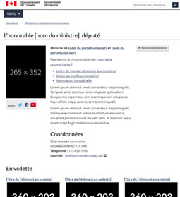

 <strong>
  De :
  <a href="https://www.canada.ca/fr/secretariat-conseil-tresor.html">
   Secrétariat du
			Conseil du Trésor du Canada
  </a>
 </strong>

 

  <ul class="list-inline small mrgn-bttm-sm" id="list-inline-desktop-only" style="line-height:1.65em">
   <li class="mrgn-rght-lg">
    
     Obligatoire
    
   </li>
   <li class="mrgn-rght-lg">
    Dernière modification : 2021-09-27
   </li>
  </ul>
 

 Une page de profil de ministre représente la page d’accueil unique pour les ministres, les secrétataires parlementaires et les chefs d’institutions quasi judiciaires. Elle fournit de façon uniforme un aperçu de la biographie d'une personne et clarifie ses rôles et responsabilités.

<section>
 <h2>
  Sur cette page
 </h2>
 <ul>
  <li>
   <a href="#quand">
    Quand utiliser cette configuration
   </a>
  </li>
  <li>
   <a href="#eviter">
    Quoi éviter
   </a>
  </li>
  <li>
   <a href="#comment">
    Comment mettre en oeuvre
   </a>
  </li>
  <li>
   <a href="#derniers">
    Derniers changements
   </a>
  </li>
  <li>
   <a href="#discussion">
    Discussion
   </a>
  </li>
 </ul>
</section>

<section>
 <h2 id="quand">
  Quand utiliser cette configuration
 </h2>
 

  Utilisez le modèle de page de profil ministériel pour fournir une présentation cohérente des renseignements au sujet des personnes suivantes :
 

 <ul>
  <li>
   les ministres du gouvernment du Canada;
  </li>
  <li>
   les secrétaires parlementaires inclus dans l’onglet « Secrétaires parlementaires » du
   <a href="https://www.canada.ca/fr/gouvernement/ministres.html">
    répertoire des ministres
   </a>
   ; et
  </li>
  <li>
   les chefs d’institutions quasi judiciaires sans lien de dépendance.
  </li>
 </ul>
</section>

<section>
 <h2 id="eviter">
  Quoi éviter
 </h2>
 

  N'utilisez pas ce modèle plus d'une fois pour chaque ministre, secrétaire parlementaire ou chef d'institution.
 

</section>

<section>
 <h2 id="comment">
  Comment mettre en oeuvre
 </h2>
 

  Utilisez ce modèle et suivez les lignes directrices.
 

 

  

   

    

     

      
      </img>
     

     

      

       
        Pages de profil des ministres
       
      

      

       <a class="btn btn-call-to-action" href="../mise-en-page/pages-profil-ministres-directives.html">
        Modèle avec directives
       </a>
      

     

    

   

  

 

 

  

   Code
  

  
  
  <pre><code>&lt;h1 id="wb-cont" property="name"&gt;L’honorable [nom du ministre], député | [Nom du secrétaire parlementaire] | [Nom du
  chef de l'institution ou de l'organisation]&lt;/h1&gt;
&lt;div class="row"&gt;
  &lt;div class="col-md-3"&gt;
    &lt;p class="mrgn-tp-lg"&gt;&lt;img src="img/265x352.png" alt="" class="img-responsive"&gt;&lt;/p&gt;
  &lt;/div&gt;
  &lt;div class="col-md-9"&gt;
    &lt;p class="mrgn-tp-lg"&gt;&lt;strong&gt;Ministre de &lt;a href="#"&gt;[nom du portefeuille no1]&lt;/a&gt; et &lt;a href="#"&gt;[nom du
          portefeuille no2]&lt;/a&gt; | Secrétaire parlementaire du/de la &lt;a href="#"&gt;[nom du ou de la ministre du
          portefeuille]&lt;/a&gt; | [Titre officiel du chef de l'organisation]&lt;/strong&gt;&lt;/p&gt;
    &lt;p&gt;Représente la circonscription de &lt;a href="#"&gt;[nom de la circonscription]&lt;/a&gt;&lt;/p&gt;
    &lt;ul&gt;
      &lt;li&gt;&lt;a href="#"&gt;Lettre de mandat adressées aux ministres&lt;/a&gt;&lt;/li&gt;
      &lt;li&gt;&lt;a href="#"&gt;Cahier de breffage ministériel&lt;/a&gt;&lt;/li&gt;
      &lt;li&gt;&lt;a href="#"&gt;Nomination ministérielle&lt;/a&gt;&lt;/li&gt;
    &lt;/ul&gt;
    &lt;p&gt;Lorem ipsum dolor sit amet, consectetur adipisicing elit. Tempore amet ducimus nihil, voluptate quibusdam?
      Excepturi in aspernatur rem ipsam aperiam voluptates fugit officiis culpa, ratione, et maxime impedit.&lt;/p&gt;
    &lt;p&gt;Lorem ipsum dolor sit amet, consectetur adipisicing elit. Tempore amet ducimus nihil, voluptate quibusdam?
      Excepturi in aspernatur rem ipsam aperiam voluptates fugit officiis culpa, ratione, et maxime impedit.&lt;/p&gt;
    &lt;section&gt;
      &lt;h2&gt;Coordonnées&lt;/h2&gt;
      &lt;p&gt; Chambre des communes&lt;br&gt;
        Ottawa (Ontario) K1A 0A6&lt;br&gt;
        &lt;strong&gt;Téléphone :&lt;/strong&gt; 123-456-7890&lt;br&gt;
        &lt;strong&gt;Courriel :&lt;/strong&gt; &lt;a href="mailto:"&gt;[prénom.nom@canada.ca]&lt;/a&gt; &lt;span
          class="glyphicon glyphicon-envelope"&gt;&lt;/span&gt;
      &lt;/p&gt;
    &lt;/section&gt;
  &lt;/div&gt;
&lt;/div&gt;
&lt;section class="gc-features"&gt;
  &lt;h2&gt;En vedette [facultatif]&lt;/h2&gt;
  &lt;div class="row wb-eqht"&gt;
    &lt;div class="col-lg-4 col-md-6 mrgn-bttm-md"&gt;
      &lt;h3 class="h5"&gt;&lt;a href="#" class="stretched-link"&gt;[Titre de l'élément en vedette]&lt;/a&gt;&lt;/h3&gt;
      &lt;img src="./images/feature-img-360x203.jpg" alt=""
        class="img-responsive thumbnail mrgn-bttm-sm"&gt;
      &lt;p&gt;Brève descripton de l'élément en vedette&lt;/p&gt;
    &lt;/div&gt;
    &lt;div class="col-lg-4 col-md-6 mrgn-bttm-md"&gt;
      &lt;h3 class="h5"&gt;&lt;a href="#" class="stretched-link"&gt;[Titre de l'élément en vedette]&lt;/a&gt;&lt;/h3&gt;
      &lt;img src="./images/feature-img-360x203.jpg" alt=""
        class="img-responsive thumbnail mrgn-bttm-sm"&gt;
      &lt;p&gt;Brève descripton de l'élément en vedette&lt;/p&gt;
    &lt;/div&gt;
    &lt;div class="col-lg-4 col-md-6 mrgn-bttm-md"&gt;
      &lt;h3 class="h5"&gt;&lt;a href="#" class="stretched-link"&gt;[Titre de l'élément en vedette]&lt;/a&gt;&lt;/h3&gt;
      &lt;img src="./images/feature-img-360x203.jpg" alt=""
        class="img-responsive thumbnail mrgn-bttm-sm"&gt;
      &lt;p&gt;Brève descripton de l'élément en vedette&lt;/p&gt;
    &lt;/div&gt;
  &lt;/div&gt;
&lt;/section&gt;
				</code></pre>
 

</section>

<section>
 <h2 id="#derniers">
  Derniers changements
 </h2>
 <dl class="dl-horizontal">
  <dt>
   <time class="link-muted" datetime="2021-09-27">
    2021-09-27
   </time>
  </dt>
  <dd>
   <ul>
    <li>
     remplacement des sections Nouveautés, Activités récentes et Galerie par une section En vedette flexible
    </li>
    <li>
     suppression du widget de médias sociaux
    </li>
    <li>
     simplification et amélioration des directives
    </li>
    <li>
     clarification de la manière d'afficher les ministres, les secrétaires parlementaires et les chefs d'organisation
    </li>
   </ul>
  </dd>
 </dl>
</section>

<section>
 <h2 id="discussion">
  Discussion
 </h2>
 

  <a href="https://github.com/canada-ca/design-system-systeme-conception/issues">
   Discuter de ce modèle dans GitHub
  </a>
 

</section>

