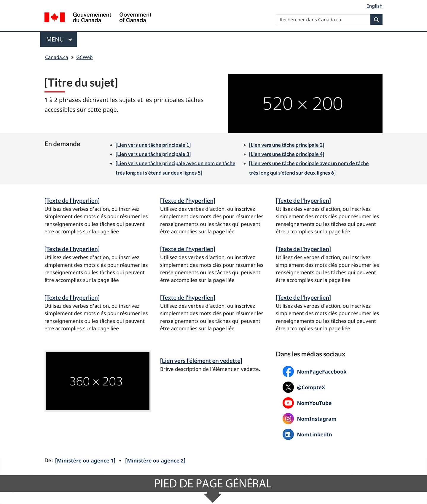
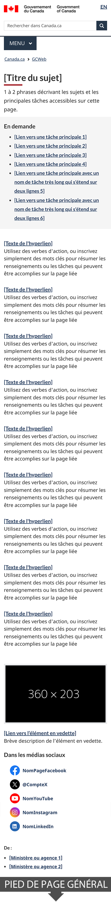

 
  Obligatoire
 

Les pages de sujet permettent d’accéder aux sujets et aux pages de destination qui permettent l’achèvement des tâches.

<section>
 <h2>Sur cette page</h2>
    <ul>
        <li><a href="#use">Quand l’utiliser</a></li>
        <li><a href="#avoid">Quoi éviter</a></li>
        <li><a href="#design">Contenu et conception</a></li>
        <li><a href="#implement">Comment procéder à la mise en œuvre</a></li>
        <li><a href="#research">Justification stratégique </a></li>
        <li><a href="#changes">Derniers changements</a></li>
    </ul>
</section>
<section>
     <h2 id="use">Quand l’utiliser</h2>
     
Ce modèle doit être utilisé pour les deux premiers niveaux de sujet de chaque thème de <a href="https://www.canada.ca/fr/gouvernement/a-propos/systeme-conception/arborescence-thematique-types-contenu.html#tree">l’arborescence thématique de Canada.ca</a>.

     
Il est facultatif pour les sujets de niveau inférieur.

</section>
<section>
     <h2 id="avoid">Quoi éviter</h2>
     
Les pages où les utilisateurs et utilisatrices peuvent amorcer une tâche doivent être considérées comme du contenu de destination et ne doivent pas recourir au modèle de page de sujet.

     
Le modèle de page de sujet ne doit pas être utilisé pour la promotion; utilisez plutôt les <a href="../modeles-recommandes/pages-campagnes.html">pages de campagne</a>.

</section>
<section>
     <h2 id="design">Contenu et conception</h2>
     
Trouvez ici des spécifications sur le contenu et la conception ainsi que des exemples visuels.

     
Le modèle de page de sujet est composé de plusieurs configurations&nbsp;:

     

            

                

                    <table class="table table-striped" id="ilp-01" aria-live="polite">
                        <caption class="wb-inv">
                            Contenu et configurations de conception de la page sujet
                        </caption>
                        <thead>
                            <tr>
                                <th class="col-md-3">Configuration</th>
                                <th class="col-md-7">Directives relatives à la page de sujet</th>
                                <th class="col-md-2 text-center">Obligatoire</th>
                            </tr>
                        </thead>
                        <tbody>
                            <tr>
                                <td><a href="../configurations-conception-communes/bloc-introduction.html">Bloc d’introduction</a></td>
                                <td>
                                    
Suivez les instructions de la configuration.

                                    
L’image est facultative. Si vous incluez une image, utilisez les dimensions de l’image demi-largeur.

                                </td>
                                <td class="text-center"> Obligatoire</td>
                            </tr>
                            <tr>
                                <td><a href="../configurations-conception-communes/en-demande.html">Bande en demande</a></td>
                                <td>
                                    
Met en évidence les tâches principales.

                                    
Ce composant fournit des raccourcis vers les tâches principales du sujet. Toutefois, si toutes les tâches principales relatives au sujet sont déjà incluses sous forme de liens directs dans la partie Services et renseignements, ne les dupliquez pas ici. Dans un tel cas, vous pouvez choisir de ne pas inclure ce composant.

                                </td>
                               <td class="text-center">Facultatif</td>
                            </tr>
                            <tr>
                                <td><a href="../configurations-conception-communes/services-renseignements.html">Services et renseignements</a></td>
                                <td>
                                
Organise le contenu et la navigation en présentant les informations et services les plus visités en premier.

                                
Le titre « Services et renseignements » de cette section doit utiliser la classe wb-inv pour ne pas être visible, tout en restant présent pour la structure sémantique et les lecteurs d’écran.

                                </td>
                                <td class="text-center"> Obligatoire</td>
                            </tr>
                            <tr>
                                <td>
                                    Espace flexible&nbsp;: 
                                    <ul>
                                        <li><a href="../configurations-conception-communes/vignettes-promotionnelles.html">Promotions contextuelles</a></li>
                                        <li><a href="../configurations-conception-communes/bloc-medias-sociaux.html">Médias sociaux</a></li>
                                        <li><a href="../configurations-conception-communes/collaborateurs.html">Collaborateurs</a></li>
                                    </ul>
                                </td>
                                <td>
                                    
La partie inférieure de la page, au-dessus du pied de page, est considérée comme un espace flexible.

                                    
L’utilisation de cet espace est facultative et les configurations pouvant être utilisées dans cet espace sont Médias sociaux, Collaborateurs et Promotion contextuelle (une seule promotion contextuelle).

                                </td>
                                <td class="text-center">Facultatif</td>
                            </tr>
                        </tbody>
                    </table>
                

            

        

 <h3>Exemples visuels 
</h3>
        

            <figure class="mrgn-tp-md mrgn-bttm-lg">
                <figcaption><b>Page de sujet — grand écran</b></figcaption>
                
                

                    
Description de l’image&nbsp;: Page de sujet — grand écran

                    
La page de sujet commence par un bloc d’introduction. Le [titre du sujet] est affiché dans le style standard H1 de Canada.ca. Après cela, 1 à 2 phrases décrivent les sujets et les principales tâches accessibles sur la page. À droite se trouve une image avec des dimensions de 520 px sur 200 px.

                    
Sous le bloc d’introduction se trouve une bande En demande avec deux colonnes de liens (trois dans chaque rangée). Les liens mènent aux tâches principales.

                    
En dessous de la bande En demande se trouve la configuration Services et renseignements. Il s’agit de trois colonnes, avec trois sujets dans chaque colonne. Le sujet commence par un titre sous forme d’hyperlien, suivi d’une description. Les instructions pour la description sont les suivantes&nbsp;: utilisez des verbes d’action ou énumérez simplement des mots-clés pour résumer les informations ou les tâches qui peuvent être accomplies sur la page à laquelle le lien renvoie.

                    
Une promotion contextuelle se trouve sous la configuration Services et renseignements. Elle comprend une image positionnée à gauche, dont les dimensions sont de 360 px sur 203 px. À droite de l’image se trouve un titre en hyperlien pour l’élément vedette, suivi d’une brève description de celui-ci.

                    
À droite de la promotion contextuelle se trouve le composant Médias sociaux. Son titre est «&nbsp;Dans les médias sociaux&nbsp;». Il comprend cinq icônes&nbsp;: Facebook, X, YouTube, Instagram, LinkedIn. À côté de chaque icône se trouve le nom du compte en hyperlien. Sous les icônes se trouve un lien intitulé «&nbsp;D’autres moyens de rester en contact&nbsp;». 

                    
En bas de la page, juste au-dessus du champ «&nbsp;Date de modification&nbsp;» et du pied de page, se trouve la configuration Collaborateurs. Elle est alignée à gauche. Elle est composée du texte «&nbsp;De&nbsp;:&nbsp;» suivi d’un hyperlien intitulé «&nbsp;[Ministère ou organisme]&nbsp;», le tout étant présenté horizontalement.
 
               

               </figure>
        

                

            <figure class="mrgn-tp-md mrgn-bttm-lg">
                <figcaption><b>Page de sujet — petit écran</b></figcaption>
                
                

                    
Description de l’image&nbsp;: Page de sujet — petit écran

                    
La page de sujet commence par un bloc d’introduction. Le [titre du sujet] est affiché dans le style standard H1 de Canada.ca. Après cela, 1 à 2 phrases décrivent les sujets et les principales tâches accessibles sur la page.

                    
Sous le bloc d’introduction se trouve une bande En demande avec une colonne de liens (six au total). Les liens mènent aux tâches principales.

                    
En dessous de la bande En demande se trouve la configuration Services et renseignements. Il s’agit d’une colonne, avec neuf sujets au total. Le sujet commence par un titre sous forme d’hyperlien, suivi d’une description. Les instructions pour la description sont les suivantes&nbsp;: utilisez des verbes d’action ou énumérez simplement des mots-clés pour résumer les informations ou les tâches qui peuvent être accomplies sur la page à laquelle le lien renvoie.

                    
Une promotion contextuelle se trouve sous la configuration Services et renseignements. L’image de la promotion apparaît en premier, avec des dimensions de 360 px sur 203 px. En dessous de l’image se trouve un titre en hyperlien pour l’élément vedette, suivi d’une brève description de celui-ci.

                    
En dessous de la promotion contextuelle se trouve le composant Médias sociaux. Son titre est «&nbsp;Dans les médias sociaux&nbsp;». Il comprend cinq icônes&nbsp;: Facebook, X, YouTube, Instagram, LinkedIn. À côté de chaque icône se trouve le nom du compte en hyperlien. Sous les icônes se trouve un lien intitulé «&nbsp;D’autres moyens de rester en contact&nbsp;».

                    
En bas de la page, juste au-dessus du champ «&nbsp;Date de modification&nbsp;» et du pied de page, se trouve la configuration Collaborateurs. Elle est alignée à gauche. Elle est composée du texte «&nbsp;De&nbsp;:&nbsp;» suivi d’un hyperlien intitulé «&nbsp;[Ministère ou organisme]&nbsp;», le tout étant présenté verticalement.
 
               

               </figure>
        

<section>
<section>
     <h2 id="implement">Comment procéder à la mise en œuvre</h2>
        
Trouvez ici des exemples pratiques et du code pour mettre en œuvre le modèle de page de sujet.

        <h3>Référence pour la mise en œuvre du thème GCWeb (BOEW)</h3>
        
La référence pour la mise en œuvre explique comment configurer le modèle de page de sujet.

        <ul>
            <li><a href="https://wet-boew.github.io/GCWeb/templates/topic/topic-doc-fr.html">Documentation sur la page de sujet — GCWeb</a></li>
        </ul>
        <h3>Mises en œuvre</h3>
        
Déterminez ce qui convient le mieux au type de page que vous créez.

        

            

                

                    

                        

                            
<strong>AEM-GC</strong>

                            
Pour Adobe Experience Manager (AEM) du gouvernement du Canada&nbsp;:

                            <ul>
                                <li>
                                    <a href="https://www.gcpedia.gc.ca/wiki/Documentation_d%27AEM_spécifique_au_GC_6.5">
                                        Documentation d’AEM et des services Web gérés (lien GCpédia — accessible uniquement sur le réseau du gouvernement du Canada)
                                    </a>
                                </li>
                            </ul>
                        

                        

                            
<strong>SGDC</strong>

                            
Pour la solution de gabarits à déploiement centralisé (SGDC)&nbsp;:

                            <ul>
                                <li><a href="https://cenw-wscoe.github.io/sgdc-cdts/docs/index-fr.html">Documentation de la SGDC</a></li>
                            </ul>
                        

                        

                            
<strong>Drupal WxT</strong>

                            
Pour Drupal WxT&nbsp;:

                            <ul>
                                <li><a href="https://drupalwxt.github.io/">Documentation de Drupal WxT (en anglais seulement)</a></li>
                            </ul>
                        

                    

                

            

        

</section>
<section>
     <h2 id="research">Justification stratégique</h2>
     
Ce modèle est un élément obligatoire des spécifications de Canada.ca.

     <ul>
          <li><a href="https://conception.canada.ca/specifications/elements-obligatoires.html">Éléments obligatoires du système de conception</a></li>
     </ul>
</section>
<section>
 <h2 id="changes">
  Derniers changements
 </h2>
 

  <strong>
   2024-09-24&nbsp;:
  </strong>
 

 <ul>
  <li>
   Passage de la version bêta à la version stable du modèle
  </li>
  <li>
   Mise à jour des directives pour inclure des spécifications de contenu et de conception, des exemples visuels et des conseils de mise en œuvre
  </li>
 </ul>
 

  <strong>
   2020-07-10&nbsp;:
  </strong>
 

 <ul>
  <li>
   Modifications à la disposition des colonnes de la section Services et renseignements pour les tabelettes
  </li>
  <li>
   Clarification des directives pour les comptes de médias sociaux
  </li>
 </ul>
 

  <strong>
   2020-06-30&nbsp;:
  </strong>
  une nouvelle version bêta de ce modèle a été ajoutée.
 

</section>
