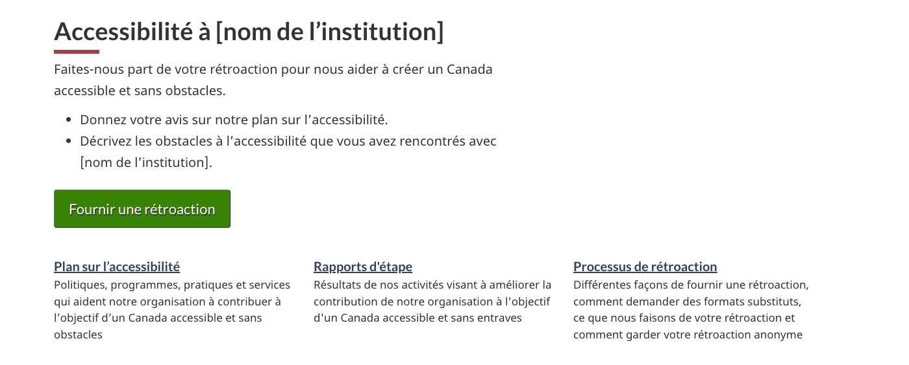

<strong>Dernière mise à jour</strong>&nbsp;: {{ page.dateModified }}

Toutes les entités du gouvernement du Canada, y compris les ministères et les organismes, doivent fournir des renseignements publics concernant leurs plans sur l’accessibilité, leurs rapports d’étape et leur mécanisme de rétroaction.

<section>
    <h2>Sur cette page</h2>
    <ul>
        <li><a href="#quand">Quand utiliser cette configuration</a></li>
        <li><a href="#contenu">Contenu et conception</a></li>
        <li><a href="#mise">Comment procéder à la mise en œuvre</a></li>
        <li><a href="#justification">Justification stratégique</a></li>
        <!-- <li><a href="#changements">Derniers changements</a></li> -->
    </ul>
</section>
<section>
    <h2 id="quand">Quand utiliser cette configuration</h2>
    
Il s’agit d’un modèle recommandé pour soutenir la conformité aux exigences en matière de planification et de rapports établies par le  <cite>Règlement canadien sur l’accessibilité</cite>.

    

        Les lignes directrices sur le Règlement canadien sur l’accessibilité se trouvent ici&nbsp;:
    

    <ul>
        <li><a href="https://www.canada.ca/fr/emploi-developpement-social/programmes/directives-reglements-canadien-accessibilite.html"> Lignes directrices sur le Règlement canadien sur l’accessibilité</a></li>
    </ul>
</section>
<section>
    <h2 id="contentu">Contenu et conception</h2>
    
Vous trouverez ici des spécifications sur le contenu et la conception.

    <h3>Page d’accueil en matière d’accessibilité</h3>
    
Les pages d’accueil en matière d’accessibilité échappent à la structure thème/sujet. Toutefois, elles utilisent un affichage similaire à celui des pages de sujet. La page comprend les éléments suivants&nbsp;:

    <ul>
        <li>Titre H1</li>
        <li>Bloc d’introduction</li>
        <li>Bouton de super-tâche conduisant à votre processus de rétroaction</li>
        <li>
            Menus d’accueil thématiques suivants&nbsp;:
            <ul>
                <li>Plan sur l’accessibilité</li>
                <li>Rapports d’étape</li>
                <li>Processus de rétroaction</li>
            </ul>
        </li>
    </ul>
    
Vous trouverez dans le modèle suivant le texte suggéré pour chacun de ces éléments&nbsp;:

    <ul>
        <li><a href="./accessibilite/accessibilite.html">Accessibilité à [nom de l’institution]</a></li>
    </ul>
    
Le plan sur l’accessibilité, les rapports d’étape et le processus de rétroaction utilisent tous ce modèle&nbsp;:

    <ul>
        <li><a href="./generique.html">Page de contenu de base</a></li>
    </ul>
    <h3>Plan sur l’accessibilité</h3>
    
Suivez le plan de contenu suivant&nbsp;:

    <ul>
        <li><a href="./accessibilite/plan.html">Plan sur l’accessibilité à [nom de l’institution]</a></li>
    </ul>
    <h3>Rapports d’étape</h3>
    
Pour la page d’accueil, suivez le plan de contenu suivant&nbsp;:

    <ul>
        <li><a href="./accessibilite/accueil-rapports-etape.html">Rapports d’étape sur l’accessibilité pour [Nom de l’institution]</a></li>
    </ul>
    
Pour le rapport d’étape, suivez le plan de contenu et les lignes directrices connexes que vous trouverez ici&nbsp;:

    <ul>
        <li><a href="./accessibilite/rapport-etape.html">Rapport d’étape sur l’accessibilité pour [Nom de l’institution]</a></li>
    </ul>
    <h3>Processus de rétroaction</h3>
    
Suivez le plan de contenu suivant&nbsp;:

    <ul>
        <li><a href="./accessibilite/processus-retroaction.html">Processus de rétroaction sur l’accessibilité à [nom de l’institution]</a></li>
    </ul>
    <h3>Formulaire de rétroaction sur l’accessibilité</h3>
    
Suivez le plan de contenu suivant&nbsp;:

    <ul>
        <li><a href="./accessibilite/formulaire-retroaction.html">Formulaire de rétroaction sur l’accessibilité à [nom de l’institution]</a></li>
    </ul>
    
Le formulaire de rétroaction sur l’accessibilité utilise le composant suivant&nbsp;:

    <ul>
        <li><a href="https://wet-boew.github.io/GCWeb/components/wb-fieldflow/alternative-fr.html">Alternatives pour le déroulement de champs</a> de GCWeb</li>
    </ul>
</section>
<section>
    <h2 id="mise">Comment procéder à la mise en œuvre</h2>
    
Trouvez ici des exemples pratiques et du code pour mettre en œuvre le [].

    <h3>Référence de mise en œuvre du thème GCWeb (BOEW)</h3>
    
Références de mise en œuvre de GCWeb pour&nbsp;:

    <ul>
        <li><a href="https://wet-boew.github.io/GCWeb/components/wb-fieldflow/alternative-fr.html">Déroulement de champs - Documentation - GCWeb</a></li>
        <li><a href="https://wet-boew.github.io/GCWeb/templates/content-page/content-fr.html">Page de contenu basique</a></li>
    </ul>
    <h3>Implementations</h3>
    
Déterminez ce qui convient le mieux au type de page que vous créez.

  

        

            

                

                    

                        
<strong>AEM-GC</strong>

                        
Pour Adobe Experience Manager (AEM) du gouvernement du Canada&nbsp;:

                        <ul>
                            <li>
                                <a href="https://www.gcpedia.gc.ca/wiki/Documentation_d%27AEM_sp%C3%A9cifique_au_GC_6.5">
                                    Documentation d’AEM et des services Web gérés (lien GCPédia - accessible uniquement sur le réseau du gouvernement du Canada)
                                </a>
                            </li>
                        </ul>
                    

                    

                        
<strong>SGDC</strong>

                        
Pour la solution de gabarits à déploiement centralisé (SGDC)&nbsp;:

                        <ul>
                            <li><a href="https://cenw-wscoe.github.io/sgdc-cdts/docs/index-fr.html">Documentation de la SGDC</a></li>
                        </ul>
                    

                    

                        
<strong>Drupal WxT</strong>

                        
Pour Drupal WxT&nbsp;:

                        <ul>
                            <li><a href="https://drupalwxt.github.io/">Documentation de Drupal WxT (en anglais seulement)</a></li>
                        </ul>
                    

                

            

        

    

</section>
<section>
    <h2 id="justification">Justification stratégique</h2>
    
Ce modèle prend en charge les exigences en matière de planification et de rapport établies par le&nbsp;:

    <ul>
        <li>
            <a href="https://laws.justice.gc.ca/fra/reglements/DORS-2021-241/"><cite>Règlement canadien sur l’accessibilité</cite></a>
        </li>
    </ul>
    
Pour plus de lignes directrices concernant ces exigences, visitez&nbsp;:

    <ul>
        <li>
            <a href="https://www.canada.ca/fr/emploi-developpement-social/programmes/directives-reglements-canadien-accessibilite.html">Lignes directrices sur le Règlement canadien sur l’accessibilité</a>
        </li>
    </ul>
</section>
<!-- <section>
    <h2 id="changements">Derniers changements</h2>
    <dl class="dl-horizontal">
        <dt>
            <time datetime="2024-12-05" class="link-muted">2024-12-05</time>
        </dt>
        <dd>
            <ul>
                <li>Updated the guidance to include content and design specifications, visual examples and implementation guidance</li>
            </ul>
        </dd>
    </dl>
</section> -->
