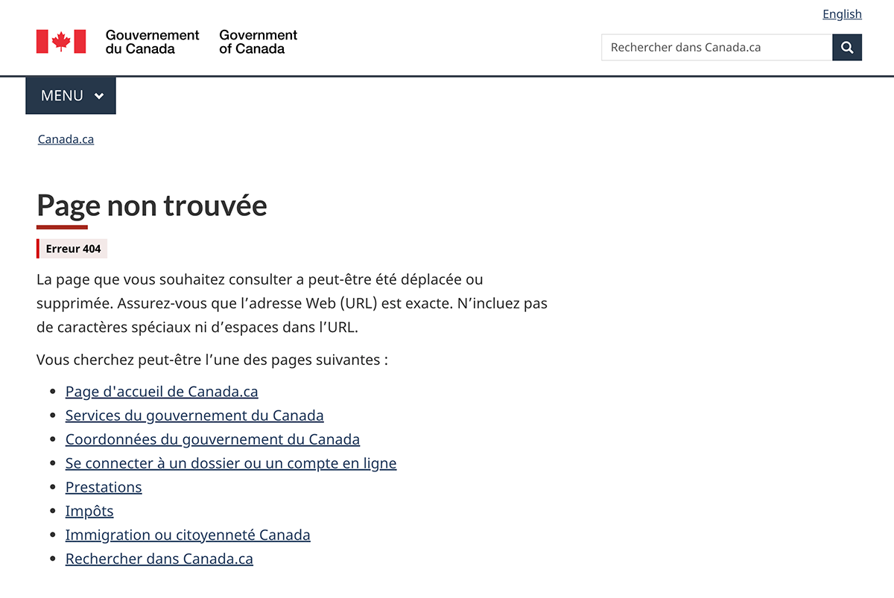

Une erreur 404 est générée lorsque l'on tente d'accéder à une page non trouvée.

Ce modèle de page d'erreur 404 fournit à l'utilisateur des suggestions pour régler le cas d'erreur et contient des liens vers des sections clés qui peuvent être utiles. Il existe deux versions de ce modèle :

<ul>
    <li>une page unilingue avec une option de changement de langue pour les utilisateurs dont la préférence linguistique est connue;</li>
    <li>une page bilingue pour les utilisateurs dont la préférence linguistique n'est pas connue.</li>
</ul>

<section>
<h2>Sur cette page</h2>
<ul>
    <li><a href="#utilisation">Quand l'utiliser</a></li>
    <li><a href="#eviter">Quoi éviter</a></li>
    <li><a href="#conception">Contenu et conception</a></li>
    <li><a href="#mettre">Comment mettre en œuvre</a></li>
</ul>
</section>

<section>
  <h2 id="utilisation">Quand l'utiliser</h2>
  
Utilisez ce modèle pour créer un emplacement normalisé où les utilisateurs peuvent se rendre lorsqu'ils obtiennent un message d'erreur 404.

</section>

<section>
  <h2 id="eviter">Quoi éviter</h2>
    
Ce modèle doit être utilisé seulement pour signaler une erreur 404.

    
Assurez-vous que la page comprend au moins un lien de renvoi (par exemple, vers la page d'accueil Canada.ca). Ne fournissez pas de liens non pertinents qui n'aident pas l'utilisateur à revenir au contenu Web du gouvernement du Canada.

    
Pour la version bilingue, n'utilisez pas le français et l'anglais dans le même bloc de contenu, le même paragraphe ou la même phrase.

</section>

<section>
    <h2 id="conception">Contenu et conception</h2>
    
Trouver des spécifications de contenu et de conception et des exemples visuels.

    <h3>Spécifications de contenu</h3>
    
Utilisez «&nbsp;Page non trouvée&nbsp;» pour l'en-tête H1, ou le titre de la page.

    
Ajoutez une phrase pour indiquer que la page recherchée par l'utilisateur a peut-être été déplacée ou supprimée.

    
Proposez à l'utilisateur des façons de résoudre le cas d'erreur, notamment en&nbsp;:

        <ul>
            <li>lui suggérant de vérifier l'orthographe de l'adresse Web (URL);</li>
            <li>lui indiquant de supprimer les caractères spéciaux ou les espaces dans l'URL;</li>
            <li>lui fournissant un moyen de signaler le lien rompu, le cas échéant.</li>
        </ul>
    
Ajoutez le texte «&nbsp;Vous cherchez peut-être l'une des pages suivantes :&nbsp;» suivi d'une liste à puces d'au plus 10 liens. En haut de la liste, ajoutez les trois pages les plus recherchées sur Canada.ca suivantes&nbsp;:

        <ul>
            <li><a href="https://www.canada.ca/fr.html">Accueil</a></li>
            <li><a href="https://www.canada.ca/fr/services.html">Services du gouvernement du Canada</a></li>
            <li><a href="https://www.canada.ca/fr/contact.html">Coordonnées du gouvernement du Canada</a></li>
        </ul>
    
Après avoir ajouté les liens vers ces trois pages, vous pouvez énumérer certaines des pages les plus «&nbsp;en demande&nbsp;» pour votre institution. Voici quelques-unes des pages les plus demandées sur Canada.ca que vous pouvez également inclure&nbsp;:

        <ul>
            <li><a href="https://www.canada.ca/fr/gouvernement/ouvrir-session-dossier-compte-en-ligne.html">Se connecter à un dossier ou un compte en ligne</a></li>
            <li><a href="https://www.canada.ca/fr/services/prestations.html">Prestations</a></li>
            <li><a href="https://www.canada.ca/fr/services/impots.html">Impôts</a></li>
            <li><a href="https://www.canada.ca/fr/services/immigration-citoyennete.html">Immigration ou citoyenneté Canada</a></li>
        </ul>
    <h4>Spécifications de contenu supplémentaires pour la version bilingue</h4>
    
En plus du contenu présenté dans les spécifications générales, la page bilingue doit comprendre deux liens d'ancrage qui apparaîtront au-dessus de chaque langue lorsque la page sera redimensionnée pour les écrans d'appareils mobiles.

    <ul>
        <li>Pour le lien au-dessus du contenu anglais, utilisez le texte «&nbsp;Aller à la version française&nbsp;».</li>
        <li>Pour le lien au-dessus du contenu français, utilisez le texte «&nbsp;Go to the English version&nbsp;».</li>
    </ul>
    <h4>Interactions</h4>
    <ul>
        <li>Lorsque la préférence linguistique de l'utilisateur <b>est connue</b>, ce dernier doit être dirigé vers la page d'erreur 404 dans la langue de son choix.</li>
        <li>Lorsque la préférence linguistique de l'utilisateur <b>n'est pas connue</b>, ce dernier doit être dirigé vers la page d'erreur 404 bilingue.</li>
    </ul>
    <h3>Spécifications de conception</h3>
    <ul>
        <li>Il faut inclure une étiquette de danger directement sous l'en‑tête H1 pour signaler une «&nbsp;erreur 404&nbsp;». 
        <ul>
            <li><a href="../configurations-conception-communes/etiquettes.html#danger">Suivez les directives de mise en œuvre pour une étiquette de danger</a>.</li>
        </ul>
        </li>
        <li>Tous les liens doivent être présentés selon les styles de Canada.ca.
            <ul>
                <li><a href="../styles/typographie.html">Typographie</a></li>
                <li><a href="../styles/couleurs.html">Couleurs</a></li>
            </ul>
        </li>
        <li>Vous pouvez inclure une barre de recherche facultative sous la liste des liens suggérés.
        <ul>
            <li><a href="../configurations-conception-communes/champ-recherche.html">Suivez les instructions pour le Champ de recherche du site</a>.</li>
        </ul>
        </li>
    </ul>
    <h4>Spécifications de conception supplémentaires pour la version bilingue</h4>
    
Utilisez les types de mise en page suivants pour la version bilingue :

    <ul>
        <li>deux colonnes avec tout le contenu anglais à gauche et tout le contenu français à droite pour l'affichage sur un grand ou moyen écran;</li>
        <li>une seule colonne avec tout le contenu empilé pour l'affichage sur un petit écran.</li>
    </ul>
    
Étant donné que la préférence linguistique n'est pas connue, limitez les éléments de l'en-tête et du pied de page à ce qui suit :

    <ul>
        <li>dans l'en-tête, n'incluez que la signature du gouvernement du Canada avec un lien vers la page d'accueil Canada.ca;</li>
        <li>dans le pied de page, n'incluez que le mot-symbole «&nbsp;Canada&nbsp;».</li>
    </ul>
    <h4>Interactions</h4>
    
Lorsque la version bilingue de la page est redimensionnée pour les écrans d'appareils mobiles, les contenus anglais et français seront empilés. Lorsque le contenu est empilé, un lien de saut doit apparaître au-dessus de chaque langue pour permettre à l'utilisateur de passer d'une langue à l'autre.

    <h3>Exemples visuels</h3>
    

        <figure class="mrgn-tp-md mrgn-bttm-lg">
            <figcaption><b>Page d'erreur 404 unilingue – grand écran</b></figcaption>
            
            

                
Description de l'image&nbsp;: Page d'erreur 404 unilingue – grand écran

                
En haut de la page se trouve l'en-tête H1 intitulé «&nbsp;Page non trouvée&nbsp;», souligné d'un trait rouge court et épais. Sous l'en‑tête H1 se trouve une étiquette de danger indiquant «&nbsp;erreur 404&nbsp;».

                
Après l'étiquette se trouve un paragraphe fournissant à l'utilisateur des instructions sur la façon de trouver la page qu'il cherche.

                
Sous le paragraphe se trouve la phrase «&nbsp;Vous cherchez peut-être l'une des pages suivantes :&nbsp;» avec une liste à puces située sous ce dernier.

            

        </figure>
    

    

        <figure class="mrgn-tp-md mrgn-bttm-lg">
            <figcaption><b>Page d'erreur 404 bilingue – grand écran</b></figcaption>
            
            

                
Description de l'image&nbsp;: Page d'erreur 404 bilingue – grand écran

                  
La version bilingue de la page d'erreur 404 s'affiche en deux colonnes.

                  
La première colonne porte l'en-tête H2 intitulé «&nbsp;Page not found&nbsp;». Sous l'en-tête H2 se trouve une étiquette de danger assortie du texte «&nbsp;404 error&nbsp;».

                  
Après l'étiquette se trouve un paragraphe fournissant à l'utilisateur des instructions sur la façon de trouver la page qu'il cherche.

                  
Sous le paragraphe se trouve la phrase d'introduction «&nbsp;You may be looking for:&nbsp;» avec une liste à puces des liens vers les pages les plus demandées sur Canada.ca située sous ce dernier.

                  
Après la liste des liens, il y a une courte barre de recherche dans laquelle figure la mention «&nbsp;Search Canada.ca&nbsp;» dans l'espace réservé pour le texte. Il y a un bouton de recherche illustré à l'aide d'une icône de loupe à côté de la barre de recherche.

                  
La deuxième colonne porte l'en-tête H2 intitulé «&nbsp;Page non trouvée&nbsp;». Sous l'en-tête H2 se trouve une étiquette de danger assortie du texte «&nbsp;Erreur 404&nbsp;».

                  
Après l'étiquette se trouve un paragraphe fournissant à l'utilisateur des instructions sur la façon de trouver la page qu'il cherche.

                  
Sous le paragraphe se trouve la phrase d'introduction «&nbsp;Vous cherchez peut-être l'une des pages suivantes&nbsp;:&nbsp;» avec une liste à puces des liens vers les pages les plus demandées sur Canada.ca située sous ce dernier.

                  
Après la liste des liens, il y a une courte barre de recherche dans laquelle figure la mention «&nbsp;Rechercher dans Canada.ca&nbsp;» dans l'espace réservé pour le texte. Il y a un bouton de recherche illustré à l'aide d'une icône de loupe à côté de la barre de recherche.

            

        </figure>
    

    

        <figure class="mrgn-tp-md mrgn-bttm-lg">
            <figcaption><b>Page d'erreur 404 bilingue – petit écran</b></figcaption>
            
            

                
Description de l'image&nbsp;: Page d'erreur 404 bilingue – petit écran

                
La version bilingue de la page d'erreur 404 s'affiche dans une seule colonne.

                
En haut de la page se trouve l'en-tête H2 intitulé «&nbsp;Page not found&nbsp;». Sous l'en-tête H2 se trouve une étiquette de danger assortie du texte «&nbsp;404 error&nbsp;».

                
Sous l'étiquette se trouve le lien «&nbsp;Aller à la version française&nbsp;».

                
Après le lien se trouve un paragraphe fournissant à l'utilisateur des instructions sur la façon de trouver la page qu'il cherche.

                
Sous le paragraphe se trouve la phrase d'introduction «&nbsp;You may be looking for:&nbsp;» avec une liste à puces des liens vers les pages les plus demandées sur Canada.ca située sous ce dernier.

                
Après la liste des liens, il y a une courte barre de recherche dans laquelle figure la mention «&nbsp;Search Canada.ca&nbsp;» dans l'espace réservé pour le texte. Il y a un bouton de recherche illustré à l'aide d'une icône de loupe à côté de la barre de recherche.

                
Ensuite, il y a un deuxième en-tête H2 intitulé «&nbsp;Page non trouvée&nbsp;». Sous cet en-tête H2 se trouve une étiquette de danger assortie du texte «&nbsp;Erreur 404&nbsp;».

                
Sous l'étiquette se trouve le lien «&nbsp;Go to the English version&nbsp;».

                
Après le lien se trouve un paragraphe fournissant à l'utilisateur des instructions sur la façon de trouver la page qu'il cherche.

                
Sous le paragraphe se trouve la phrase d'introduction «&nbsp;Vous cherchez peut-être l'une des pages suivantes&nbsp;:&nbsp;» avec une liste à puces des liens vers les pages les plus demandées sur Canada.ca située sous ce dernier.

                
Après la liste des liens, il y a une courte barre de recherche dans laquelle figure la mention «&nbsp;Rechercher dans Canada.ca&nbsp;» dans l'espace réservé pour le texte. Il y a un bouton de recherche illustré à l'aide d'une icône de loupe à côté de la barre de recherche.

            

        </figure>
    

</section>
<section>
  <h2 id="mettre">Comment mettre en œuvre</h2>
  
Trouvez des exemples pratiques et saisissez le code pour la mise en œuvre de la page d'erreur 404.

  <h3>Référence pour la mise en œuvre du thème GCWeb (WET)</h3>
  
La référence de mise en œuvre explique comment configurer la page d'erreur 404.

  <ul>
      <li><a href="https://wet-boew.github.io/GCWeb/templates/servermessage/servermessage-doc-fr.html">Documentation des messages d'erreur du serveur - GCWeb (WET)</a></li>
  </ul>
  </section>