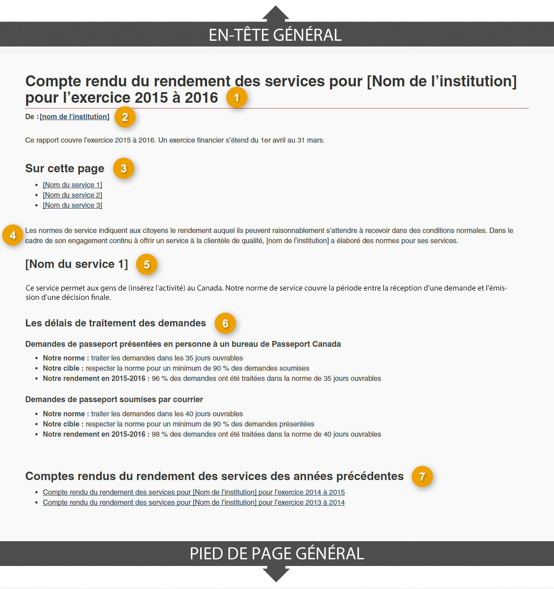

  
Les pages de compte rendu du rendement des services institutionnels rassemblent toutes les normes de service d’une institution et fournissent des renseignements sur le compte rendu du rendement annuel, en appui à la <a href="{{ page.service-digital-policy-url }}">Politique sur les services et le numérique</a>.

  
Pour chacune des normes de service d’une institution, indiquez le niveau de rendement auquel les personnes peuvent raisonnablement s’attendre dans des conditions normales, et donnez un compte rendu du rendement antérieur par rapport à ces normes.

  <section>
    <h2>Sur cette page</h2>
    <ul>
      <li><a href="#utilisation">Quand utiliser ce modèle</a></li>
      <li><a href="#specifications">Comment utiliser ce modèle</a></li>
      <li><a href="#navigation">Navigation de l’utilisateur</a></li>
      <li><a href="#changements">Derniers changements</a></li>
    </ul>
  </section>
  <section>
    <h2 id="utilisation">Quand utiliser ce modèle</h2>
    
Utilisé par chacune des institutions pour présenter les normes de service et le compte rendu du rendement de l’exercice financier précédent. La page devrait être mise à jour chaque année, dans les 4 mois suivant la fin de l'exercice financier précédent.

  </section>
  <section>
    <h2 id="specifications">Comment utiliser ce modèle</h2>
    

      <button class="btn btn-default wb-toggle" data-toggle='{"selector": "details", "parent": "#template-elements", "type": "on"}' type="button">Développer tout</button>
      <button class="btn btn-default wb-toggle" data-toggle='{"selector": "details", "parent": "#template-elements", "type": "off"}' type="button">Réduire tout</button>
    

    

      

        <figure class="mrgn-bttm-lg">
          <figcaption class="text-center"><b>Modèle de page de compte rendu du rendement des services institutionnels</b></figcaption>
          
        </figure>
      

      

        <section id="template-elements">
          <section>
            <h3>1&nbsp;: Titre de la page</h3>
            
Indique que la page fournit des comptes rendus annuels sur le rendement comparativement aux normes de service d’une institution

            <ul class="list-unstyled">
              <li id="element1">
                

                  
<strong>Contenu</strong>

                  <ul>
                    <li>Le titre est le suivant&nbsp;: Compte rendu du rendement des services de [nom de l’institution] pour l’exercice financier de [année] à [année].</li>
                  </ul>
                

              </li>
              <li id="element2">
                

                  
<strong>Présentation</strong>

                  <ul>
                    <li>Cette composante doit être une balise H1 unique.</li>
                    <li>Elle doit être le premier élément de la page.</li>
                  </ul>
                

              </li>
            </ul>
          </section>
          <section>
            <h3>2&nbsp;: Liens aux sous-sections</h3>
            
Cela permet de diviser les liens aux normes de service en groupes logiques

            <ul class="list-unstyled">
              <li id="element5">
                

                  
<strong>Contenu</strong>

                  <ul>
                    <li>Cette composante est facultative; utilisez-la dans les cas où un grand nombre de normes de service est signalé.</li>
                    <li>Regroupez les sous-sections de façon logique (par exemple, par canal de prestation de services, volume ou type de service)</li>
                    <li>Le texte de chacun des liens doit correspondre exactement au texte de l’en-tête associé.</li>
                  </ul>
                

              </li>
              <li id="element6">
                

                  
<strong>Présentation</strong>

                  <ul>
                    <li>Se trouve sous le titre de la page.</li>
                    <li>Utilisez la conception <a href="../configurations-conception-communes/table-matiere-interieur.html">Table des matières à l’intérieur de la page</a>.</li>
                  </ul>
                

              </li>
            </ul>
          </section>
          <section>
            <h3>3&nbsp;: Introduction</h3>
            
Fournit un aperçu des normes de service d’une institution.

            <ul class="list-unstyled">
              <li id="element7">
                

                  
<strong>Contenu</strong>

                  <ul>
                    <li>Limitez le texte à un paragraphe ou deux.</li>
                  </ul>
                

              </li>
              <li id="element8">
                

                  
<strong>Présentation</strong>

                  <ul>
                    <li>Le paragraphe d’introduction du service doit se trouver sous le titre de la page.</li>
                  </ul>
                

              </li>
            </ul>
          </section>
          <section>
            <h3>4&nbsp;: Nom du service et description</h3>
            
Fournit un aperçu du service.

            <ul class="list-unstyled">
              <li id="element9">
                

                  
<strong>Contenu</strong>

                  <ul>
                    <li>Limitez le texte à un ou deux paragraphes.</li>
                  </ul>
                

              </li>
              <li id="element10">
                

                  
<strong>Présentation</strong>

                  <ul>
                    <li>L’aperçu de la sous-section apparaît au début de chaque sous-section de la page.</li>
                  </ul>
                

              </li>
            </ul>
          </section>
          <section>
            <h3>5&nbsp;: Normes de service et renseignements sur le rendement</h3>
            
Décrit chacune des normes de service de l’institution et présente les plus récents résultats du rendement.

            <ul class="list-unstyled">
              <li id="element11">
                

                  
<strong>Contenu</strong>

                  <ul>
                    <li>Cette composante comprend les normes de service et les renseignements sur le rendement conformément à la <a href="{{ page.service-digital-policy-url }}">Politique sur les services et le numérique</a>.</li>
                    <li>Le contenu devrait être conforme à l'inventaire des services du ministère et aux autres rapports</li>
                    <li>Pour chaque norme de service présentée, présentez la liste des normes, des cibles et du rendement comme suit&nbsp;:
                      <ul>
                        <li>[Service]&nbsp;: nom du service auquel s’applique la norme.
                          <ul>
                            <li>Description&nbsp;: brève description du service en langage clair</li>
                            <li>Notre norme de service&nbsp;: énoncé concis de la norme.</li>
                            <li>Notre cible de rendement&nbsp;: indique la cible quantifiable.</li>
                            <li>Notre rendement en [exercice précédent]&nbsp;: indique le rendement quantifié.</li>
                          </ul>
                        </li>
                      </ul>
                    </li>
                  </ul>
                

              </li>
              <li id="element12">
                

                  
<strong>Présentation</strong>

                  <ul>
                    <li>Ne coupez pas les mots par un trait d’union à la fin d’une ligne; conservez plutôt une marge de droite inégale pour les paragraphes et autres blocs de texte.</li>
                  </ul>
                

              </li>
            </ul>
          </section>
          <section>
            <h3>6&nbsp;: Normes de service et rendement antérieur</h3>
            
Fournit des liens vers les normes et le rendement du service des exercices antérieurs

            <ul class="list-unstyled">
              <li id="element13">
                

                  
<strong>Contenu</strong>

                  <ul>
                    <li>Cette composante présente les résultats du rendement des exercices antérieurs (soit à l'aide de liens, soit directement sur la page).</li>
                    <li>L’en-tête porte le nom&nbsp;: &laquo;&nbsp;Comptes rendus du rendement des services des années précédentes&nbsp;&raquo;.</li>
                    <li>Le lien de chacune des pages de normes de service des années précédentes est formulé comme suit&nbsp;: &laquo;&nbsp;Compte rendu du rendement des services pour [Nom de l’institution] pour l’exercice [année]-[année]&nbsp;&raquo;.</li>
                  </ul>
                

              </li>
              <li id="element14">
                

                  
<strong>Présentation</strong>

                  <ul>
                    <li>Cette composante se trouve sous le contenu de la page principale.</li>
                    <li>Les pages liées appliqueront la configuration de la page du modèle de compte rendu du rendement des services institutionnels, tout en assurant un lien vers la page du compte rendu du rendement des services institutionnels de l’exercice actuel.</li>
                  </ul>
                

              </li>
            </ul>
          </section>
        </section>
      

    

  </section>
  <section>
    <h2 id="navigation">Navigation de l’utilisateur</h2>
    <figure class="mrgn-bttm-lg">
      <figcaption class="text-center"><b>Diagramme de la façon de naviguer</b></figcaption>
      
      

        
Version textuelle

        
On peut accéder aux pages de compte rendu du rendement des services institutionnels à partir des pages d’accueil institutionnelle du site Canada.ca.

      

    </figure>
  </section>
  <section>
    <h2 id="changements">Derniers changements</h2>
    <dl class="dl-horizontal">
      <dt><time>2026-06-03</time></dt>
      <dd>Les directives ont été mises à jour afin de supprimer les références à la configuration d’institution responsable, qui est en cours de désaffectation.</dd>
    </dl>
  </section>

