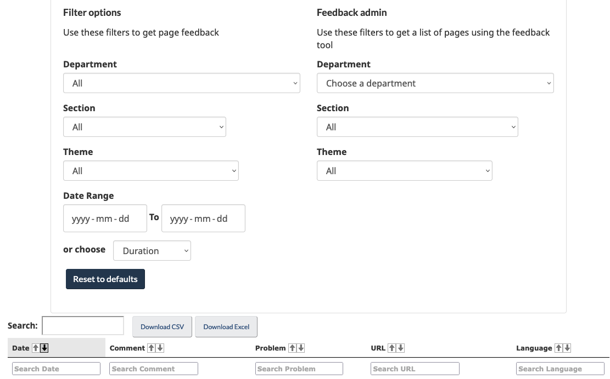

<ul class="toc lst-spcd col-md-12">
<li class="col-md-4 col-sm-6"><a class="list-group-item active" href="acces.html">Accéder à la rétroaction</a></li>
<li class="col-md-4 col-sm-6"><a class="list-group-item" href="methodes.html">Analyser la rétroaction</a></li>
<li class="col-md-4 col-sm-6"><a class="list-group-item" href="communiquer.html">Partager des idées</a></li>
<li class="col-md-4 col-sm-6"><a class="list-group-item" href="decider.html">Décider de ce qu’il faut améliorer</a></li>
</ul>

			    
L’outil de rétroaction sur la page en est encore à la phase pilote. Cela signifie que vous pouvez utiliser l’outil, mais sachez que son apparence ou son codage pourrait changer ultérieurement.

## Sur cette page
*   [Où la rétroaction est stockée](#ou-la-retroaction-est-stockee)
*   [Comment accéder à la rétroaction](#comment-acceder-a-la-retroaction)

## Où la rétroaction est stockée

Lorsqu’un utilisateur soumet de la rétroaction, celle-ci est envoyée et stockée dans une base de données gérée par le bureau de la transformation numérique du SCT.

## Comment accéder à la rétroaction

On peut consulter et télécharger la rétroaction sous forme de fichiers CSV ou Excel à tout moment en utilisant le site Web du visualiseur de rétroaction.

Le visualiseur de rétroaction est un environnement protégé par un mot de passe, accessible à tous les participants de la rétroaction sur les pages. Contactez le DTO pour accéder au site.

Adresse courriel : [dto.btn@tbs-sct.gc.ca](mailto:dto.btn@tbs-sct.gc.ca)

### Filtres du visualiseur de rétroaction

Le visualiseur de rétroaction comprend des filtres qui vous permettent d’accéder à une rétroaction en particulier et de la télécharger, notamment :

*   Plage de dates
*   Institution, thème et section de contenu
*   URL
*   Langue
*   Recherche dans les champs de rétroaction
						
						

Image du visualiseur de rétroaction

<nav role="navigation" class="mrgn-bttm-lg">
<ul class="pager">
<li class="next"><a href="methodes.html" rel="next">Suivant : Méthodes d’analyse de la rétroaction</a></li>
</ul>
</nav>