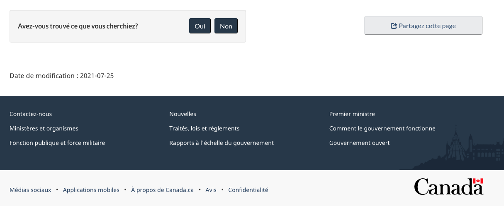

<ul class="toc lst-spcd col-md-12">
<li class="col-md-4 col-sm-6"><a class="list-group-item active" href="fonctionnement.html">Fonctionnement de l’outil</a></li>
<li class="col-md-4 col-sm-6"><a class="list-group-item" href="quand.html">Quand utiliser l’outil de rétroaction</a></li>
<li class="col-md-4 col-sm-6"><a class="list-group-item" href="ameliorer.html">Comment la rétroaction peut aider</a></li>
</ul>

			    
L’outil de rétroaction sur la page en est encore à la phase pilote. Cela signifie que vous pouvez utiliser l’outil, mais sachez que son apparence ou son codage pourrait changer ultérieurement.

## Sur cette page

*   [Pourquoi recueillir la rétroaction des utilisateurs](#pourquoi-recueillir-la-rétroaction-des-utilisateurs)
*   [Conception de l’outil de rétroaction](#conception)
*   [Protection des renseignements personnels](#protection-des-renseignements-personnels)

## Pourquoi recueillir la rétroaction des utilisateurs

Le but premier de la collecte d’une rétroaction est de l’utiliser comme outil de recherche pour améliorer le contenu.

> La rétroaction des clients est critique afin de veiller à ce que les services répondent à leurs besoins et en favorisent l’amélioration continue.
> 
> Source: [Ligne directrice sur les services et le numérique](https://www.canada.ca/fr/gouvernement/systeme/gouvernement-numerique/ligne-directrice-services-numerique.html#ToC2_2)

La rétroaction de la première personne, saisie « dans un moment » d’échec, nous donne une idée des problèmes qui touchent une page de contenu, une tâche ou un service.

La combinaison d’informations qualitatives et de données quantitatives est une étape vers la mise en place d’une culture du contenu centrée sur l’humain, fondée sur des preuves, et itérative.

## Conception de l’outil de rétroaction

L’outil de rétroaction est un **modèle facultatif**. Ajoutez-le au bas d’une page de contenu, après le contenu de la page et avant la date de modification. Il remplace le modèle « Signaler un problème » tout en recueillant activement les commentaires des utilisateurs.

L’outil de rétroaction invite les visiteurs à :

*   indiquer s’ils ont trouvé ce qu’ils cherchaient (oui / non)
*   donner leur avis en décrivant le problème

			
Image du pied de page de Canada.ca avec l'outil de rétroaction

			<figure class="mrgn-tp-lg">
			
			</figure>

			
Image des options après avoir cliqué sur « Non »

			<figure class="mrgn-tp-lg">
			
			</figure>
			

			
Outil de rétroaction

		
			
Il y a le texte « Vous ne recevrez aucune réponse. N'incluez pas de renseignements personnels (téléphone, courriel, NAS, renseignements financiers, médicaux ou professionnels). Maximum 300 caractères », suivi d’un champ de texte pour fournir plus de détails.

			

## Protéger les renseignements personnels

Des filtres sont en place pour supprimer ces types courants de renseignements personnels et le langage blasphématoire s’ils sont soumis :

*   Numéros de téléphone
*   Courriel
*   Numéros d’assurance sociale
*   Numéros de passeport
*   Codes postaux
*   Gros mots

Lorsque les renseignements personnels sont nettoyés automatiquement, ils sont remplacés par des dièses (###).
<nav role="navigation" class="mrgn-bttm-lg">
<ul class="pager">
<li class="next"><a href="quand.html" rel="next">Suivant : Quand utiliser l’outil de rétroaction</a></li>
</ul>
</nav>