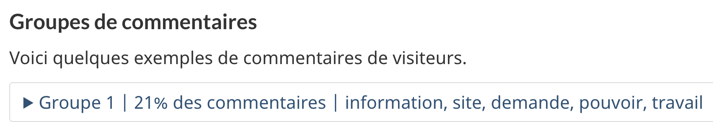

  

    <ul class="toc lst-spcd col-md-12">
      <li class="col-md-4 col-sm-6"><a class="list-group-item active" href="acceder-resultats.html">Résultats et aux rapports du sondage</a></li>
			<li class="col-md-4 col-sm-6"><a class="list-group-item" href="commentaires.html">Comment analyser les commentaires</a></li>
      <li class="col-md-4 col-sm-6"><a class="list-group-item" href="partager.html">Partager les idées</a></li>
      <li class="col-md-4 col-sm-6"><a class="list-group-item" href="decider.html">Décider de ce qui doit être amélioré</a></li>
    </ul>
  

## Sur cette page

- [Données brutes du sondage](#données-brutes-du-sondage)
- [Résultats du trimestre courant](#résultats-du-trimestre-courant)
- [Résultats des sondages annuels et trimestriels antérieurs](#résultats-des-sondages-annuels-et-trimestriels-antérieurs)

## Données brutes du sondage

Il s’agit de la meilleure option si vous cherchez à télécharger des données assujetties à une période personnalisée.

Les données brutes du sondage n’ont pas été traitées aux fins de continuité de la notation dans le cas où les tâches changeraient d’intitulé d’un trimestre à l’autre. Par exemple : en avril 2024, le SCT a mis à jour l’intitulé de la tâche « Lire une convention collective de la fonction publique » et l’a remplacé par « Trouver une convention collective ». Pour obtenir les résultats associés à cette tâche, vous devrez chercher à l’aide des deux intitulés de tâche.

Téléchargez les réponses au sondage et les commentaires sous forme de fichiers CSV ou Excel à l’aide du visualiseur de commentaires.

Utilisez des filtres pour sélectionner des périodes, des institutions, des thèmes ou des tâches précises.

Le visualiseur de commentaires est protégé par un mot de passe.

Les instructions concernant le mot de passe se trouvent sur [GCPedia (accessible seulement sur le réseau du GC)](https://www.gcpedia.gc.ca/wiki/Sondage_sur_la_r%C3%A9ussite_des_t%C3%A2ches_du_gouvernement_du_Canada_-_Donn%C3%A9es#R.C3.A9ponses_[…]t_commentaires).
{: .alert .alert-info}

## Résultats du trimestre courant

### Navigateur de résultats du sondage sur la réussite des tâches (SRT) du GC — Nouveauté — Mai 2024

À compter de mai 2024, vous pouvez parcourir les résultats trimestriels du sondage en ligne.

[Navigateur de résultats du SRT du GC](https://analytics-analytique.tbs.alpha.canada.ca/fr/) (accessible sur le réseau du GC seulement).

Vous pouvez les parcourir par thème ou par ministère, puis cibler les résultats de tâches précises.

Les données du navigateur ont été traitées aux fins de continuité de la notation dans le cas où les tâches changeraient d’intitulé d’un trimestre à l’autre. Par exemple : en avril 2024, le SCT a mis à jour l’intitulé de la tâche « Lire une convention collective de la fonction publique » et l’a remplacé par « Trouver une convention collective ».  

Pour toutes les tâches ayant obtenu plus de 100 commentaires, les commentaires ont été automatiquement regroupés en fonction de leur similarité afin d’en faciliter l’analyse. Le groupement doit être vu comme une méthode préliminaire qui permet de classer les commentaires en grappes plus petites.  

Chaque grappe comprend :
* Un numéro de grappe
* Le pourcentage de commentaires associés à la tâche compris dans la grappe
* Des mots-clés décrivant la grappe
* Le nombre de commentaires compris dans la grappe
* Cinq commentaires reflétant bien le thème général de la grappe

  

  
Un groupe de commentaires contient un numéro de groupe, le pourcentage de commentaires que ce groupe représente et un échantillon de mots-clés.

En savoir plus sur les méthodes de science des données utilisées pour le groupement

L’Éditeur principal a collaboré avec le bureau du dirigeant principal des données d’EDSC, qui a mis au point le script de groupement.

Ce script fait appel à :

<ul>
<li>Un modèle d’apprentissage automatique préentraîné qui convertit les commentaires textuels en points spatiaux en fonction des concepts généraux qu’ils comprennent.</li>
<li>D’abord, un « modèle transformateur de phrase » encode les commentaires dans un espace en fonction de « concepts » (p. ex., identité de genre, taille, temps de verbe). Le processus est multilingue à dessein et n’implique aucun besoin de traduction. Il peut traiter les commentaires comprenant des synonymes ou des concepts semblables même si ceux-ci ne font pas appel aux mêmes mots.</li>
<li>Ensuite, un « groupement agglomératif » crée des grappes (des groupes) à partir des commentaires qui sont spatialement rapprochés.</li>
</ul>

Bien que cette méthode analytique se calcule rapidement, elle peut parfois présenter des difficultés avec le jargon ou les termes techniques propres à certains contextes.

Ce modèle d’analyse a été choisi en raison de sa capacité à traiter des commentaires en plusieurs langues sans qu’on ait besoin de recourir à la traduction vers une même langue, ce qui aurait introduit des erreurs de traduction et allongé les délais de traitement.

Au fur et à mesure que la technologie évolue, nous continuerons à rechercher des méthodes d’analyse de la rétroaction qui pourraient nous rapprocher de l’obtention de résumés en langage clair des problèmes soulevés dans les commentaires.

## Résultats des sondages annuels et trimestriels antérieurs

Téléchargez les résultats et les rapports annuels et trimestriels du Sondage sur la réussite des tâches du GC

[Obtention des rapports du Sondage sur GCPédia (accessible seulement sur le réseau du GC)](https://www.gcpedia.gc.ca/wiki/Sondage_sur_la_r%C3%A9ussite_des_t%C3%A2ches_du_gouvernement_du_Canada_-_Rapports)

<nav role="navigation" class="mrgn-bttm-lg">
  <ul class="pager">
    <li class="next"><a href="commentaires.html" rel="next">Suivant&nbsp;: Méthodologie d’analyse des commentaires</a></li>
  </ul>
</nav>
