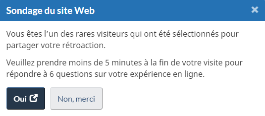

    

        <ul class="toc lst-spcd col-md-12">
            <li class="col-md-4 col-sm-6"><a class="list-group-item" href="apercu-srt.html">Pourquoi mesurer la réussite </a></li>
            <li class="col-md-4 col-sm-6"><a class="list-group-item active" href="methodologie.html">Méthodologie du sondage</a></li>
            <li class="col-md-4 col-sm-6"><a class="list-group-item" href="utiliser.html">Comment utiliser les résultats</a></li>
        </ul>
    

## Sur cette page

* [Taille de l’échantillon](#taille-de-léchantillon)
* [Conception du Sondage](#conception-du-sondage)

## Taille de l’échantillon

En tout, 10 % des internautes qui consultent les sites Web du GC sont invités au hasard à remplir le Sondage. Si des organisations ont besoin de plus de réponses au Sondage, l’Éditeur principal peut générer plus d’invitations.

## Conception du Sondage

### Invitation à participer au Sondage

Lorsque les internautes arrivent sur une page Web, une fenêtre contextuelle les invite au hasard à remplir le Sondage à la fin de leur visite. Si les internautes cliquent sur «&nbsp;Oui, après ma visite&nbsp;» dans la fenêtre, le Sondage s’ouvre dans une fenêtre ou un onglet distinct. Il est demandé aux internautes d’aller à cet onglet ou à cette fenêtre afin de répondre au Sondage une fois qu’ils auront terminé leur visite sur le site Web.

<figure class="mrgn-tp-lg">
  
</figure>

### Questions du sondage

1.  **Avez-vous terminé votre visite?**
    * Oui
    * Non

2.  **Premièrement, choisissez la catégorie qui décrit le mieux la principale raison de votre visite aujourd’hui.**

    Pour voir la liste des tâches, consultez la page GCpedia [Sondage sur la réussite des tâches du Gouvernement du Canada](https://www.gcpedia.gc.ca/wiki/Sondage_sur_la_r%C3%A9ussite_des_t%C3%A2ches_du_gouvernement_du_Canada_-_Liste_de_t%C3%A2ches_actuelles_et_anciennes). (Accès interne seulement)

3.  **Dans quelle mesure avez-vous été satisfait de votre expérience sur le site?**

    * Très insatisfait
    * Insatisfait
    * Neutre
    * Satisfait
    * Très satisfait

4.  **Dans quelle mesure a-t-il été facile ou difficile d’utiliser le site?**

    * Très difficile
    * Difficile
    * Ni difficile ni facile
    * Facile
    * Très facile

5.  **Avez-vous été en mesure d’accomplir ce que vous êtes venu faire?**

    * Oui, je le pense (allez à la question 6a)
    * Non, je ne pense pas (allez à la question 6b)
    * J’ai commencé ce sondage avant d’avoir terminé ma visite (fin du sondage)

6.  Si oui, veuillez répondre à la question ouverte – **De quelle manière aurions-nous pu vous offrir une meilleure expérience?** (Optionnel)

7.  Si non, veuillez répondre à la question ouverte – **Pourquoi n’avez-vous pas été en mesure d’accomplir ce que vous étiez venu faire?** (Optionnel)

<nav role="navigation" class="mrgn-bttm-lg">
    <ul class="pager">
        <li class="next"><a href="utiliser.html" rel="next">Suivant&nbsp;: Comment utiliser les résultats</a></li>
    </ul>
</nav>
